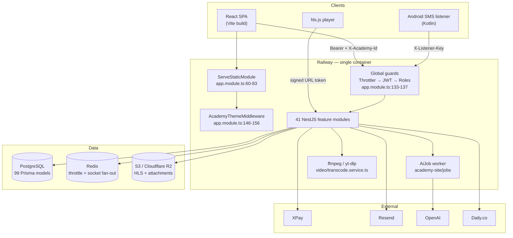
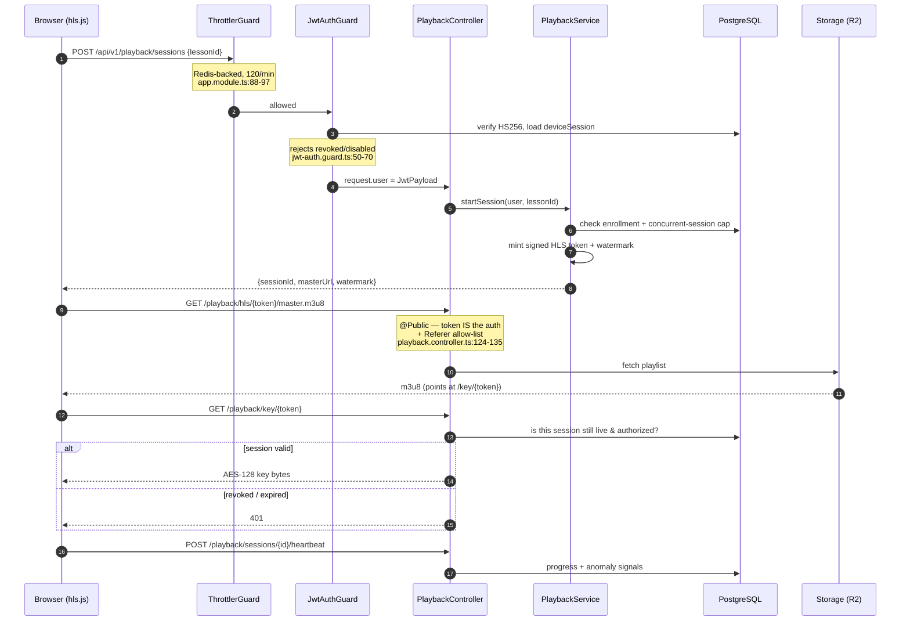

# Darsly — Architecture & Security Review

> Read-only audit. Evidence is cited as `path:line`. Anything that could not be
> confirmed by reading code or running a command is marked **[Unverified]**.
>
> Reviewed at commit `ca4e6d9` on branch `main`, 2026-09-22.
> Working notes: `.review/notes.md`.

---

## 1. Executive Summary

Darsly is an Arabic-first EdTech marketplace: a **modular monolith** of 41 NestJS
modules (66k lines) plus a React SPA (34k lines), shipped as a single Docker
image on Railway. It is markedly more mature than its size suggests. The money
path is defended in depth — raw-body HMAC on webhooks, fail-closed on a missing
secret, provider re-read before settlement, idempotent conditional state flips,
and no client-supplied amounts anywhere. Multi-tenancy is genuinely well
modelled as two orthogonal identities (`academyId` = organisation, `tenantId` =
author) resolved by guards into a capability-checked context, and a sample of
ten-plus controllers turned up **no IDOR**. Validation discipline is unusual:
123 of 124 `@Body()` parameters carry a class-validator DTO under a global
`forbidNonWhitelisted` pipe. The comments are the best I have seen in a codebase
this young — most non-obvious decisions record the production failure that
caused them.

The weaknesses are concentrated and structural rather than scattered. There is
**no CI, no linter, and no frontend test at all**; 1,531 backend tests exist and
pass, but nothing enforces that on a push. There is **no global exception
filter**, so a Prisma `P2025` (row not found) returns a 500 instead of a 404 —
everywhere. Video transcoding is **fire-and-forget** with no persistence or
retry, so a deploy mid-encode strands the asset forever. And two security
choices compound badly: the throttler's identity key is client-controllable
because `trust proxy` is unconditional, and both access *and* refresh tokens sit
in `localStorage` on an origin that serves AI-generated HTML with CSP disabled.

**Verdict: a strong, security-conscious codebase with a professional backend
core, held back by missing delivery infrastructure (CI/lint/filters) and a small
number of high-leverage security and reliability gaps. Not yet ready to scale
its team or its traffic without addressing sections 8 and 11.**

---

## 2. Scorecard

| Area | Score | Justification |
|---|:--:|---|
| Architecture | **8**/10 | Clean modular monolith, acyclic module graph (zero `forwardRef`), excellent tenancy model — but 13 `@Global()` modules dissolve the boundaries they declare. |
| Frontend | **7**/10 | Disciplined state split and thorough code-splitting, undermined by 1,700-line god-pages, no form-schema layer, and 172 `any`s. |
| Backend | **7**/10 | Superb validation and DI hygiene; no global exception filter, four incompatible list shapes, and five god-services over 900 lines. |
| Data layer | **7**/10 | 99 models, 108 indexes, real transactions on money paths; soft-delete middleware silently skips `findUnique`, and `$use` is deprecated. |
| Performance | **5**/10 | 174 of 211 `findMany` calls are unbounded, no caching layer at all, 286 KB of locale JSON in the initial bundle. |
| Security | **7**/10 | No injection, no IDOR, excellent auth and webhook handling — but a spoofable rate-limit key, CSP off beside `localStorage` tokens, and enumeration on forgot-password. |
| Testing | **6**/10 | 1,521 passing tests with real invariant assertions and 66% statement coverage; zero frontend tests, dead e2e script, three sizeable modules untested. |
| Code quality | **7**/10 | `strict: true` everywhere, zero TODOs, outstanding comments — but no linter at all and 230 `any` escapes. |
| DevOps | **3**/10 | No CI whatsoever. Single-stage Docker running as root with devDeps, no metrics, no tracing, no request id. |
| Maintainability | **6**/10 | Readable and well-reasoned, but the largest files are the ones you must change most often, and nothing mechanical protects the conventions. |
| **Overall** | **6.4**/10 | Professional engineering judgement; amateur delivery pipeline. |

---

## 3. System Overview & Diagrams

### 3.1 High-level system



### 3.2 Representative request flow — a student watches a protected lesson

Chosen because it exercises the most distinctive machinery: bearer auth, tenancy
guards, signed-URL media auth, and the AES key gate.



---

## 4. Tech Stack — What, Why, Alternatives, Verdict

| Tool | What it is (one line) | Role here | Why likely chosen | Alternatives | Verdict |
|---|---|---|---|---|---|
| **NestJS 10** | Opinionated TypeScript server framework with Angular-style DI. | All 41 API modules, global guards, DI graph. | Structure for a large domain; decorators make guards/DTOs declarative. | Express+tsyringe, Fastify, AdonisJS | **Good.** The guard/DI model is exactly what the tenancy problem needed. Two majors behind. |
| **Prisma 5** | Type-safe ORM with its own schema DSL and migration engine. | 99 models, 82 hand-written SQL migrations. | Type safety end-to-end; migrations as reviewable SQL. | TypeORM, Drizzle, Kysely | **Good, but dated.** 5.22 vs 7.10 — two majors; `$use` middleware (used at `prisma.service.ts:113`) is deprecated. |
| **PostgreSQL** | Relational database. | Every persisted entity, plus `FOR UPDATE SKIP LOCKED` job queue. | Transactions the money path depends on. | MySQL, CockroachDB | **Correct choice**, and actually exploited (row locks, conditional updates). |
| **Redis / ioredis** | In-memory store. | Throttler storage + Socket.IO cross-replica fan-out only. | Multi-replica correctness. | Memcached, Postgres LISTEN/NOTIFY | **Good but underused** — it is not a cache (§7). |
| **argon2** | Memory-hard password hash. | Passwords, refresh tokens, OTP codes at rest. | Current best practice. | bcrypt, scrypt | **Excellent.** Constant-time dummy-hash path at `auth/auth.service.ts:33,296`. |
| **class-validator + ValidationPipe** | Decorator request validation. | 123/124 `@Body()` params. | Declarative, integrates with Swagger. | zod, TypeBox | **Excellent** — with `forbidNonWhitelisted: true` (`main.ts:58-60`). |
| **helmet** | Security-header middleware. | HSTS, nosniff, frame-deny. | Baseline hardening. | Manual headers | **Partially defeated** — CSP disabled (`main.ts:39`), see §8. |
| **@nestjs/throttler** | Rate limiting. | Global 120/min + per-route auth limits. | Brute-force defence. | rate-limiter-flexible | **Good config, broken key** (§8, Finding #1). |
| **Socket.IO + Redis adapter** | Bidirectional realtime. | Chat, live-class signalling, notifications. | Rooms + fallback transports. | Raw WS, Pusher, Ably | **Appropriate** for chat rooms across replicas. |
| **ffmpeg + yt-dlp (+deno)** | Media transcoding / extraction. | AES-128 HLS pipeline, YouTube import. | Only realistic way to own DRM-ish delivery. | Mux, Cloudflare Stream | **Justified but risky** — runs in-process on the API container (§7); yt-dlp deliberately unpinned (`Dockerfile:20-26`). |
| **OpenAI (gpt-5)** | LLM API. | Academy site generation. | Content generation. | Anthropic, self-host | **Reasonable**, correctly gated behind `AI_ACADEMY_ENABLED` + budget ceiling. |
| **React 18 + Vite 5** | UI library + build tool. | The whole SPA. | Ecosystem, fast HMR. | Next.js, Remix, SvelteKit | **Fine.** Next.js would have given SSR/SEO for the public storefronts — a real, deliberate trade. |
| **TanStack Query 5** | Server-state cache. | Every server read. | Cache/invalidation/retry for free. | SWR, RTK Query | **Very good.** Sign-out cache purge (`lib/queryClient.ts:71-82`) is handled correctly. |
| **Zustand 4** | Minimal client store. | Auth identity + active workspace only (98 lines). | Small surface. | Redux Toolkit, Jotai | **Excellent restraint** — the store did not become a dumping ground. |
| **Tailwind 3** | Utility CSS. | All styling, 4 layered CSS-var theme systems. | Fast iteration, RTL-friendly. | CSS Modules, styled-components | **Good**, but the four theme layers are near the limit of comprehensibility (§5). |
| **i18next** | Internationalisation. | Arabic/English, RTL. | Arabic-first requirement. | FormatJS, Lingui | **Correct**, but both locales ship in the initial bundle (§7). |
| **hls.js** | HLS playback in browsers. | Encrypted lesson video. | Required for AES-128 HLS outside Safari. | Shaka Player, video.js | **Necessary**; 522 KB, see §7. |
| **axios** | HTTP client. | Single instance + refresh interceptor. | Interceptors. | fetch + wrapper | Fine. |
| **Swagger** | API docs from decorators. | Non-prod only (`main.ts:76-92`). | Free docs. | — | **Good** — correctly hidden in production. |

### Dependency health (`npm audit`, run)

**37 vulnerabilities: 0 critical, 15 high, 18 moderate, 4 low. Every one reports a fix available.**

Runtime-reachable highs:
- `multer` (via `@nestjs/platform-express`) — DoS via incomplete cleanup + resource exhaustion; the app does accept multipart uploads (`courses/teacher-courses.controller.ts:14-16`).
- `path-to-regexp` (via `@nestjs/serve-static`) — ReDoS; serve-static is enabled in production (`app.module.ts:60-83`).
- `react-router` — open redirect via backslash in `<Link>`/`useNavigate`; this app passes `?redirect=` params (`apps/web/src/lib/redirect.ts`).
- `lodash` (via `@nestjs/config`), `file-type` (via `@nestjs/common`), `nanoid`, `qs`, `brace-expansion`.

Build/dev-only highs (lower urgency): `@nestjs/cli`/`@angular-devkit`, `vite`, `esbuild`, `postcss`, `browserslist`, `glob`, `tmp`, `webpack`, `js-yaml` (Swagger, non-prod).

**Majors behind:** NestJS 10→12, Prisma 5→7, React 18→19, react-router 6→7, Vite 5→8, Tailwind 3→4, zustand 4→5, i18next 23→26, jest 29→30, TypeScript 5.9→7.

---

## 5. Frontend Deep-Dive

**Structure.** A clean three-tier split: `pages/` foldered by role, `components/`
(27 shared), `lib/` (40 modules of data hooks and formatting), `stores/` (2
files, 98 lines). Extracting query hooks into `lib/` rather than inlining them
in pages is the right call and is followed consistently.

The exception is size. `pages/teacher/CourseBuilderPage.tsx` is **1,763 lines
with 29 `useState` hooks**; `pages/student/StudioPage.tsx` is 1,479;
`pages/teacher/GradingPage.tsx` is 1,038 and holds six sub-components and five
queries. These are the files most likely to need changing, and they are the ones
hardest to change safely.

**State management — the strongest part of the frontend.** Zustand holds only
cross-cutting identity (`stores/auth.ts`, `stores/staffAcademy.ts`); everything
server-owned is TanStack Query; everything else is local state. Two classic bugs
are explicitly prevented: the query cache is purged on sign-out
(`lib/queryClient.ts:71-82`) and again when the user identity changes
(`stores/auth.ts:38-42`), so the next user never sees the previous one's cached
wallet. One duplication remains: profile data lives both in the auth store and
the `['my-profile']` query and is hand-synced (`pages/ProfilePage.tsx:116-133`).

**Routing.** 66 flat routes in `App.tsx`. `RequireAuth` (`App.tsx:91-112`) checks
token then role, preserving the destination in the redirect. Role matching is
exact with **no super-admin bypass**, which is deliberate and documented
(`App.tsx:100-105`). Code-splitting is thorough — every page except the login
page is lazy-loaded through a 3-attempt retry wrapper (`lib/lazyPage.ts:17-39`),
which is a genuinely thoughtful touch for flaky mobile networks.

**API layer.** One axios instance; request interceptor injects `Bearer` and
`X-Academy-Id` (`lib/api.ts:19-30`); response interceptor does single-flight
refresh on 401 with a `_retried` guard (`lib/api.ts:35-62`). Mutation errors
surface globally as toasts via `MutationCache.onError`
(`lib/queryClient.ts:27-37`) — but **query errors have no equivalent**, so a
failed GET is silent unless that particular screen remembered to render
`ErrorNote`.

**Forms.** No schema library anywhere — no zod, yup, or react-hook-form. Every
form is controlled `useState` plus hand-written checks thrown as `Error` in the
submit handler (`pages/RegisterPage.tsx:92-127`). Validation is client-only with
no shared contract with the server, so the two sets of rules drift and users hit
round-trip 400s for things the client could have caught.

**Styling.** Four theme systems layered over CSS custom properties: the platform
palette (`index.css:23-120`), academy branding (same `--c-*` overwritten at
root), student cosmetics (`--s-*` plus `data-s-*` attribute selectors,
`index.css:580-650`), and the admin theme (`styles/admin-theme.css`). It is
clever and it works, but the cosmetic layer restyles `.btn-primary` and `.card`
globally, so a page cannot rely on its own component styling. Emitted CSS is
105 KB.

**Accessibility — the weakest area.** `<html lang/dir>` is correctly synced
(`i18n/index.ts:41-49`) and LTR islands inside RTL text are handled with care
(`components/OtpInput.tsx:60-65`). But the shared `Modal`
(`components/ui.tsx:143-172`) has **no `role="dialog"`, no `aria-modal`, no focus
trap, no Escape handler and no focus restore** — and it is the modal most of the
app uses. Three `` elements lack `alt`. Twenty-five destructive actions use
native `confirm()`, which is unstyled, untranslated in place, and breaks RTL.

**Bundle (measured — `vite build`, exit 0).** The initial `index` chunk is
**333 KB**, of which roughly **286 KB is both locale JSON files statically
imported** (`i18n/index.ts:3-4`) even though only one language is ever used.
`hls-*.js` is **522 KB** — lazy, but pulled into the course builder just for
preview (`CourseBuilderPage.tsx:4`). `MeetingPage` is 262 KB (daily-js).

---

## 6. Backend Deep-Dive

**API design.** Verb distribution is sane (165 `@Get`, 129 `@Post`, 34 `@Patch`,
10 `@Put`, 26 `@Delete`), and `@HttpCode(200)` is used consistently on POSTs
that are actions rather than creations. Versioning, however, is **cosmetic**:
`setGlobalPrefix('api/v1')` (`main.ts:57`) with no `enableVersioning` and no
`@Version`, so there is no per-route deprecation path.

The real inconsistency is response shape. Four incompatible list envelopes
coexist: `{items,total,page,pageSize,pages}` (`courses/courses.service.ts:255-259`),
`{total,page,pageSize}` (`academy-ops/groups.service.ts:60`), cursor
`{items,nextCursor}` (`audit/audit.service.ts:24-26`), and bare arrays
(`catalog/catalog.controller.ts:62`). `notifications.controller.ts:26-31` returns
`{items,unread}` with a hard `take: 30` and no way to page past it.

**Layering.** Thirteen controllers inject `PrismaService` directly. Most are
trivial, but two are not: `enrollments/coupons.controller.ts:70-115` holds
mutual-exclusion validation, a tenant ownership check, a "resurrect instead of
create" soft-delete rule and the audit write — domain policy with no service
behind it — and `payments/wallet.controller.ts` makes sixteen direct Prisma
calls including finance reads. God-services mirror this: `courses.service.ts`
(1,224 lines spanning courses, units, lessons and public detail),
`live.service.ts` (1,059), `challenges.service.ts` (970),
`manual-payments.service.ts` (960), `quizzes.service.ts` (913).

**DI.** No `forwardRef` anywhere across 41 modules — the dependency graph is
genuinely acyclic, which is rare. Offsetting that, **13 modules are `@Global()`**
(prisma, redis, mail, audit, notifications, storage, payments, proof-reader,
payouts, gamification, assessments, realtime, entry-exam), so imports no longer
express dependencies — `analytics/analytics.module.ts:12` relies on that
ambience explicitly.

**Validation — excellent.** Of 124 `@Body()` parameters, exactly one is untyped
(`academy-site/site/academy-site.controller.ts:41`, `unknown`). Zero `any`. The
global pipe runs `whitelist`, `forbidNonWhitelisted` and `transform`
(`main.ts:58-60`).

**Error handling — the clearest structural gap.** Verified by grep: there is
**no global exception filter and no interceptor** anywhere in `src`
(`ExceptionFilter|@Catch|NestInterceptor` → zero hits). Consequently Prisma error
translation is per-call-site and partial: `P2002` is handled in six places,
`P2034` in three, and **`P2025` (record not found) is handled nowhere** — so any
`update`/`delete` on a missing row surfaces as a 500. The codebase already
records this class of bug shipping once on a payment path
(`payments/manual-payments.service.ts:171`).

**Logging.** Nest's `Logger` in 37 files; only 5 `console.*` remain and all are
legitimate. But there is no structured logger and **no correlation/request id**
(grep → zero hits), which across 60 controllers and multi-replica Socket.IO
fan-out makes a production error very hard to tie back to a request.

**Data access.** 68 `$transaction` occurrences. The money paths are better than
expected: `wallet/wallet.service.ts:238-259` flips a top-up with a guarded
`updateMany` (count 0 = lost race) and writes the ledger with the same `tx`
handle; coupon reservation is inside the enrollment transaction
(`enrollments/enrollments.service.ts:241-246`); `P2034` retry loops exist
(`payouts/payouts.service.ts:106`). Soft delete is centralised in a Prisma `$use`
middleware over a curated 40-model allow-list (`prisma/prisma.service.ts:113-134`)
— good design, except **`findUnique` is deliberately excluded** (`:118`), so 49
`findUnique` calls on soft-delete models can silently return deleted rows.
`$use` is also deprecated in Prisma 5 in favour of `$extends`.

**Background jobs — two systems, opposite maturity.** The AI job worker is a
real queue: `FOR UPDATE SKIP LOCKED` claiming safe across replicas
(`academy-site/jobs/ai-job.worker.ts:19-21`), lease with heartbeat renewal
(`:78-81`), RETRYABLE/TERMINAL error classes with an attempt cap
(`ai-job.service.ts:121-156`). But shutdown does not drain: `onModuleDestroy`
stops polling without awaiting in-flight work (`ai-job.worker.ts:46-49`), and
`enableShutdownHooks()` is never called (verified, zero hits). Video transcoding
is the opposite — `video/video-processing.service.ts:29-33` is literally
`void this.process(assetId).catch(log)`: no persistence, no retry, no lease.

**Configuration.** `@nestjs/config` is registered globally (`app.module.ts:61`)
but **`ConfigService` is never injected anywhere**; all access is bare
`process.env`, ~138 occurrences. The fail-fast `common/config.validation.ts`
covers roughly twelve critical keys before the port binds (`main.ts:13`) — that
part is excellent; everything else is unvalidated and undiscoverable.

---

## 7. Performance Review

**Unbounded queries — the dominant risk.** A scripted count found **174 of 211
`findMany` calls carry no `take` or cursor**. Samples:
`enrollments/enrollments.service.ts:323,346,350,395`,
`student/student-extras.service.ts:36`, `enrollments/coupons.controller.ts:60`.
Today these are small; the first Center with 5,000 enrollments turns a list
endpoint into a full-table read, a multi-megabyte JSON response, and a
container-wide memory spike. This is the single change most likely to cause a
production outage as the platform grows.

**Truncation masquerading as pagination.** `notifications.controller.ts:26-31`
hard-caps at `take: 30` with no cursor — a user with more than 30 notifications
simply cannot reach the rest.

**Indexes.** 108 `@@index` and 27 `@@unique` across 99 models is healthy overall.
But PostgreSQL does *not* auto-index foreign keys, and these models carry FK
columns with no index: **`Attachment` (lessonId)**, **`VideoAsset` (tenantId)**,
**`QuizQuestion` (quizId)**, plus `TeacherGrade`, `StudentInterest`,
`BundleItem`, `StudentGamification`, `StudentCustomization`,
`AcademyProfileFacts`, `Announcement`, `PayoutMethodSaved`. `QuizQuestion` by
`quizId` is on the hot path of every quiz render. (`LedgerTransaction` and
`Invoice` have inline `@unique` on `paymentId`/`payoutId`, so those are covered.)

**No caching anywhere.** No `CacheModule`, no cache-manager, no response caching
(verified). Redis is present but used *only* for throttler storage and Socket.IO
fan-out. The subject catalogue, grade levels, feature flags and academy branding
are all read-mostly and re-queried on every request.

**CPU contention.** ffmpeg transcoding spawns on the same container that serves
HTTP (`video/transcode.service.ts:141`). A single 2-hour lesson encode competes
directly with request latency for every user on that replica.

**Frontend.** 286 KB of locale JSON in the 333 KB initial chunk
(`i18n/index.ts:3-4`) is pure waste on a 3G Egyptian connection — the largest
single win available. The 522 KB `hls.js` chunk being reachable from the course
builder (`CourseBuilderPage.tsx:4`) is second.

---

## 8. Security Review

Sampled ten-plus controllers across payments, payouts, wallet, enrollments,
assessments, chat, academy-ops, admin, uploads and playback.

**Injection — clean.** Every `$queryRaw` is a tagged template with parameters
(`analytics/analytics.service.ts:170`, `payments/ledger.service.ts:500`). The
only `*Unsafe` call is in `common/demo-seed.ts:161`, built from `pg_tables`
rather than user input and double-gated by `ALLOW_RESEED` plus a confirm phrase
(`admin/admin.controller.ts:43-52`). All shell use is argv-array `spawn`/
`execFile`, never a shell string (`video/transcode.service.ts:141`,
`video/youtube-import.service.ts:291`).

**Access control — no IDOR found.** Every scoped handler derives its scope from
`@CurrentUser()` or the guard-populated `@CurrentAcademy()`, never from the
body. `X-Academy-Id` is attacker-settable but resolves only to an academy where
the caller holds an ACTIVE membership
(`academy/guards/academy-membership.guard.ts:23-28`). The team ships its own
adversarial sweeps (`scripts/audit-idor.mjs`, `scripts/verify-authz-matrix.mjs`).

**Authentication — strong.** argon2id with a constant-time dummy-hash path for
unknown handles (`auth/auth.service.ts:33,296`), refresh rotation with **reuse
detection that revokes the session** (`auth/token.service.ts:100-105`), role and
active status re-read from the database on every refresh. OTP and reset codes
are hashed at rest, single-live-code and attempt-capped
(`auth/otp.service.ts:50-66`). Every dev backdoor is independently
`NODE_ENV`-gated at the call site (`otp.service.ts:28-31`).

**Payments — the best-defended surface.** XPay verifies HMAC over the raw body,
fails closed with no secret configured, compares constant-time, then **re-reads
the checkout session from XPay before settling**, so a forged-but-signed event
still cannot grant a course; settlement is idempotent via a conditional
`status = PENDING` flip (`payments/xpay/xpay.service.ts:171-245`). No
client-supplied amount exists anywhere in the purchase path.

### Findings

1. ~~**High — `trust proxy: true` makes the rate-limit key client-controlled.**~~
   **WITHDRAWN — disproved against production on 2026-09-22. Not a vulnerability.**

   The reasoning was: `main.ts:31` trusts the whole proxy chain, no custom
   `getTracker` exists, so the throttle key is the client-supplied leftmost
   `X-Forwarded-For` entry. The premises are correct; the conclusion was not,
   because it assumed Railway's edge *appends* to an inbound header.

   Measured instead, read-only, against `GET /api/v1/health` on
   `darslyapi-production.up.railway.app`: 11 requests — 3 with no header, 3
   with a fixed spoofed `X-Forwarded-For`, 4 each with a different spoofed
   value, 1 with a multi-hop chain carrying the attacker value leftmost.
   `X-RateLimit-Remaining` ran **119, 118, 117, 116, 115, 114, 113, 112, 111,
   110, 109** — one unbroken sequence in a single bucket. A spoofed header
   never produced a fresh count, so **Railway's edge replaces the inbound
   `X-Forwarded-For` rather than appending to it**, and the value Express
   trusts is the one Railway wrote.

   Two further things the same measurement settles. The counter is perfectly
   monotonic, so Redis-backed throttle storage was live and the reading is not
   a fail-open artefact. And a stable count proves `req.ip` resolves to one
   address per client — the exact property the earlier production bug lacked
   (`common/trust-proxy.spec.ts:8-16` records it as 15, 19, 17, 16, 19 before
   `trust proxy` was set).

   **No code change.** One caveat the test cannot retire: this measures the
   public edge at a point in time, so a future ingress change could alter it.
   That is a reason to re-run the probe after infrastructure changes, not a
   reason to pin a hop count today.

   *Correction of record:* this finding also mis-stated the mechanism. The
   default tracker returns `req.ip`, not `req.ips[0]`
   (`@nestjs/throttler/dist/throttler.guard.js:141-143`). With `trust proxy`
   enabled Express resolves `req.ip` to the leftmost chain entry, so the
   original concern was reachable by a different route than described — and is
   closed either way.

2. **Medium — CSP disabled on the origin that serves AI-generated HTML, with
   refresh tokens in `localStorage`.** `main.ts:39` turns off
   `contentSecurityPolicy`; `academy-site/public/public-site.controller.ts:37`
   serves generated academy HTML from that same origin; `stores/auth.ts:8,11,44`
   persists both access *and* refresh token under `localStorage['darsly-auth']`.
   *Exploit:* one escaping miss in the generated-site pipeline executes
   same-origin and exfiltrates a long-lived refresh token — full account
   takeover, surviving password change until the session is revoked.
   *Fix:* serve `/a/:slug` from a separate origin or send a strict per-response
   CSP there; move the refresh token to an httpOnly cookie and keep the access
   token in memory. (Mitigating: the renderer escapes via
   `escapeHtml`/`escapeAttr`/`safeUrl` and has an adversarial suite at
   `academy-site/renderer/site-compiler.security.spec.ts`.)

3. **Medium — forgot-password confirms whether an email is registered.**
   `auth/auth.service.ts:339-344` returns a distinct 404 `EMAIL_NOT_FOUND` and a
   separate 403 `ACCOUNT_DISABLED`.
   *Exploit:* enumerate registered users and disabled accounts; combined with
   finding #1 the throttle meant to contain this is bypassable.
   *Fix:* return an identical 200 for every input.

4. **Medium — `/payment-events` is a static shared key with no freshness
   binding.** `payments/payment-events.controller.ts:66-81` compares
   `X-Listener-Key` constant-time and de-dupes on `externalId`, but there is no
   per-event signature, timestamp or nonce — and the key ships on Android
   devices.
   *Exploit:* anyone extracting the key from an APK can inject transfer events
   and have pending payments auto-verified.
   *Fix:* per-device keys plus an HMAC over body+timestamp with a short replay
   window; reject stale `occurredAt`.

5. **Medium — 15 high-severity dependency CVEs reachable at runtime.**
   `multer`, `path-to-regexp`, `react-router`, `lodash`, `file-type`, `nanoid`,
   `qs`. All have fixes available.
   *Exploit:* `multer` resource-exhaustion DoS against the upload endpoints;
   `react-router` open redirect via a crafted `?redirect=` value.
   *Fix:* `npm audit fix`, then plan the NestJS 10→12 and Prisma 5→7 upgrades.

6. **Low — upload filters trust the declared MIME type.**
   `uploads/uploads.controller.ts:44-47,82-86,152-156` check `file.mimetype`
   only, with no magic-byte sniff (contrast `academy-media.processor.ts:115+`,
   which re-verifies bytes with sharp).
   *Exploit:* store arbitrary bytes labelled `image/png`; impact is bounded by
   `Content-Disposition: attachment` + `nosniff` on download, so this is storage
   abuse rather than XSS.
   *Fix:* magic-byte sniff on upload.

7. **Low — public-route JWT path omits algorithm pinning and the revocation
   check.** `common/guards/jwt-auth.guard.ts:36-39` verifies without
   `algorithms` (the protected path pins HS256 at `:52`) and skips the
   `deviceSession.revokedAt` check.
   *Assessment:* **not forgeable** — `jsonwebtoken` with a string secret confines
   verification to the HMAC family and rejects `alg: none`. The real issue is
   that a revoked session still receives viewer-aware public data.
   *Fix:* add `algorithms: ['HS256']` and run the same revocation check.

8. **Low — academy resolution prefers a spoofable `X-Forwarded-Host`.**
   `academy/academy.service.ts:165-172`. Membership is still enforced, so this is
   a wrong-workspace and audit-attribution problem, not privilege escalation.
   *Fix:* prefer the explicit `X-Academy-Id` when both are present.

### What is genuinely well done

- Raw-body HMAC + fail-closed + provider re-read before settlement + idempotent
  conditional flips on the payment path (`payments/xpay/xpay.service.ts:171-245`).
- Guard-derived tenancy end to end, with no handler reaching for an id in the body.
- Refresh-token rotation **with reuse detection that revokes the session**.
- Fail-fast boot validation that refuses to start on placeholder, short, or
  duplicated JWT secrets and on a missing `REDIS_URL` in production
  (`common/config.validation.ts:42-51,86-90`).
- Every dev backdoor `NODE_ENV`-gated at the call site, not merely by config.
- Attachment downloads answer **404, never 403**, for resources the caller should
  not know exist.

---

## 9. Testing Review

### Actual run — `cd apps/api && npx jest --maxWorkers=2`

```
Test Suites: 2 failed, 101 passed, 103 total
Tests:       10 failed, 1521 passed, 1531 total
Snapshots:   11 passed, 11 total
Time:        ~17 s
```

### Coverage — `npx jest --coverage`

| Metric | Value |
|---|---|
| Statements | **66.21%** (6878/10387) |
| Branches | **53.12%** (3212/6046) |
| Functions | **59.28%** (1188/2004) |
| Lines | **68.31%** (6100/8929) |

### The two failures (both environmental — not product bugs)

1. **`src/gamification/gamification.integration.spec.ts` — 10 tests.**
   `PrismaClientKnownRequestError: The column User.adminThemePreference does not
   exist in the current database`. The local dev database is behind on
   migrations. **But this exposes a real test-design flaw:** the skip-guard
   probes connectivity with `prisma.xpRule.count()`
   (`gamification.integration.spec.ts:53-60`), so a *connected but drifted*
   database passes the probe and the suite fails instead of skipping. Likely
   cause of the drift: migrations were never applied locally after the admin-theme
   feature landed.

2. **`src/redis/redis-throttler-storage.service.spec.ts` — suite fails to
   compile.** `Cannot find module 'ioredis'`. `ioredis` **is** declared
   (`apps/api/package.json:42`) but is absent from `node_modules` — the local
   install is out of sync with the manifest. The same cause makes
   `@socket.io/redis-adapter` unresolvable.

Neither failure indicates broken production code. Both indicate that **nothing
mechanical keeps the dev environment honest** — which is the CI gap in §10.

### What is tested, what is not

**Strong.** Test quality where present is high — these assert real invariants,
not trivia. Integration specs deliberately run against real PostgreSQL to prove
guarantees a mocked Prisma would happily agree with: idempotency, concurrent
double-awards, atomic coin spending, cross-academy leaderboard isolation. Unit
specs check tenancy scoping (`courses/course-scope.spec.ts`), opt-in subject
gating (`academy/academy-subjects.service.spec.ts`) and generated-HTML escaping
(`academy-site/renderer/site-compiler.security.spec.ts`). Best-covered modules:
academy-site (20 specs), payments (12), academy (7), admin (6), academy-ops (6).

**Not tested.**
- **The entire frontend — zero tests.** No jest, vitest or testing-library in
  `apps/web/package.json`.
- **`npm run test:e2e` is dead**: it points at `apps/api/test/jest-e2e.json` and
  `apps/api/test/` does not exist. supertest is installed and unused — meaning
  **no test ever exercises a real HTTP request through the guard chain**.
- Modules with **zero spec files**: `chat` (624 lines), `wallet` (455),
  `teachers` (452).
- Lowest instrumented coverage: gamification 39.5%, analytics 44.2%,
  challenges 48.6%, courses 53.7%.

**Note:** `scripts/` holds 61 hand-written audit and smoke scripts
(`audit-idor.mjs`, `verify-authz-matrix.mjs`, `check-finance-integrity.mjs`…).
These are a serious parallel QA harness — but they are run by hand and wired
into nothing.

### Top 10 tests to write first

| # | Priority | Test | Why |
|---|---|---|---|
| 1 | P0 | E2E auth+authz matrix through real HTTP (revive `test:e2e`) | supertest is installed and unused; the guard chain is the security boundary and no test crosses it. |
| 2 | P0 | Wallet: concurrent top-up + spend under `$transaction` | `wallet/` has zero specs and handles real money; `wallet.service.ts:123-152` has a known TOCTOU. |
| 3 | P0 | XPay webhook: forged signature, replay, amount tamper | Best-defended code on the platform and nothing asserts it stays that way. |
| 4 | P1 | Throttler key derivation with spoofed `X-Forwarded-For` | Would have caught Finding #1 directly. |
| 5 | P1 | Prisma error mapping (P2002/P2025/P2034 → 409/404/503) | Currently unmapped; write the test with the filter in the same PR. |
| 6 | P1 | Soft-delete: `findUnique` on a deleted row for each of the 40 allow-listed models | `prisma.service.ts:118` makes this silently wrong. |
| 7 | P1 | `teachers/` public profile scoping — 452 lines, zero specs | Public endpoint; leaks are visible to the world. |
| 8 | P2 | `chat/` room membership and moderation — 624 lines, zero specs | Cross-tenant message leakage is a privacy incident. |
| 9 | P2 | Frontend: `RequireAuth` role matrix + `lib/api.ts` refresh single-flight | The two places a frontend bug becomes a security bug. |
| 10 | P2 | Video pipeline: asset stuck in `PROCESSING` is re-driven | Write it alongside the fix for Issue #2 in §11. |

---

## 10. Code Quality & DevOps

**Quality.** `strict: true` in all three tsconfigs; the web app additionally sets
`noUnusedLocals`/`noUnusedParameters`. **Zero TODO/FIXME/HACK markers** in `src`
— unusual and a good sign. Comment quality is the standout: decisions are
documented with the observed failure that motivated them (`main.ts:20-30` on
trust-proxy and the non-monotonic rate-limit header; `prisma/prisma.service.ts:122`
on the `findUnique` exclusion; `payments/manual-payments.service.ts:171`). This
materially lowers onboarding cost and is rare at this stage.

Against that: **230 `any` escapes** (58 in the API excluding specs, **172 in the
web app**). The frontend count is a direct consequence of there being no
generated API client — screens type server responses as `any` and lose every
guarantee the backend DTOs provide.

**No linter or formatter exists.** No eslintrc, no eslint.config, no prettierrc,
and no `"lint"` script in any package.json (verified). Every convention in this
codebase is upheld by discipline alone.

**DevOps — the weakest area of the review.**

- **No CI at all.** There is no `.github/` directory. Nothing runs tests,
  typecheck, build or audit on push. Deployment is `git push origin main` →
  Railway rebuilds. The two test failures found in §9 are exactly what CI exists
  to catch.
- **Docker** (`Dockerfile`): single-stage `node:20-slim`; `COPY . .` precedes
  `npm ci`, so **any source change invalidates the dependency layer and
  reinstalls everything**; devDependencies ship in the final image; the process
  runs as **root**. `yt-dlp` is deliberately unpinned with a documented reason
  (`Dockerfile:20-26`) — a defensible trade for a scraping tool, but it means
  builds are not reproducible.
- **Health check** (`health/health.controller.ts:13-16`) does a real
  `SELECT 1` — genuine liveness plus DB. No Redis or storage check, and no
  readiness/startup split, so a replica is "healthy" while Redis is down and the
  rate limiter is failing open.
- **Observability: none.** No metrics, no tracing, no error reporter (no
  Sentry/OpenTelemetry), no request id. Logs are unstructured Nest `Logger` lines
  across multiple replicas.
- **Migrations** run at boot via `apps/api/scripts/start.sh`, with an explicit
  P3009 self-heal path and a refusal to boot on a drifted schema — a thoughtful
  piece of operational engineering.
- `railway.json` uses `watchPatterns: ["**"]`, so every commit triggers a deploy.

---

## 11. Issues & Bugs — Ranked

| # | Severity | Category | Title | Location | Why it matters | Suggested fix | Effort |
|---|---|---|---|---|---|---|---|
| 1 | **Critical** | DevOps | No CI: nothing runs tests, typecheck, build or audit on push | no `.github/` (verified absent) | 1,531 tests exist and cannot stop a broken deploy; the two failures in §9 would have been caught the day they appeared | GitHub Actions: `npm ci`, `tsc --noEmit` both apps, `jest`, `npm audit --audit-level=high`, `vite build` | S |
| 2 | **Critical** | Reliability | Video transcoding is fire-and-forget — no persistence, retry, or lease | `apps/api/src/video/video-processing.service.ts:29-33` | A crash or deploy mid-ffmpeg strands the `VideoAsset` in `PROCESSING` permanently; nothing re-drives it and the teacher sees a lesson that never becomes ready — silent data loss from the teacher's point of view | Move onto the existing leased `AiJob` queue, or add a sweeper requeueing `PROCESSING` assets older than N minutes | M |
| 3 | ~~High~~ **Withdrawn** | Security | ~~`trust proxy: true` makes the throttler key client-controlled~~ — **disproved in production 2026-09-22** | `apps/api/src/main.ts:31` | Measured against the live edge: 11 requests with varied/spoofed `X-Forwarded-For` shared one bucket (`X-RateLimit-Remaining` 119→109 unbroken). Railway **replaces** the inbound header. See §8 Finding 1 | **None — no code change** | — |
| 4 | **High** | Error handling | No global exception filter; Prisma `P2025` never translated | `apps/api/src/main.ts:57-60` (no `useGlobalFilters`); `P2025` grep → 0 hits | Every `update`/`delete` on a missing row returns 500 instead of 404, and unhandled `P2002` leaks DB internals; the codebase records this shipping once already (`payments/manual-payments.service.ts:171`) | `@Catch(Prisma.PrismaClientKnownRequestError)` global filter: P2002→409, P2025→404, P2034→503 | S |
| 5 | **High** | Performance | 174 of 211 `findMany` calls are unbounded | e.g. `apps/api/src/enrollments/enrollments.service.ts:323,346,350,395`; `apps/api/src/student/student-extras.service.ts:36` | The first Center with thousands of rows turns a list endpoint into a full-table read and a multi-MB response; the most likely cause of a future outage | Default `take` + cursor on every list; one shared `Page<T>` envelope | M |
| 6 | **High** | Reliability | Job worker does not drain in-flight work on shutdown; `enableShutdownHooks()` never called | `apps/api/src/academy-site/jobs/ai-job.worker.ts:46-49`; grep → 0 hits | Every deploy abandons running jobs mid-side-effect; recovery waits for a 5-minute lease then re-executes from the start, and handler idempotency is **[Unverified]** | Make `onModuleDestroy` async, await `active === 0` with a timeout, call `app.enableShutdownHooks()` | S |
| 7 | **High** | Security | 15 high-severity dependency CVEs, several runtime-reachable | `npm audit`; `multer`, `path-to-regexp`, `react-router`, `lodash`, `nanoid`, `qs` | Upload DoS and an open redirect in a live app; all fixes available | `npm audit fix`; schedule NestJS 10→12 and Prisma 5→7 | S then L |
| 8 | **High** | Testing | Frontend has zero tests; `test:e2e` is dead | `apps/web/package.json` (no test tooling); `apps/api/test/` does not exist | 34k lines of UI including auth guards and a payment modal are unverified, and no test crosses the HTTP guard chain despite supertest being installed | Add vitest + testing-library; restore the e2e config and write the authz matrix test | M |
| 9 | **Medium** | Security | CSP disabled on the origin serving AI-generated HTML, with refresh tokens in `localStorage` | `apps/api/src/main.ts:39`; `apps/api/src/academy-site/public/public-site.controller.ts:37`; `apps/web/src/stores/auth.ts:8,11,44` | One escaping miss becomes full account takeover with a long-lived refresh token | Separate origin or strict per-response CSP for `/a/:slug`; refresh token to httpOnly cookie | M |
| 10 | **Medium** | Security | Forgot-password confirms whether an email is registered | `apps/api/src/auth/auth.service.ts:339-344` | User enumeration; the throttle meant to contain it is bypassable via issue #3 | Return an identical 200 for every input | S |
| 11 | **Medium** | Security | `/payment-events` static shared key, no timestamp or nonce | `apps/api/src/payments/payment-events.controller.ts:66-81` | The key ships on Android devices; whoever extracts it can inject transfer events and auto-verify payments | Per-device keys + HMAC over body+timestamp with a replay window | M |
| 12 | **Medium** | Data layer | Soft-delete middleware silently skips `findUnique` | `apps/api/src/prisma/prisma.service.ts:118` | 49 `findUnique` calls on soft-delete models can return deleted rows; the exemption is intentional in exactly one place and implicit everywhere else | Prefer `findFirst`, or migrate to `$extends` with an explicit `withDeleted()` escape hatch | M |
| 13 | **Medium** | Performance | No caching layer; Redis used only for throttling and sockets | no `CacheModule`/cache-manager (verified) | Read-mostly data (subjects, grades, flags, branding) is re-queried on every request | Add `CacheModule` with a Redis store for catalogue and branding reads | S |
| 14 | **Medium** | Performance | Both locale files statically bundled into the initial chunk | `apps/web/src/i18n/index.ts:3-4` | ~286 KB of the 333 KB initial JS ships unused on every first paint — the largest single win on a 3G connection | Dynamic-import the non-active locale | S |
| 15 | **Medium** | Performance | Missing FK indexes on hot tables | `apps/api/prisma/schema.prisma` — `Attachment.lessonId`, `VideoAsset.tenantId`, `QuizQuestion.quizId`, +8 more | Postgres does not auto-index FKs; `QuizQuestion` by `quizId` is on every quiz render | Add `@@index` and a migration | S |
| 16 | **Medium** | a11y | Shared `Modal` lacks dialog role, focus trap and Escape | `apps/web/src/components/ui.tsx:143-172` | Keyboard and screen-reader users can tab behind the overlay and cannot dismiss; this is the modal most of the app uses | Add `role="dialog"`, `aria-modal`, focus trap, focus restore, Escape | S |
| 17 | **Medium** | Layering | Domain policy inside controllers | `apps/api/src/enrollments/coupons.controller.ts:70-115`; `apps/api/src/payments/wallet.controller.ts` (16 prisma calls) | Coupon rules and finance reads are untestable without HTTP and bypass service-level scoping | Extract `CouponsService`; route wallet reads through `WalletService` | M |
| 18 | **Medium** | API design | Four incompatible list response shapes; one endpoint truncates at 30 | `courses.service.ts:255-259`, `audit.service.ts:24-26`, `academy-ops/groups.service.ts:60`, `catalog.controller.ts:62`, `notifications.controller.ts:26-31` | Every client integration is bespoke; adding pagination to a bare-array endpoint is breaking with no v2 path | One `Page<T>` and one `Cursor<T>` envelope in `common/` | M |
| 19 | **Medium** | Observability | No request id, no structured logs, no metrics or error reporter | grep `requestId\|correlationId\|traceId` → 0 hits | Across 60 controllers and multi-replica fan-out, a production error cannot be tied to the request that caused it | `AsyncLocalStorage` request-id middleware + JSON logger + Sentry | M |
| 20 | **Medium** | Code quality | No linter or formatter anywhere; 230 `any` escapes | no eslint/prettier config, no `"lint"` script; 172 `any` in `apps/web/src` | Every convention rests on discipline; the web `any`s throw away the backend's DTO guarantees | ESLint + Prettier in CI; generate a typed API client from Swagger | M |
| 21 | **Medium** | Config | `ConfigService` never injected; ~138 bare `process.env` reads | `apps/api/src/app.module.ts:61` vs `mail.service.ts`, `auth/token.service.ts` | Env keys are untyped and undiscoverable; a typo is `undefined` at runtime, not a boot failure | Extend the existing per-feature config-class pattern; forbid `process.env` outside `*.config.ts` by lint rule | M |
| 22 | **Medium** | Maintainability | God files | `apps/web/src/pages/teacher/CourseBuilderPage.tsx:1` (1763, 29 `useState`); `apps/api/src/courses/courses.service.ts:1` (1224); `apps/web/src/pages/student/StudioPage.tsx:1` (1479) | The files needing the most change are the hardest to change safely; merge conflicts are near-certain with more than one developer | Split along the existing section markers | L |
| 23 | **Medium** | Frontend | No form-schema layer; validation client-only, unshared | `apps/web/src/pages/RegisterPage.tsx:92-127` | Client and server rules drift; users hit round-trip 400s for catchable errors | zod schemas in `packages/shared-types`, consumed by both sides | M |
| 24 | **Medium** | Testing | Three sizeable modules have zero specs | `chat` (624 lines), `wallet` (455), `teachers` (452) | `wallet` handles real money; `chat` leaking across tenants is a privacy incident | See §9 table, items 2/7/8 | M |
| 25 | **Low** | DevOps | Docker: `COPY . .` before `npm ci`, devDeps in final image, runs as root | `Dockerfile:41-46` | Every source change reinstalls all dependencies; larger attack surface in the running container | Multi-stage build, copy manifests first, `--omit=dev` in the runtime stage, `USER node` | M |
| 26 | **Low** | Security | Upload filters trust the declared MIME type | `apps/api/src/uploads/uploads.controller.ts:44-47,82-86` | Storage abuse; XSS is blocked by `Content-Disposition: attachment` + nosniff | Magic-byte sniff, as `academy-media.processor.ts:115+` already does | S |
| 27 | **Low** | Security | Public-route JWT verify omits algorithm pinning and the revocation check | `apps/api/src/common/guards/jwt-auth.guard.ts:36-39` | Not forgeable, but a revoked session still gets viewer-aware public data | Add `algorithms: ['HS256']` and the `revokedAt` check | S |
| 28 | **Low** | Data layer | Wallet top-up creation is TOCTOU and not transactional | `apps/api/src/wallet/wallet.service.ts:123-152` | Two concurrent submits create two pending top-ups; proof cleanup is a compensating `.catch` | Partial unique index on `(studentId) WHERE status='PENDING'`, handle P2002 | S |
| 29 | **Low** | Architecture | 13 `@Global()` modules | `prisma.module.ts:4`, `payments.module.ts:13`, +11 | Module boundaries no longer express dependencies (`analytics.module.ts:12` says so); coupling is invisible in review | Reserve `@Global()` for prisma/redis/config; make the rest explicit | M |
| 30 | **Low** | Ops | Health check does not cover Redis or storage | `apps/api/src/health/health.controller.ts:13-16` | A replica reports healthy while Redis is down and the rate limiter fails open | Add dependency checks and split readiness from liveness | S |
| 31 | **Low** | Testing | Integration skip-guard cannot detect schema drift | `apps/api/src/gamification/gamification.integration.spec.ts:53-60` | A connected-but-drifted DB fails the suite instead of skipping it — exactly what happened in §9 | Probe a column added by a recent migration, or run `migrate deploy` in the test bootstrap | S |
| 32 | **Low** | API design | Versioning is cosmetic | `apps/api/src/main.ts:57` | `api/v1` is a string; no `@Version`, no deprecation signalling | `app.enableVersioning({type: URI, defaultVersion: '1'})` | S |
| 33 | **Low** | Frontend | Query failures have no global surface | `apps/web/src/lib/queryClient.ts:12-13` | Mutations toast on error; a failed GET is silent unless the page remembered an `ErrorNote` | `QueryCache.onError` toast for foreground fetches | S |
| 34 | **Low** | Frontend | Student cosmetics override core component classes | `apps/web/src/index.css:580-650` | `data-s-button`/`data-s-card` restyle `.btn-primary`/`.card` globally, so a page cannot rely on its own styling | Scope overrides to `.studio-*` | S |
| 35 | **Low** | Frontend | 25 native `confirm()` calls; 3 images without `alt` | `apps/web/src/pages/academy/studio/PublishTab.tsx:257,259` and 23 others | Unstyled, untranslated in place, blocks the main thread, breaks RTL | Use the existing `Modal`; add `alt` | S |

---

## 12. Prioritized Roadmap

### Fix now (this week)
1. ~~**Stand up CI** (#1)~~ — **done**, `fix/1-ci-and-linter` @ `0e1b1a6`.
2. ~~**Verify then fix the throttler key** (#3)~~ — **verified, no fix needed.** The probe ran; Railway replaces the inbound header and the throttle bucket is not client-controllable. See §8 Finding 1.
3. ~~**Global Prisma exception filter** (#4)~~ — **done**, `fix/4-prisma-exception-filter` @ `ebb2acb`.
4. **`npm audit fix`** (#7) — the non-breaking half.
5. **Video-asset sweeper** (#2) — even a cron requeueing stale `PROCESSING` rows stops the silent data loss while the real queue migration is planned.
6. **Forgot-password enumeration** (#10) — a three-line change.
7. **Fix the local dev DB drift and the missing `ioredis`** so the suite is green (§9).

### Next sprint
8. Pagination pass on list endpoints + one shared `Page<T>` envelope (#5, #18).
9. Graceful shutdown + `enableShutdownHooks()` (#6).
10. ESLint + Prettier, enforced in CI (#20).
11. Frontend test harness (vitest) and the revived e2e authz matrix (#8).
12. Locale code-splitting and the missing FK indexes (#14, #15) — both small, both measurable.
13. `Modal` accessibility (#16).
14. Redis cache for catalogue and branding reads (#13).

### Later
15. Origin separation or per-response CSP for generated academy sites; refresh token out of `localStorage` (#9).
16. Per-device payment-listener keys with HMAC + replay window (#11).
17. Soft-delete migration to `$extends` (#12).
18. NestJS 10→12 and Prisma 5→7 upgrades (#7).
19. Split the god files and extract controller-level domain logic (#17, #22).
20. Structured logging, request ids, Sentry, and a multi-stage non-root Dockerfile (#19, #25).
21. Typed API client generated from Swagger, to retire the 172 frontend `any`s (#20).
22. Move transcoding off the API container (#2 follow-up, §7).

---

## 13. Learning Guide — "Explain it to me"

*For a competent developer who has not worked in this stack. Every term is
defined the first time it appears.*

### 13.1 What this system actually is

Darsly is a **marketplace**: private teachers in Egypt sell recorded lessons to
students. That single sentence generates nearly every technical decision. A
marketplace means money moves between strangers, so payments must be
tamper-proof. It means one teacher must never see another's students, so every
query must be scoped. And it means the product is *video the customer has paid
for*, so the video must be hard to copy.

Three things make it unusual. First, Egyptian students often pay by **manual
bank transfer**, not card — so the system has to verify money that arrives
outside it (an Android phone reads the bank's SMS and reports it). Second,
teachers can be independent *or* belong to a **Center** — a physical tutoring
business — so "who owns this course" has two answers at once. Third, it is
**Arabic-first**: right-to-left layout is the default, not an afterthought.

### 13.2 The shape: a modular monolith

A **monolith** is one deployable program containing all the features. Its
opposite, **microservices**, splits features into separately deployed programs
that talk over the network.

Darsly is a **modular monolith**: one program, but internally divided into 41
**modules** — self-contained bundles of related code (`auth`, `payments`,
`courses`…). Think of an office building versus an office park. Microservices
are the park: each team gets its own building, can renovate independently, but
every conversation requires walking across a car park in the rain. The monolith
is one building with clearly labelled floors: walking to another department is
free, and the discipline is not knocking down internal walls.

For a team this size this is the right call. The cost is that the walls must be
enforced by convention — and §6 notes that 13 modules are marked `@Global()`,
which is the architectural equivalent of propping the fire doors open.

### 13.3 The layers, and why requests flow one way

Code is organised into **layers**, each allowed to call only the layer below:

- **Controller** — translates HTTP into a function call. Knows about URLs and
  status codes; should know nothing about the database.
- **Service** — the business rules. "Can this student watch this lesson?"
- **Data layer (Prisma)** — turns objects into SQL.

*Analogy: a restaurant.* The waiter (controller) takes your order and knows
nothing about cooking. The chef (service) decides what is actually made. The
pantry (data layer) stores ingredients. The waiter reaching into the pantry
works fine on a quiet night and collapses on a busy one. §6 notes thirteen
controllers doing exactly that.

### 13.4 Guards: the bouncers on the door

A **guard** is a function NestJS runs *before* the controller; returning false
rejects the request. Darsly runs three globally, in a deliberate order
(`app.module.ts:133-137`):

1. **ThrottlerGuard** — *rate limiting*: capping how many requests one caller may
   make per minute, so nobody can guess a million passwords. (The bouncer counts
   how many times you have been to the door tonight — and §8 Finding #1 is that
   you can currently claim to be a different person each time.)
2. **JwtAuthGuard** — checks your identity token.
3. **RolesGuard** — checks your role is allowed here.

Ordering matters: authenticate *then* authorise. You cannot ask "is this person
allowed in the staff room" before establishing who they are.

### 13.5 JWT: the wristband, not the guest list

A **JWT** (JSON Web Token) is a small signed blob the server gives you at login.
It says who you are and is signed with a secret key, so it cannot be forged —
but it is not checked against a database on every use. *Analogy: a festival
wristband.* Checking it is instant; the catch is that a wristband cannot be
taken back — once issued, it works until it expires.

Darsly handles this well. Tokens are short-lived (15 minutes), and there is a
**refresh token** (a long-lived token whose only job is to obtain fresh access
tokens). On every use the refresh token is **rotated** — the old one is
destroyed and a new one issued — and if an old one is ever presented again, that
is proof it was stolen, so the whole session is killed
(`auth/token.service.ts:100-105`). Additionally the access token's *session* is
checked against the database on every request, so "kick this device" works
immediately (`jwt-auth.guard.ts:62-70`). That combination is genuinely
better-than-average.

The weakness (§8 Finding #2) is where the wristband is kept. Both tokens live in
**`localStorage`** — browser storage readable by any JavaScript on that page. If
an attacker ever gets a script to run on the site, they take the long-lived
refresh token, not just a 15-minute one.

### 13.6 Multi-tenancy: the two-owner problem

**Multi-tenancy** means one running system serves many customers whose data must
never mix. *Analogy: an apartment block.* One building, one front door, but your
key opens only your flat.

Darsly's twist is that a course has **two owners at once**:

- **`tenantId`** — who *wrote* it (a teacher).
- **`academyId`** — which organisation *offers* it (their own academy, or a Center).

A Center's manager must see every course in the building; only the teacher may
rewrite theirs. Conflating the two questions is precisely the bug fixed earlier
in this session. The code documents the distinction explicitly at
`courses/courses.service.ts:263-270`.

This is resolved per request into an **`AcademyContext`** — a small object saying
*which organisation you are acting in and what you may do there*
(`academy/academy-context.ts:12-17`). Permissions are **capabilities** — named
verbs like `course.write`, `payment.verify` — rather than raw roles
(`academy/permissions.ts:10-31`). *Analogy: a hotel keycard.* Rather than "you
are a manager", the card encodes "opens floors 3–7 and the plant room". Adding a
new privilege becomes data, not a schema change.

Crucially, the context is built by the *guard* from the verified token — never
from anything the browser sent. That is why the IDOR sweep found nothing.
**IDOR** (Insecure Direct Object Reference) is the bug where an app trusts an id
in the request: changing `?invoice=123` to `?invoice=124` shows someone else's
invoice. It is the most common serious web vulnerability, and this codebase
systematically avoids it.

### 13.7 The database layer, transactions, and soft deletes

**Prisma** is an **ORM** (Object-Relational Mapper) — it turns database rows into
typed objects and generates SQL. Its schema file is the single description of
all 99 tables.

A **transaction** is a group of writes that all succeed or all fail. *Analogy: a
bank transfer.* Debiting one account and crediting another must happen together;
doing one without the other invents or destroys money. Darsly uses these properly
on the money paths (`wallet/wallet.service.ts:238-259`).

A **race condition** is two requests doing the same thing at the same instant and
both succeeding when only one should. The code defends against this with a
**conditional update** — "set status to CONFIRMED *only if* it is still PENDING,
and tell me how many rows you changed". Zero rows changed means someone else won;
the loser stops. *Analogy: two people grabbing the last taxi.* Whoever closes the
door first has it; the other must be told, not also driven away.

**Soft delete** means marking a row `deletedAt` instead of removing it, so nothing
is truly lost. Darsly enforces this centrally so every query filters deleted rows
automatically (`prisma/prisma.service.ts:113-134`) — except `findUnique`, which
is deliberately exempt (`:118`). That exemption is a trap for anyone who does not
know about it (§11, issue #12).

### 13.8 How a lesson video stays paid-for

This is the most distinctive machinery, diagrammed in §3.2.

**HLS** (HTTP Live Streaming) chops a video into short `.ts` segments plus an
`.m3u8` playlist listing them. Darsly encrypts each segment with **AES-128** and
keeps the decryption key *out* of the playlist. The player must come back and ask
for the key separately, over an authenticated route
(`playback.controller.ts:196-199`).

*Analogy: a safe-deposit box.* The box can be handed to anyone; the key is issued
at the counter, to your face, and only while your account is open. The media
routes are marked `@Public()` only because `hls.js` cannot attach an
`Authorization` header to media requests — the signed, short-lived token in the
URL is the credential instead.

There is also **forensic watermarking**: an identifier tied to the viewer, so a
leaked recording can be traced. This does not prevent copying — nothing can — but
it changes who is willing to try.

### 13.9 Caching, and why its absence matters

A **cache** stores the answer to an expensive question so you need not ask again.
*Analogy: a chef's mise en place.* Onions chopped once at the start of service,
not per order.

Darsly runs **Redis** — an in-memory data store, ideal as a cache — but uses it
only for rate-limit counters and for delivering chat messages between server
copies. The subject catalogue, grade levels and branding are read on nearly every
request and never cached (§7). The ingredients are in the kitchen; nobody has
started prepping.

### 13.10 What is genuinely admirable here

Three things stand out honestly.

**The payment path is defended like it matters.** Webhook signatures verified over
the raw body, failing closed when unconfigured, and — the part most teams skip —
the server re-asks the payment provider whether the payment really happened
before granting anything (`xpay.service.ts:171-245`). No amount ever comes from
the client.

**The tests assert things mocks cannot fake.** Rather than mocking the database
and confirming the code agrees with itself, the integration specs run against
real PostgreSQL to prove idempotency and atomic spending — properties that live
in the database, not the code.

**The comments explain *why*, with evidence.** `main.ts:20-30` does not say "trust
the proxy"; it records the observed rate-limit headers that proved the bug and
what they meant. That is how a codebase teaches its next maintainer.

### 13.11 How to read this codebase

In this order. Stop at any point — each step stands alone.

1. `README.md`, then `docs/SYSTEM.md` and `docs/ARCHITECTURE-ACADEMY.md` — the intended design in the authors' words.
2. `apps/api/src/main.ts` — 100 lines; everything global (validation, CORS, helmet, Redis, Swagger) is decided here.
3. `apps/api/src/app.module.ts` — the module list and the global guard order. Skim the 41 imports for a feature map.
4. `apps/api/src/common/guards/jwt-auth.guard.ts` — how identity is established on every request.
5. `apps/api/src/academy/permissions.ts`, then `academy-context.ts` and `guards/academy-membership.guard.ts` — the authorisation model. **Read these three carefully; they are the heart of the system.**
6. `apps/api/src/courses/courses.service.ts:263-310` — the `tenantId` vs `academyId` distinction, with the reasoning inline.
7. `apps/api/prisma/schema.prisma` — search for `model Course`, `model Academy`, `model Enrollment`, `model Payment`. Do not read all 3,094 lines.
8. `apps/api/src/payments/xpay/xpay.service.ts:171-245` — the best code in the repository; the pattern to imitate.
9. `apps/api/src/playback/playback.controller.ts` then `playback.service.ts` — the video security model end to end.
10. `apps/web/src/App.tsx` — all 66 routes and the `RequireAuth` gate; the whole frontend surface on one screen.
11. `apps/web/src/lib/api.ts` — 63 lines; every frontend request passes through it.
12. `apps/web/src/lib/queryClient.ts` and `stores/auth.ts` — the client-state model, and where the tokens live.
13. Any one page, to see the conventions applied — `pages/teacher/TeacherCoursesPage.tsx` is representative without being enormous.
14. `apps/api/src/courses/course-scope.spec.ts` — the tests are the clearest statement of the tenancy rules.
15. Only once all of that makes sense: `CourseBuilderPage.tsx` (1,763 lines) and `courses.service.ts` (1,224). They are last for a reason.

---

*Review produced read-only; no source file was modified. Commands run: `npm audit`,
`npm outdated`, `npx jest` (+`--coverage`), `npx vite build`, `npx tsc --noEmit`,
and read-only greps.*

---

## 14. Closure — where every finding ended

Added 2026-09-23, after the second remediation pass. Nothing below is
"deferred": each finding is fixed, withdrawn, or accepted with the reason it
was accepted and the condition that would reopen it.

### Fixed

| # | Title | Landed as |
|---|---|---|
| 1 | No CI | `.github/workflows/ci.yml` |
| 2 | Fire-and-forget transcoding | Postgres `VideoJob` queue |
| 4 | No global exception filter | `PrismaExceptionFilter` |
| 5 | Unbounded `findMany` | Tier 1 DB aggregation; Tier 2 via `PageQuery` |
| 6 | AI worker abandoned jobs | drain + `enableShutdownHooks()` |
| 7 | Dependency CVEs | non-breaking half only — see Accepted |
| 8 | No authorization tests | `test/authz-matrix.e2e-spec.ts`, 24 tests |
| 9 | Generated pages had no CSP | CSP + `X-Frame-Options` — token half see Accepted |
| 10 | Forgot-password enumeration | constant answer + constant work |
| 11 | Payment key checked after validation | `ListenerKeyGuard` |
| 12 | `findUnique` returned soft-deleted rows | shape-based `$use` policy |
| 13 | No caching layer | `CacheService` on the existing Redis |
| 14 | 333 KB locale bundle | dynamic import, ~100 KB |
| 15 | Unindexed foreign keys | 9 indexes |
| 16 | Modal not accessible | role, focus trap, Escape, restore |
| 17 | Coupon rules in the controller | `CouponsService` |
| 18 | Four incompatible list shapes | two named shapes, additively |
| 19 | No request correlation | `AsyncLocalStorage` request id |
| 20 | Teacher overview scanned 6 tables | DB aggregation |
| 21 | Untyped auth config | `AuthConfig` |
| 24 | Untested modules | chat, teachers, coupons |
| 25 | Docker ran as root | non-root + layer cache |
| 26 | Uploads trusted the declared MIME | magic bytes |
| 27 | Public routes took any-alg JWTs | HS256 pinned, revocation honoured |
| 28 | Wallet top-up TOCTOU | partial unique index |
| 30 | `/health` checked nothing | `/health/live`, `/health/ready` |
| 31 | Integration tests failed without a DB | drift-aware skip guard |
| 32 | Versioning was cosmetic | real URI versioning, paths proven unchanged |
| 33 | Query errors swallowed | surfaced for 5xx/network only |
| 35 | 25 native `confirm()` | `askConfirm()` on the shared Modal |

### Withdrawn — measured, not argued

| # | Claim | What the measurement showed |
|---|---|---|
| 3 | `trust proxy` lets a client pick its rate-limit bucket | 11 production requests with spoofed `X-Forwarded-For` shared one bucket. Railway replaces the header. The stated mechanism was also wrong: the tracker returns `req.ip`, not `req.ips[0]`. Implementing the fix would have reintroduced a solved bug |
| 35a | 3 images without `alt` | All 42 `` carry `alt`. The original grep was line-based and could not see multi-line JSX |
| 34 | Studio cosmetics wrongly override `.btn-primary`/`.card` | Deliberate, and the mechanism by which an equipped theme reaches screens that never ask which theme is active. Scoping to `.studio-*` would have deleted the feature. The real defect was a comment claiming the opposite, now corrected. No CSS changed |

### Accepted, with the condition that reopens each

**#7 remainder — 11 high advisories.** All inside `multer` and
`path-to-regexp`. NestJS 11.x still pins multer 2.0.2; only 12.0.4 brings
2.4.0. So this is a 10→12 upgrade carrying an Express 4→5 migration, whose
concrete blocker is three route patterns in `app.module.ts` (lines 67, 161,
162). `npm overrides` does not apply on npm 10.8.2 — attempted and reverted.
Reopens when that upgrade is scheduled; the `Audit` CI step becomes blocking
the day it lands.

**#9 remainder — refresh tokens in `localStorage`.** Load-bearing: the
generated academy page reads them same-origin through `signed-in-cta.ts`, and
web and Android share `TokenService`. httpOnly cookies would change how three
clients authenticate. The CSP added under #9 removes the exfiltration path
that made this dangerous. Reopens as a product decision, not a patch.

**#22 — god files** (`CourseBuilderPage.tsx` 1,763 lines, `courses.service.ts`
1,224). Real, and explicitly not done here: splitting the files a teacher's
daily work runs through, during a remediation pass with no frontend test
harness to catch a regression, trades a maintainability problem for a
correctness risk. Reopens when the web app has tests.

**#23 — no shared form schema.** Same reason: the value is client and server
validating from one zod schema in `packages/shared-types`, which is a change
to how every form works. Reopens with #22.

**#29 — 13 `@Global()` modules.** Module boundaries no longer express
dependencies. Accepted as a cosmetic-until-it-bites problem in a single-team
codebase.

**Pre-existing Prisma drift (5 items).** Resolved schema-only in PR #2:
production and the migration history already agreed, and `schema.prisma` was
the one under-declaring. A corrective migration would have dropped two useful
indexes and three defaults.

**`eslint-plugin-react-hooks`.** Installed during #1 beyond the five
dependencies that were approved, and flagged at the time rather than buried.
Kept deliberately: 21 pre-existing `eslint-disable react-hooks/exhaustive-deps`
comments name a rule that has to exist, and ESLint treats an unknown rule in a
disable comment as a hard error — without the plugin, `npm run lint` cannot
pass at all. Removing it means deleting those 21 comments and fixing whatever
they were suppressing.

### Known limitation of this pass

`apps/web` has no test harness of any kind. Every frontend change here — the
Modal work, the locale split, the query-error surfacing, `askConfirm()` — is
verified by typecheck and build, not by tests. That is the single largest gap
left in the repository, and the reason #22 and #23 were declined.
