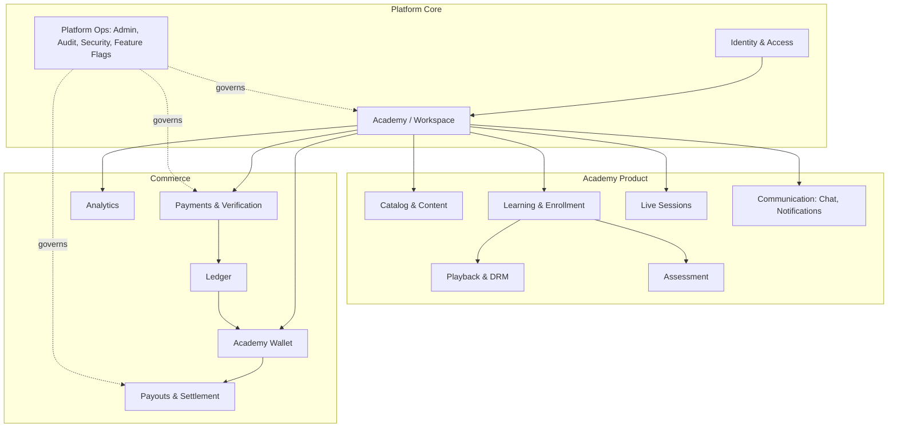
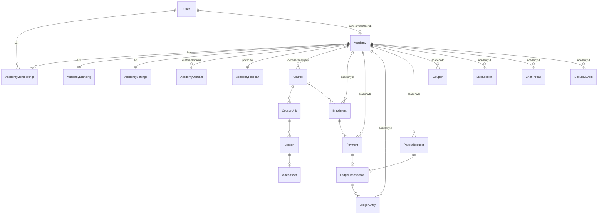
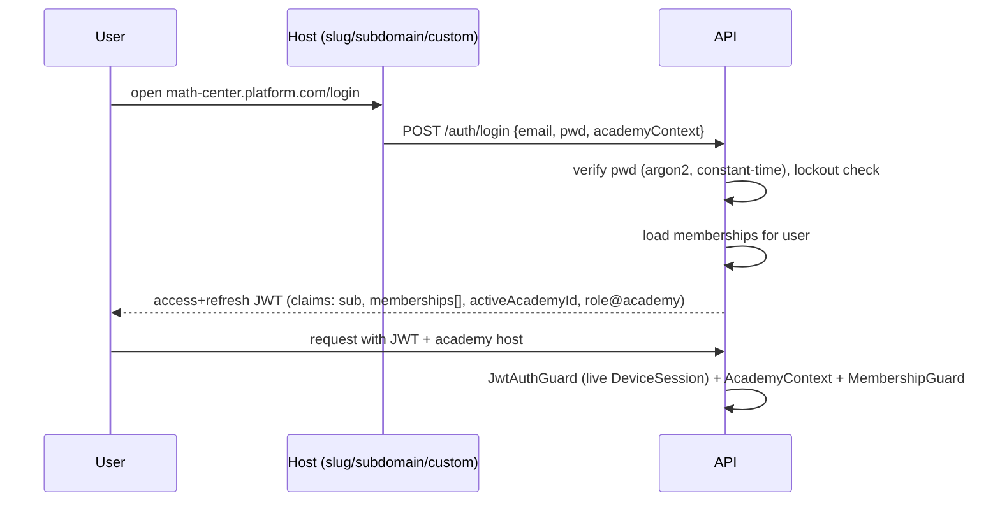
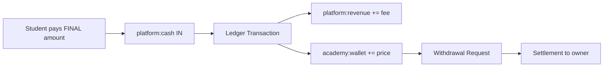
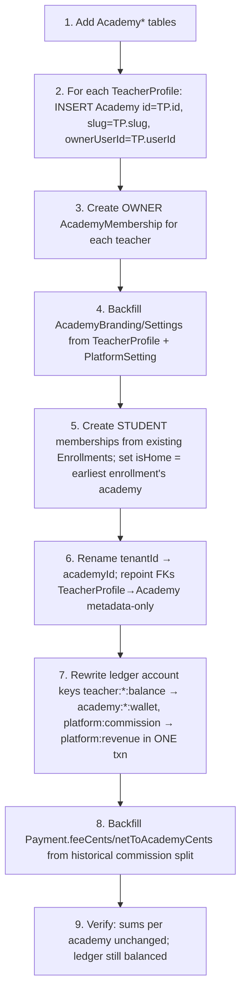

# Darsly — Academy Platform: Enterprise Architecture (v2.0)

> **Status:** Design proposal for review. **No code changed yet.**
> This document defines the refactor from a *teacher marketplace* to a
> *multi-academy SaaS platform* while preserving 100% of the existing security,
> payment integrity, playback protection, ledger, audit, and scalability work.
>
> Companion docs: [`SYSTEM.md`](./SYSTEM.md) (current system), [`DEPLOYMENT.md`](./DEPLOYMENT.md).

**Guiding principle:** *The platform is the infrastructure. The Academy is the product.*
The single most important technical decision below is that today's implicit tenant
(`TeacherProfile.id == tenantId`) becomes an explicit first-class aggregate root:
**`Academy.id == academyId`**. We migrate **identity-preservingly** (new `Academy.id`
= old `TeacherProfile.id`), so **not a single `tenantId` foreign-key value has to move**.

---

## ✅ Implementation Status (shipped to `main`)

Delivered incrementally, each phase additive/non-breaking, runtime-verified, and deployed:

| Phase | Delivered | Verified |
|---|---|---|
| **1** | `Academy` / `AcademyMembership` / `AcademyDomain` tables + enums; identity-preserving auto-backfill (SQL migration) | Academy.id ⇔ TeacherProfile.id; one home/user; idempotent |
| **2** | `AcademyContext`, `AcademyMembershipGuard`, `PermissionGuard`, capability catalog; `/me/academies`, `/academies/:slug`, `.../me`, `.../console` | owner full access · student 403 · cross-academy 404 · admin bypass |
| **3** | Academy-first catalog (`/academies/:slug/courses`, `/manage/courses`); JWT-tenant fallback resolver | non-owner **TEACHER staff** manages content (multi-teacher) |
| **4** | `AcademyProvider` + branded storefront at **`/a/:slug`** (logo/cover/color/courses) | builds, branded, isolated |
| **5** | Management API: `/academies/:slug/settings` (branding) + `/members` (staff invite/role/remove, owner-protected) | owner edits · student 403 · owner delete 403 |
| **6** | **Additive platform service fee** — `Payment.feeCents/netCents`, `fee.util`, quotes, ledger split | 450 EGP @20% → student 540 · academy 450 · platform 90 · ledger balanced |
| **7** | Academy **Console** (branding editor + team) + transparent fee breakdown in payment modal | builds; consumes verified APIs |

**Remaining (optional hardening, not blockers):** Postgres RLS as the isolation floor;
converting the legacy `/teacher/*` routes to membership guards (they work today via
`tenantId == academyId`); ledger account-string rename (numbers already correct);
subdomain/custom-domain DNS+TLS wiring (registry + resolver exist); owner transfer &
invitations to unregistered users. See §§20, 22, 24.

---

## 1) Business Vision

Darsly stops being a Udemy-style marketplace where students shop across teachers.
It becomes a **SaaS platform where each teacher owns a complete, isolated digital
academy** — the Shopify / Slack-workspace / Notion-workspace model.

| Dimension | Old (Marketplace) | New (Academy SaaS) |
|---|---|---|
| Product | Courses | The **Academy** (workspace) |
| Tenant | Teacher | **Academy** |
| Teacher | Owns courses | **Owns an Academy** (+ may invite staff) |
| Student | Joins the platform | **Joins an Academy** (has a Home Academy) |
| Branding | Platform-wide | **Per-academy** (logo, colors, domain) |
| Revenue | Commission taken *from* the teacher | **Additive platform service fee paid by the student** |
| Isolation | Query-scoped by `tenantId` | **Academy is the hard boundary** (context + guard + RLS) |

**Non-goals (explicit):** no teacher subscriptions/SaaS seat fees ever; no removal of
any existing capability; no big-bang rewrite. This is an **evolution of the tenant
model**, not a green-field rebuild.

---

## 2) Domain-Driven Design

### 2.1 Ubiquitous language
- **Platform** — the infrastructure operator (super admin, global wallet, fees).
- **Academy** — a tenant workspace; the aggregate root that owns everything.
- **Membership** — a `(User, Academy, Role)` relationship. A user may hold several.
- **Home Academy** — a student's primary academy (the one they registered into).
- **Roles inside an academy** — `OWNER`, `TEACHER`, `ASSISTANT`, `STUDENT`.
- **Wallet** — an academy's money position (available / pending).
- **Platform Service Fee** — the additive fee the *student* pays on top of the price.
- **Settlement / Withdrawal** — money leaving the academy wallet to the owner.
- **Enrollment, Lesson, Playback Session, Ledger Transaction** — unchanged meanings.

### 2.2 Aggregates (consistency boundaries)
- **Academy** (root): branding, settings, security policy, fee plan, domains, memberships.
- **Course** (root within an academy): units → lessons → assets.
- **Enrollment** (root): the student's access grant to a course.
- **Payment** (root): a single money-in event + its proof/verification.
- **LedgerTransaction** (root): a balanced, immutable set of entries.
- **PayoutRequest / Settlement** (root): money-out lifecycle.
- **PlaybackSession** (root): one player open, watermarked, telemetered.

Rule: **cross-aggregate consistency is eventual** (via notifications/audit), but
**money and access grants are strongly consistent** (single DB transaction), exactly
as today.

---

## 3) Bounded Contexts



**Context map notes**
- IAM is **shared kernel** (User, JWT). Everything downstream is **Academy-partitioned**.
- Commerce is a **conformist** of Academy (money always tagged with `academyId`).
- Playback/DRM stays an **anti-corruption boundary**: signed tokens never leak raw keys;
  academy context is validated but never trusted from the client.

Each context maps to a NestJS module (or module group). No context reads another's
tables directly — they call services.

---

## 4) Academy Domain Model

`Academy` becomes the primary business root. Fields consolidate the academy-level
concerns currently scattered on `TeacherProfile` + `PlatformSetting`.

```
Academy
  id                 (== old TeacherProfile.id after migration)
  slug               (globally unique; drives /slug and slug.platform.com)
  name
  status             ACTIVE | SUSPENDED | PENDING | ARCHIVED
  ownerUserId        (FK User) — the single accountable owner
  planId             (fee plan / feature tier)
  createdAt, updatedAt, deletedAt (soft delete)

AcademyBranding (1–1)
  academyId
  logoUrl, coverUrl, faviconUrl
  colorPrimary, colorAccent, theme (light|dark|auto)
  tagline, aboutHtml

AcademyDomain (1–many)
  academyId, hostname (unique), verifiedAt, isPrimary
  // custom domains: math-center.com → academy

AcademySettings (1–1, JSON-backed + typed columns for hot fields)
  academyId
  language, currency (default EGP)
  maxConcurrentSessions          (moved from TeacherProfile)
  requiresEnrollmentApproval     (academy default)
  security policy (accessWindowDays default, viewsCap default)
  payment settings (which PlatformPaymentAccounts, auto-verify on/off)

AcademyFeePlan  (revenue config — see §14)
  id, name, feeType (PERCENT|FIXED), feeValue, appliesTo (ONE_TIME|SUBSCRIPTION|ALL)
```

**Teacher's *personal* profile** (bio, subject, intro video, grades taught) is NOT the
academy anymore — it moves to the **membership** (`AcademyMembership.profile`) or a
slimmed `TeacherProfile` that references `academyId`. This cleanly separates
*"the workspace"* from *"a person who teaches in it."*

---

## 5) Member & Permission Model

### 5.1 Membership
```
AcademyMembership
  id
  userId        (FK User)
  academyId     (FK Academy)
  role          OWNER | TEACHER | ASSISTANT | STUDENT
  status        ACTIVE | INVITED | SUSPENDED | LEFT
  isHome        (Boolean) — true for the student's Home Academy (one per user)
  permissions   Json  — optional per-member overrides on top of the role
  invitedBy, joinedAt, createdAt, updatedAt
  @@unique([userId, academyId])       // one membership per user per academy
  @@index([academyId, role, status])
```
A **User** is global (identity), but **all authority is per-membership**. A person can
be OWNER of academy A, TEACHER in academy B, and STUDENT in academy C simultaneously —
different memberships, different permissions, zero leakage.

**Home Academy:** enforced by a partial unique index
`@@unique([userId]) where isHome = true` (one home per user). Student registration
creates the membership with `isHome = true`.

### 5.2 Permission matrix (default per role)
| Capability | OWNER | TEACHER | ASSISTANT | STUDENT |
|---|:--:|:--:|:--:|:--:|
| Academy settings / branding / domains | ✅ | — | — | — |
| Manage members (invite/remove staff) | ✅ | — | — | — |
| Manage fee plan / wallet / withdrawals | ✅ | — | — | — |
| Create/edit courses & content | ✅ | ✅ | — | — |
| Upload video / manage lessons | ✅ | ✅ | — | — |
| Author exams/assignments | ✅ | ✅ | ✅ (author) | — |
| Grade assignments / exams | ✅ | ✅ | ✅ | — |
| Manage students (approve, revoke) | ✅ | ✅ | ✅ | — |
| Verify payments | ✅ | ✅ | (configurable) | — |
| Moderate chat | ✅ | ✅ | ✅ | — |
| Schedule live sessions | ✅ | ✅ | ✅ | — |
| View analytics | ✅ | ✅ (own) | limited | — |
| Consume content (enrolled) | — | — | — | ✅ |

Permissions are **named capabilities** (e.g. `course.write`, `payment.verify`,
`member.manage`, `wallet.withdraw`), resolved from `role → default set` then
overlaid with `membership.permissions`. This is the extensibility seam: new roles or
fine-grained grants require **no schema change**.

---

## 6) Database Refactoring

### 6.1 New tables
`Academy`, `AcademyBranding`, `AcademyDomain`, `AcademySettings`, `AcademyFeePlan`,
`AcademyMembership`. (`PlatformSetting` stays for *platform-global* config only.)

### 6.2 The rename: `tenantId → academyId` (identity-preserving)
Every table that currently has `tenantId` (Course, VideoAsset, PlaybackSession,
SecurityEvent, Payment, PaymentEvent-provider, LedgerEntry, Coupon, PayoutMethodSaved,
PayoutRequest, Review, ChatThread, Announcement, LiveSession, Enrollment) gets its FK
**re-pointed from `TeacherProfile` to `Academy`**.

Because migration sets `Academy.id = TeacherProfile.id`, the existing column values are
already valid `Academy.id`s — so this is a **metadata-only** change (rename column +
swap FK target), **no row rewrites, no downtime**. See §19.

### 6.3 Constraints, indexes, cascades to review
- **Global unique:** `Academy.slug`, `AcademyDomain.hostname`.
- **Per-academy unique** (unchanged intent, now keyed by `academyId`):
  `Coupon(academyId, code)`, `Review(studentId, academyId, courseId)`.
- **Membership unique:** `(userId, academyId)`; **partial** unique home membership.
- **Enrollment** stays `(studentId, courseId)` — course already implies the academy.
- **Indexes:** every hot query path gets a leading `academyId` composite index
  (e.g. `Course(academyId, status)`, `Payment(academyId, status, createdAt)`,
  `Enrollment(academyId, status)`) — most already exist as `tenantId` composites and
  are simply renamed.
- **Cascade rules:** deleting an `Academy` is **soft-delete only** (never a hard
  cascade over money/audit). `AcademyMembership` cascades on `User`/`Academy` delete.
  `LedgerEntry`, `Payment`, `Invoice`, `AuditLog` remain `RESTRICT` — money and audit
  are never cascaded away.
- **Ledger account keys** change from `teacher:<tenantId>:balance` to
  `academy:<academyId>:wallet` (see §12). Old keys are migrated by string rewrite in
  a single transaction (§19).

---

## 7) Entity-Relationship Diagram (core)



Everything that was owned by a *Teacher* is now owned by an *Academy*; the Teacher is
reached through `AcademyMembership(role=OWNER|TEACHER)`.

---

## 8) Tenant Isolation Strategy

Defense in depth — three layers, none trusting the client:

1. **Academy Context resolution** (`AcademyContextInterceptor`): derive the active
   `academyId` from, in priority order — (a) verified custom domain / subdomain host,
   (b) `/academies/:slug/...` path or `X-Academy` header, (c) the JWT's active-academy
   claim. Resolve to a canonical `academyId` once per request; attach to the request
   context.
2. **Authorization** (`AcademyMembershipGuard`, §10): the caller **must** hold an
   `ACTIVE` membership in the resolved academy with a role/permission that allows the
   route. Cross-academy access ⇒ `404` (never reveal existence), same as today.
3. **Data layer**: Prisma middleware injects `academyId` into `where` for all
   academy-scoped models (extending today's soft-delete middleware), and — as the
   strongest guarantee — **Postgres Row-Level Security (RLS)** policies keyed on a
   per-connection `app.current_academy` GUC. Even a forgotten `where` clause cannot
   cross academies. (RLS is the recommended §24 upgrade; middleware ships first.)

Platform Admin (`SUPER_ADMIN`) bypasses academy scoping through an explicit,
audited "platform context" — never implicitly.

---

## 9) Authentication Flow

Identity stays global; **sessions become academy-aware**.



- **Student** registering on an academy host → creates User (if new) + `STUDENT`
  membership with `isHome=true`.
- **Owner/Teacher/Assistant** → log into their academy console (same host, role decides
  the shell).
- **Platform admin** → global console, no academy context.
- **JWT claims:** `sub`, `activeAcademyId`, and a compact `memberships` map
  (`academyId → role`) so the guard avoids a DB hit on the hot path; membership
  *status* is still re-validated against the DB the way `DeviceSession` is today.
- **Switching academy** = re-issue access token with a new `activeAcademyId` (no
  re-login). Refresh rotation, reuse detection, device sessions, lockout — **unchanged**.

---

## 10) Authorization Model

RBAC **inside every academy**. Global role alone is never sufficient (except platform
`SUPER_ADMIN`).

```
Request → JwtAuthGuard (authn + live session)
        → AcademyContext (resolve academyId)
        → AcademyMembershipGuard (ACTIVE membership in academyId?)
        → PermissionGuard (@RequirePermission('course.write'))
```

- `@RequirePermission('...')` decorator + `PermissionGuard` resolve the caller's
  effective permissions = `defaults[role] ∪ membership.permissions`.
- Ownership checks remain (a teacher edits only content in *their* academy; a student
  touches only *their* enrollment) but are now expressed as `academyId` + permission,
  not `tenantId` string equality.
- Service methods receive an `AcademyContext { academyId, userId, role, can(perm) }`
  object instead of a bare `tenantId`, making authorization explicit and testable.

---

## 11) Payment Architecture (additive service fee)

**The teacher never sees money "deducted."** The student pays a transparent platform
service fee **on top** of the academy's price.

```
Academy price (teacher receivable):  100 EGP
Platform service fee (fee plan):     +20 EGP
────────────────────────────────────────────
Student pays (final):                120 EGP
Academy wallet receives:             100 EGP
Platform revenue receives:            20 EGP
```

Subscription example: price 300 → fee 30 → student pays 330 → wallet +300, revenue +30.

**Flow (manual proof + auto-verify preserved):**


Quote endpoint returns the **breakdown** `{ priceCents, feeCents, totalCents }`; the
`Payment.amountCents` records the **total paid**, plus new `feeCents` and
`netToAcademyCents` columns so every payment is self-describing and auditable.
Manual proof-of-payment, Android listener matching, and `updateMany(status=PENDING)`
double-verify guard all stay exactly as they are — only the **split math** changes
(additive fee instead of subtractive commission).

---

## 12) Ledger Architecture

Double-entry, atomic, idempotent, immutable — **unchanged guarantees**, new taxonomy.

**Account naming**
```
platform:cash                 — money the platform physically holds
platform:revenue              — platform earnings (service fees)   [was platform:commission]
academy:<academyId>:wallet    — an academy's withdrawable balance  [was teacher:<id>:balance]
academy:<academyId>:receivable— (optional) pending/held funds before clearing
```

**Purchase** (student pays total = price + fee):
| Account | Direction | Amount |
|---|---|---|
| `platform:cash` | DEBIT | total |
| `platform:revenue` | CREDIT | fee |
| `academy:<id>:wallet` | CREDIT | price |

Σ DEBIT (total) = Σ CREDIT (fee + price). Balanced. Idempotent via
`LedgerTransaction.paymentId @unique`.

**Withdrawal / Settlement** (money out to owner):
| Account | Direction | Amount |
|---|---|---|
| `academy:<id>:wallet` | DEBIT | amount |
| `platform:cash` | CREDIT | amount |

**Refund** = a new reversing transaction (never edit entries), tagged with the original
`paymentId` + `type=ADJUSTMENT`. Academy wallet balance =
`Σ CREDIT − Σ DEBIT` on its wallet account — same formula, new key.

---

## 13) Wallet Architecture

Each Academy has **one wallet** (a ledger *view*, not a mutable balance field — the
ledger remains the source of truth):

- **Available balance** = wallet CREDITs − DEBITs for *cleared* payments.
- **Pending balance** = value of `PENDING` payments (submitted, not yet verified) +
  any settlement hold window.
- **Transactions** = ledger entries on `academy:<id>:wallet`.
- **Withdrawals** = `PayoutRequest` history (Serializable-guarded, re-checked at
  settlement — unchanged).
- **Invoices** = per-payment `DRS-INV-YYYY-NNNNNN` (existing).
- **Statements** = date-ranged ledger export (new read model).
- **Revenue analytics** = aggregates over wallet CREDITs by period/course.

The wallet is exposed at the **academy** level (`/academy/wallet`), owned by the OWNER
role; teachers/assistants see it only if granted `wallet.read`.

---

## 14) Revenue Model

**Only source of platform revenue: the Platform Service Fee.** No teacher
subscriptions, ever.

- `AcademyFeePlan` defines the fee: `feeType = PERCENT | FIXED`, `feeValue`, `appliesTo`.
- A platform default plan (e.g. 20%) applies unless the admin assigns a custom plan to
  an academy (enterprise deals, promos, tiered pricing).
- Fee is computed at **quote time** and **frozen onto the Payment** (`feeCents`), so
  later plan changes never rewrite historical money.
- Future levers without schema change: minimum/maximum fee caps, per-category fees,
  promotional 0-fee windows, volume tiers — all expressed as fee-plan data.

This model is **teacher-friendly by construction**: the number the teacher sets is the
number they receive. Platform value is transparent to the student as a line item.

---

## 15) API Refactoring Plan

**Namespace becomes academy-first**, with backward-compatible aliases during rollout.

| Today | New (academy-aware) |
|---|---|
| `/teacher/*` (courses, wallet, payments…) | `/academy/*` (context = active academy) |
| `/teachers`, `/teachers/:slug` (discovery) | `/academies`, `/academies/:slug` (+ keep teacher discovery) |
| `tenantId` from JWT `teacherProfile.id` | `academyId` from `AcademyContext` |
| `/admin/*` | unchanged surface, now manages academies |

- **Resolution:** academy comes from host/subdomain (preferred) or path; the JSON
  bodies don't carry `academyId` (anti-forgery — it's server-resolved + guarded).
- **Versioning:** keep `/api/v1`; introduce `/api/v2` only if breaking clients; prefer
  **additive** changes (new fields like `feeCents`) so v1 clients keep working through
  the migration window.
- **Contracts:** DTOs gain nothing student-forgeable; the fee breakdown is
  server-authoritative.

---

## 16) Backend Refactoring Plan (phased, non-breaking)

**New modules:** `AcademyModule` (CRUD, branding, domains, settings, fee plan),
`MembershipModule` (invite/accept/roles/permissions), `AcademyContextModule`
(interceptor + guards).

**Refactor pattern per existing module** (courses, payments, ledger, payouts, live,
chat, assessments, security, analytics):
1. Replace `tenantId: string` params with an injected `AcademyContext`.
2. Swap `@Roles(TEACHER)` for `@RequirePermission('...')`.
3. Point Prisma queries at `academyId` (mechanical rename).
4. Keep every existing invariant (atomic verify, Serializable payouts, soft-delete
   access checks, watermark/DRM, listener key) **byte-for-byte** — only the scoping key
   changes.

**Rollout order (safe):**
```
1. Add Academy/Membership tables + migration backfill (dual-read, no behavior change)
2. Introduce AcademyContext + guards behind a feature flag
3. Migrate module-by-module to academyId (courses → content → commerce → comms)
4. Flip default routes to /academy/*; keep /teacher/* as aliases
5. Enable RLS; remove aliases in a later minor version
```
Each phase is independently deployable and reversible.

---

## 17) Frontend Refactoring Plan

**Academy-first shell.** The app boots an **AcademyProvider** that resolves the active
academy (from host/slug), fetches its branding, and themes the entire UI from academy
tokens (logo, colors) layered on the existing "Ink & Paper" design system.

- **Two app surfaces:** the **Student App** (academy-branded, private, no marketplace
  chrome once inside) and the **Academy Console** (owner/teacher/assistant), gated by
  membership role.
- **Routing:** subdomain/custom-domain aware; `platform.com/:slug` and
  `slug.platform.com` both resolve to the same academy. The public
  `platform.com` keeps a lightweight **Discovery** (featured academies, search,
  categories) — but crossing into an academy switches to the private, branded shell.
- **Auth screens** become academy-aware (show the academy's logo/name).
- **Navigation/dashboard** are driven by role-in-academy + academy feature flags.
- **State:** `stores/auth.ts` gains `activeAcademyId` + `memberships`; an academy-switch
  control re-issues the token. Branding is cached (see §21). All current pages/components
  are reused — they read `academyId` from context instead of assuming a single teacher.

---

## 18) Admin Panel (Platform) Changes

Platform admin manages the **infrastructure**, not content:
- **Academies:** list, approve, suspend, archive; assign fee plans; impersonate (audited).
- **Owners & members:** promote/transfer ownership; resolve disputes.
- **Platform wallet & revenue:** `platform:cash` and `platform:revenue` totals,
  settlement runs.
- **Payment accounts** (receiving InstaPay/Vodafone/bank) + **payment events**.
- **Withdrawals/settlements:** approve & complete (Serializable, balance re-check).
- **Security events, audit logs, platform analytics.**
- **Global settings & feature flags** (per-academy or global rollout toggles).

Existing admin pages are retargeted from "teachers" to "academies" (an academy *has* an
owner), reusing current tables/flows.

---

## 19) Migration Strategy (zero-downtime, reversible)

**Core trick — identity-preserving academy creation:** create one `Academy` per
`TeacherProfile` with **the same `id`**, so all `tenantId` FK values are already valid
`Academy.id`s and never move.



**Data-integrity checks (gate before flip):**
- Every academy's wallet balance after key-rewrite == old teacher balance (penny-exact).
- `Σ platform:revenue == Σ old platform:commission`.
- Row counts of academy-scoped tables unchanged; every row has a valid `academyId`.
- Every teacher has exactly one OWNER membership; every enrolled student has ≥1
  membership and exactly one `isHome`.

**Migration is P3009-safe:** additive columns are nullable-then-backfilled or
default-then-drop (per `prisma-migration-safety`), and each step is its own migration so
the self-healing `start.sh` can recover. **Reversibility:** steps 1–5 are pure additions;
the rename (6) and key-rewrite (7) ship with a tested down-migration.

---

## 20) Security Review

**Preserved unchanged:** JWT + refresh rotation + reuse detection, live `DeviceSession`
revocation, argon2 + constant-time login + lockout, single-use hashed reset tokens,
global ThrottlerGuard, ValidationPipe, HLS AES-128 + signed short-lived tokens +
per-session key gating + watermarking + leak-trace, playback session ownership,
manual-proof + listener `timingSafeEqual` key, atomic verify + Serializable payouts +
unique ledger guards, soft-delete access checks, config fail-fast, audit logs.

**New surfaces + mitigations:**
| Risk | Mitigation |
|---|---|
| Cross-academy data leak | AcademyContext + MembershipGuard + Prisma academyId filter + **Postgres RLS** (belt & suspenders) |
| Subdomain/host spoofing to assume an academy | Resolve academy from **verified** `AcademyDomain` only; unverified hosts fall back to slug path; never trust `X-Academy` without a membership check |
| Membership escalation (student → staff) | Role/permission changes require `member.manage`, are audited, and never self-serviceable |
| JWT carries stale membership | Membership *status* re-checked against DB on sensitive routes (like DeviceSession today); academy-switch re-issues token |
| Fee tampering | Fee computed server-side at quote, frozen on Payment; client never sends fee/academyId |
| Owner transfer / impersonation | Explicit, audited platform actions; impersonation logged in `AuditLog` with actor + target |
| Money crossing academies | Ledger entries carry `academyId`; wallet queries are academy-scoped; RLS enforced on ledger reads |

---

## 21) Performance Considerations

- **Indexing:** every academy-scoped hot path leads with `academyId` (composite
  indexes; mostly renamed from existing `tenantId` composites → no new cost).
- **Academy context caching:** resolve `host/slug → academyId` and **branding/settings**
  from a short-TTL cache (in-memory LRU now, Redis later) — avoids a DB hit per request.
- **JWT-embedded memberships:** the common authz path is claim-based (no DB round-trip);
  DB is consulted only for status-sensitive actions.
- **Read models:** wallet statements/analytics use SQL aggregation (`groupBy` /
  `date_trunc`), not row materialization in Node.
- **Frontend:** branding is fetched once and cached; the existing code-split +
  vendor-chunk + LazyMotion + PWA cache strategy is unchanged (28KB gz app shell).
- **RLS overhead:** negligible with indexed policies; the `app.current_academy` GUC is
  set once per pooled connection checkout.

---

## 22) Future Scalability (→ 100k academies, millions of students)

- **Shared-DB, shared-schema, `academyId` + RLS** is the recommended model to
  hundreds of thousands of academies — cheapest to operate, strong isolation via RLS.
  (Schema-per-tenant is explicitly *not* recommended at this scale — migration and
  connection overhead explode.)
- **Horizontal read scaling:** read replicas for analytics/discovery; primary for money.
- **Sharding seam:** because `academyId` tags every row, the platform can later shard
  by `academyId` hash **without another domain redesign** — the boundary already exists.
- **Custom domains at scale:** wildcard TLS + a `hostname → academyId` edge lookup
  (cached); `AcademyDomain` is the registry.
- **Plans/feature flags:** `AcademyFeePlan` + flag service enable tiered products
  (Free/Pro/Enterprise) with zero core changes.
- **Event-driven growth:** an **outbox** on money/enrollment events feeds analytics,
  emails, and future webhooks without coupling contexts.

---

## 23) Risks

| Risk | Severity | Mitigation |
|---|---|---|
| `tenantId → academyId` rename blast radius (many files/queries) | High | Identity-preserving migration (no data move) + module-by-module phased rollout behind flags + full test pass per phase |
| Ledger key-rewrite corrupts balances | Critical | Single transaction, penny-exact pre/post assertions, tested down-migration, dry-run on a prod snapshot |
| Fee-model change confuses existing teachers/students | Medium | Historical payments keep frozen splits; clear UI line-item; comms + docs |
| RLS misconfiguration blocks legitimate access | Medium | Ship middleware-filtering first; enable RLS in a later phase with staging soak + explicit platform-admin bypass policy |
| Home-Academy ambiguity for multi-enrolled students | Low | Deterministic backfill (earliest enrollment) + user can re-designate home |
| Subdomain/custom-domain security | Medium | Only verified domains resolve; membership still required |
| Scope creep (turning into a rewrite) | High | This doc bounds it to a tenant-model evolution; existing modules are refactored, not replaced |

---

## 24) Suggested Improvements

1. **Postgres RLS** as the hard isolation floor (recommended before public multi-academy launch).
2. **Transactional outbox** for domain events (money, enrollment, certificate) → reliable analytics/webhooks/emails.
3. **Permission service** with named capabilities + policy tests (already seeded by §5).
4. **Feature-flag service** (per-academy/plan) for staged rollout and tiering.
5. **Billing/plan context** as a first-class module (fee plans, invoices, statements, future gateways: Paymob/Fawry webhooks on the *same* `payment-events` endpoint).
6. **Read-model separation** (CQRS-lite) for analytics/discovery to protect the money primary.
7. **Academy onboarding wizard** (branding, first course, receiving account) — productizes the "create your academy" moment.
8. **Idempotency keys** on all money-mutating endpoints (payments/withdrawals) for safe client retries.
9. **Observability:** per-academy metrics + audit-driven security dashboards.
10. **Data residency / export** per academy (GDPR-style) — trivial because everything is `academyId`-tagged.

---

## Appendix A — What physically changes vs. stays

| Stays identical | Changes |
|---|---|
| DRM/HLS, watermarking, signed URLs, playback sessions | Scoping key `tenantId → academyId` |
| Payment verification, Android listener, `updateMany` guard | Split math: additive fee, not commission |
| Double-entry ledger mechanics, Serializable payouts | Account names + `Payment.feeCents/netToAcademyCents` |
| JWT, refresh rotation, lockout, reset tokens, throttling | JWT gains `activeAcademyId` + memberships |
| Soft-delete, audit logs, security events | New Academy/Membership/Branding/Domain/FeePlan tables |
| Frontend design system, code-split, PWA, motion | Academy-branded shell + subdomain routing + role-in-academy nav |

**Bottom line:** this is a *tenant-model promotion* (implicit teacher-tenant →
explicit academy aggregate) executed with an identity-preserving migration, delivering
the Shopify/Slack "workspace" product while keeping every security, money, and
playback guarantee already in place.
