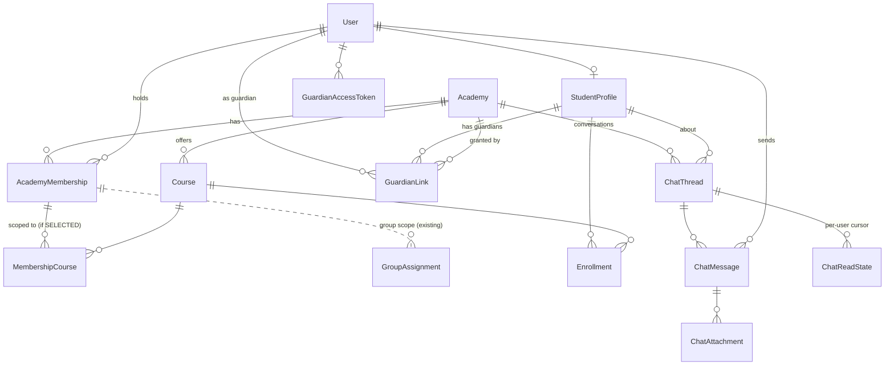

# Student Care: Assistants, Guardians & Messaging — Architecture Plan

Status: written 2026-09-28 against `main` @ `e23c7c6` as a proposal. Built since:
Phase 0 (0A + 0B messenger, messenger polish), Phase 1 (assistant authorization)
and Phase 2 (Student Care, team inbox, guardians, group chat) — see the "as built"
sections below for where the build departs from this text. Guardian payments and
guardians in class groups are not built. Every "exists today" claim in section A
was read from the code at that commit; file paths are given so each can be checked.

---

## Phase 2 — as built: Student Care, Team Inbox, Guardians, Group Chat

**One conversation model, three kinds** (`ChatThread.kind`):

| Kind | Learner side | Staff side | Identity (`dedupeKey`, server-derived, UNIQUE) |
|---|---|---|---|
| DIRECT | the student, or one guardian of them | one named staff member | `<academy>\|<student>\|S\|U:<staff>` · `<academy>\|<student>\|G:<guardian>\|U:<staff>` |
| TEAM | the student, or one guardian of them | every staff member with `message.inbox` whose scope includes the student | `<academy>\|<student>\|S\|TEAM` · `<academy>\|<student>\|G:<guardian>\|TEAM` |
| GROUP | the active students of an existing Group | staff with `message.group` on that group (owner: every group; others: `GroupAssignment`) | `<academy>\|GROUP:<group>` + partial unique index `(groupId) WHERE kind='GROUP'` |

A guardian's conversations are never the child's: the learner segment differs, so
they are different rows; the child cannot open them and vice versa.

**ConversationPolicy** (`chat/conversation-policy.ts`) is the single place that
decides, for every kind: `viewer(user, thread)` → `{side, canSend, canManage,
historyFrom}` or null, `recipients(thread)` for realtime and notifications, and
`senderOf` (frozen kind/title: `Ahmed · Student Support`, `GUARDIAN · FATHER`).
ChatService, uploads, reactions, deletion, the socket gateway (via
`canAccessThread`) and Student 360 all ask it; nothing else branches on kind for
authorization. Everything is re-read per request — a revoked guardian link, a lost
course, a removed group member or a lost capability bites on the next request.

**Group chat (existing Groups are the only membership):**
- A Group is an academy cohort with no course link; its members are
  `GroupMembership` (soft-deleted on removal) and its staff are `GroupAssignment`.
  The chat keeps no participant list — access is derived per request.
- Enable/disable/mode from the group page (`group.manage` + the group's own scope);
  enabling is `INSERT … ON CONFLICT` on the derived key (idempotent, concurrent-safe).
  Disabling sets `archivedAt` (students lose access; staff read-only; history kept).
- Modes: OPEN (everyone writes) and ANNOUNCEMENTS (staff write, students read) —
  enforced as `canSend`, which also gates uploads and voice.
- History boundary: a student reads from `GroupMembership.addedAt`. Re-adding a
  previously removed student now resets `addedAt` (a new membership), so they do not
  regain what was said while they were out; active members are untouched. The
  boundary applies to pages, `around`/cursors, quotes (shown "unavailable"),
  reactions, hide/delete and unread counts.
- Read state in groups is a count (`seenCount` on the sender's own messages, from
  the existing per-person cursors) — never avatars under every message.
- Guardians are not in class groups (V1).

**Team inbox:** filters All / Unread / Mine / Unassigned / Resolved; claim is a
conditional update (two claims cannot both win); reassign — own conversation or
`message.oversee`; resolve — assignee, anyone while unassigned, or oversee; a
learner-side message reopens the same conversation. Notifications: the assignee if
assigned, otherwise the authorized team; staff replies notify only the learner.

**Guardians:** `Guardian` (a `GUARDIAN` user) ↔ `GuardianLink` (academy-scoped,
ACTIVE/REVOKED) ↔ `StudentProfile`. Access links: 32-byte tokens, sha256 stored,
30-day expiry, rotation revokes previous tokens, `lastUsedAt`/`useCount`, rate-limited
exchange at `/auth/guardian/consume`; the URL is `/g#<token>` (fragment, removed from
the address bar on load). Revoking a guardian's last link revokes their
DeviceSessions. A GUARDIAN token is refused on every route not marked
`@GuardianAllowed` (dashboard, chat, notifications, own session). A phone that
belongs to a non-guardian account is refused (V1: one role per account).

**Capabilities added:** `message.inbox`, `message.oversee` (owner only, outside the
assistant ceiling), `message.group`.

**Student 360** (`/staff/students/:id?academy=`): overview (courses, progress,
attendance, groups), progress, groups (with their chats), guardians
(`guardian.manage`), payments (`payment.view`, per student, academy-scoped), and the
conversations about the student the viewer may open — each section through
StaffScopeService; the group section through the group scope.

**Notifications:** one unread notification per conversation per person
(updated, not stacked); no toast or OS notification for the conversation that is
open on screen.

## Phase 1 — as built (deviations from the proposal)

The proposal below is kept as written; these are the places the build chose
differently, and why.

1. **Student scope is course-only.** A student is in an assistant's scope when
   they have an enrollment (any status) in one of the assistant's courses —
   `StaffScopeService` (`academy/staff-scope.service.ts`). The proposal also
   admitted students of *assigned groups*; that path is left to the group
   routes' own `GroupAssignment` scoping, so "which students can Ahmed see"
   has one answer that the owner can read off the Team screen.
2. **Academy-wide capabilities switch off for a SELECTED assistant.**
   `ACADEMY_WIDE` in `permissions.ts` (`student.manage`, `live.manage`,
   `analytics.read`, `assessment.author`, `chat.moderate`) guards routes that
   see the whole academy. Rather than scope-check each of those routes, an
   assistant limited to some courses simply does not hold them. Legacy
   assistants (backfilled, `courseScope = ALL`) keep them unchanged.
3. **Assistants never handle money.** `ASSISTANT_CEILING` has `payment.view`
   (new, read-only, in-scope courses only, `GET /staff/payments`) but not
   `payment.verify` / `payment.collect` / `wallet.*`. The Operations preset
   is `student.view, message.reply, schedule.manage, attendance.mark,
   payment.view`.
4. **`message.inbox` / `message.oversee` are not introduced yet** — they only
   mean something with the Phase 2 shared inbox. Phase 1 adds
   `message.reply`: an assistant talks with students of their courses in
   *their own* conversations (`staffUserId` = the assistant). The teacher does
   not see those conversations (no oversight until Phase 2), and an assistant
   does not see the teacher's.
5. **Assistant conversations' `tenantId`** is the author of the in-scope course
   that connects the pair (the FK must point at a TeacherProfile); the
   teacher's `acceptsStudentMessages` switch closes assistant conversations too.
6. **One Team page for both kinds of academy**: `/teacher/team`
   (`TEACHER` and `STAFF` owners), not a reuse of `CenterMembersPage`.
7. **The assistant's workspace is `/staff`** (courses, students, student
   progress, `/staff/grading`, `/staff/payments`) instead of a Student 360
   page under `/teacher`. A STAFF account that owns nothing lands there.
8. **Grading** goes through `GradingService` with a Course filter instead of a
   tenantId; `/staff/grading/*` passes the member's scope, and a mark records
   `gradedBy` (new column on `AssignmentSubmission`; `QuizAttempt.gradedBy`
   already existed). Fixing an answer key and dismissing a report stay with
   the author.
9. **The grant travels on the invitation link** (`AcademyInvitationLink.grant`,
   JSON) and is re-validated at redemption; a link without one grants nothing.

---

## 0. Summary for the reviewer

Darsly already has most of the skeleton this feature needs. It does **not**
need a new permission system, a new realtime stack, a new storage layer or a
new session mechanism. It needs:

1. **Assistants.** The `ASSISTANT` academy role already exists at the academy
   level (`AcademyMembership`), not the course level. There is no
   `CourseAssistant` table to migrate. What's missing is **course scope**, a
   **display title**, **explicit (subtractable) permissions**, and **letting a
   non-teacher account be an assistant**. Today every assistant is forced to be
   an auto-approved `TEACHER` with a phantom `TeacherProfile`.
2. **Messaging.** Evolve `ChatThread`/`ChatMessage` in place; don't replace
   them. Four things are wrong with them today:
   - they're keyed to a teacher profile, not an academy;
   - only the owner teacher can see them;
   - there's no unique constraint, so the race you describe in §23 is a
     **live bug today**;
   - `getMessages` returns the *oldest* 200 messages, so a long conversation
     never shows its newest messages.
3. **Guardians.** Add a `GUARDIAN` user role modelled on the existing `GUEST`
   role, which already does "passwordless secret → narrowly scoped token,
   denied everywhere else by the global guard". Add a many-to-many
   `GuardianLink` and hashed, revocable access links. Revocation is immediate
   for free, because `JwtAuthGuard` checks the device session on every request.
4. **One hard external constraint.** There is **no SMS provider**. `OtpService`
   throws outside dev mode, and memory confirms OTP login is disabled.
   "Send parent access by SMS" and "OTP escalation for sensitive actions" can't
   ship as written. V1 delivers the link by **WhatsApp share / copy link**, and
   guardians get **read-only** finance. The decision is in §M.

Four places where I recommend something simpler than, or different from, the brief:

| Brief asks for | Recommendation | Why |
|---|---|---|
| One conversation per course/student, or per teacher/student | **One conversation per (academy, student, audience, staff target)**. Course/lesson context goes on the *message* | The codebase already made this call (`ChatMessage.lessonId`; the comment in `chat.service.ts:271`), and splitting threads by course confused students before |
| Full ticketing states UNASSIGNED / ASSIGNED / RESOLVED | **`assigneeUserId` (nullable) + `resolvedAt`**. "Unassigned" is derived, not stored | Same UX, one fewer state machine, no invalid combinations |
| SENT / DELIVERED / READ | **sent + per-user read cursor** ("Seen" derived) | DELIVERED needs device acks for no real user value here |
| Wallet on Student 360 and on the guardian view | **Don't show the wallet to academy staff at all; guardians don't see it in V1** | The wallet is a *platform-wide* ledger account (`student:<id>:wallet`, `ledger.service.ts:129`). Showing it to academy A leaks what the student spent at academy B |

---

## A. Current State

### A.1 Roles & tenancy

| Concept | Where | Notes |
|---|---|---|
| Global `Role` | `apps/api/prisma/schema.prisma:17` | `SUPER_ADMIN, TEACHER, STUDENT, STAFF, GUEST` |
| Tenant | `Academy` (`schema.prisma:183`) | `Academy.id == TeacherProfile.id` for PERSONAL academies (identity-preserving migration), so every legacy `tenantId` is a valid `academyId`. `CENTER` academies are organisations with several teachers |
| In-academy authority | `AcademyMembership` (`schema.prisma:337`) | `(userId, academyId)` unique; `role: OWNER/TEACHER/ASSISTANT/STUDENT`; `status: INVITED/ACTIVE/SUSPENDED/LEFT`; `permissions Json` = additive capability overrides |
| Group scope | `Group`, `GroupMembership`, `GroupAssignment(role TEACHER/ASSISTANT)` | Resource-level scope: a non-owner acts only on groups they're assigned to (`academy-ops/academy-ops-access.service.ts`) |
| Course authorship | `Course.tenantId` (author) + `Course.academyId` (organisation) | `CourseScope { academyId, authorTenantId, manageAll }` built in `courses/teacher-courses.controller.ts:69` |

### A.2 Authorization (already capability-based)

- `apps/api/src/academy/permissions.ts`: `CAPABILITIES` (18 named ones),
  `ROLE_PERMISSIONS` defaults per role, `OWNER_ONLY` ceiling, and
  `permissionsFor(role, overrides)` = defaults ∪ overrides (overrides can only
  **add**, never remove).
- `academy/academy-context.ts`: `AcademyContext { academyId, userId, role, can(cap) }`.
- `academy/guards/academy-membership.guard.ts` resolves the academy (verified
  host → `X-Academy-Id` → slug → JWT tenant fallback) and calls
  `AcademyService.buildContext()`. That rebuilds the context **from the DB on
  every request**, checking membership ACTIVE, user active, academy not
  suspended, and teacher still approved. **Permission changes and removals are
  already immediate** (your Flow M).
- `@AcademyStaff('cap')` (`academy/academy-staff.decorator.ts`) = membership
  guard + `PermissionGuard`. It's used in about 17 controllers.
- **Legacy path still alive:** `@Roles(TEACHER)` + `user.tenantId` on
  assessments (quizzes, grading, assignments), playback, uploads, challenges,
  and parts of live. Those routes ignore academy membership entirely.
- `chat.moderate` is granted to TEACHER and ASSISTANT but **enforced nowhere**.
- The web sends `X-Academy-Id` from `stores/staffAcademy.ts` as a *selector*.
  The server decides authority.

### A.3 Assistants today

- Assistants are academy-level `AcademyMembership(role=ASSISTANT)` rows.
  **There is no course-level assistant concept and no `CourseAssistant` table.**
- Added via `POST /academies/:slug/members` (existing user by email, starts
  INVITED, accepted by the invitee) or via single-use hashed
  `AcademyInvitationLink`s (`academy/invitation-links.*`).
- `assertStaffEligible()` (`permissions.ts`) requires an ASSISTANT to be an
  **approved TEACHER account**. `AuthService.registerViaInvitation()`
  (`auth/auth.service.ts:184-235`) therefore creates every invited assistant as
  `Role.TEACHER` with an **auto-APPROVED `TeacherProfile`**, a slug and its own
  `tenantId`. An assistant is a teacher identity in everything but name.
- The ASSISTANT defaults include `student.manage` (approve/revoke enrollments),
  `assessment.author`, `live.manage` and `schedule.manage`. That's far more than a
  "student support" person should have, and it **can't be narrowed**, because
  overrides only add.
- Assistants see **no conversations**. `ChatService.canAccessThread` compares
  `thread.tenantId === user.tenantId`, and an assistant's `tenantId` is their own
  phantom profile.
- UI: `pages/center/CenterMembersPage.tsx` (Centers) and the members panel
  in `pages/academy/AcademyConsolePage.tsx`. A PERSONAL-academy teacher has
  **no "Team" page** in the teacher console (`/teacher/*` routes, `App.tsx`).

### A.4 Students & courses

- `StudentProfile` is **platform-wide**. The same student can study at several academies.
- `Enrollment(studentId, courseId, tenantId, academyId, status, expiresAt)`:
  `@@unique([studentId, courseId])`, indexed `(academyId, status)`.
- Roster: `GET /teacher/roster` (`academy-ops/roster.service.ts`) is
  academy-wide for any `student.manage` holder, offset-paginated, searchable.
  It has **no course scoping**.
- "Needs attention" (`academy-ops/needs-attention.service.ts`) already derives
  repeated absences, inactive students and stale groups, group-scoped for
  non-owners. This is a good seed for Student 360 and for guardian warnings.
- Progress sources: `LessonProgress(completedAt, watchedPct)`,
  `QuizAttempt(submittedAt, scorePct, passed)`,
  `AssignmentSubmission(createdAt, score)`, `AttendanceRecord(status)`,
  `LiveBooking` + `LiveAttendance`, `StudentProfile.weeklyGoalLessons`,
  `lastActivityDate`, and `GamificationEvent` (an idempotent per-student event
  log of LESSON_COMPLETED / QUIZ_COMPLETED / UNIT_COMPLETED…).

### A.5 Chat today

| Piece | Where | Behaviour |
|---|---|---|
| Schema | `ChatThread` (`schema.prisma:2351`), `ChatMessage` (`:2383`) | Thread = `(tenantId → TeacherProfile, studentId)`, type DM/QA, per-side "clear" markers. Message has `readAt`, `replyToId`, `lessonId + videoTimestampSec`, and a private voice note (`audioKey`) |
| Service | `apps/api/src/chat/chat.service.ts` | Role-branching (`user.role === TEACHER`). Student may start a thread only with an ACTIVE enrollment; teacher with any enrollment. `acceptsStudentMessages` kill switch on TeacherProfile |
| REST | `chat/chat.controller.ts` | `GET /chat/threads`, `POST /chat/threads` (open), `DELETE /chat/threads/:id` (clear), `GET /chat/threads/:id/messages`, `POST /chat/messages`, voice upload + range-streamed playback |
| Realtime | `realtime/chat.gateway.ts`, `realtime.service.ts`, `redis/redis-io.adapter.ts` | Socket.IO, JWT on handshake, expiry re-checked per event, `user:<id>` and `thread:<id>` rooms, Redis adapter when `REDIS_URL` is set. Events: message, thread-updated, typing, mark-read |
| Web | `apps/web/src/pages/MessagesPage.tsx` (757 lines) | Two-pane list/conversation, `?t=<threadId>`, socket + **polling fallback** (list every 10s, open thread every 5s), replies, voice notes, typing echo |
| Deep link | `pages/teacher/TeacherEnrollmentsPage.tsx:132` | "Message" does `POST /chat/threads`, which **creates an empty thread** before navigating |

Defects found while reading. They matter for the redesign, and a few matter now:

1. **Duplicate-conversation race (§23) exists today.** `resolveThread` does
   `findFirst` then `create`, and `ChatThread` has no unique constraint.
2. **Newest messages invisible after 200.** `getMessages` uses
   `orderBy: createdAt asc, take: 200`.
3. **N+1 and no pagination on the list.** `listThreads` loads every thread,
   then runs one `count` per thread for unread.
4. **Per-message `readAt`** means "read by *the* other side". That's meaningless
   once several staff share a conversation.
5. **Chat is tenant-keyed, not academy-keyed.** Center teachers and all
   assistants are locked out.
6. A student sending to a teacher whose messaging is off gets
   `MESSAGING_CLOSED`, but the list query already hides those threads. That's
   fine, and the behaviour should be kept.

### A.6 Media / storage

- `storage/storage.provider.ts`: backend-agnostic `put/getStream(range)/delete/deletePrefix`.
  Local disk in dev, S3/R2 in prod (cut over 2026-09-16). **All objects are private.**
- `storage/proof-storage.service.ts` already issues **short-lived signed URLs**
  (`open(key, exp, token)`) for payment proofs. That's the right primitive for
  `` previews, which can't send a bearer header.
- `common/file-signature.ts`: magic-byte check (`assertFileMatchesMime`) so
  the client's MIME string isn't trusted. `common/image.util.ts` refuses
  mislabelled HEIF.
- Lesson attachments (`Attachment`, `uploads/uploads.controller.ts`): 50 MB,
  MIME allowlist, served with `Content-Disposition: attachment` + `nosniff`.
- Voice notes: private key `chat-voice/<threadId>/<messageId>`, streamed through
  a route that re-checks thread access. This is the precedent for chat attachments.

### A.7 Authentication

- Access JWT `{ sub, role, tenantId?, sessionId, liveSessionId? }`
  (`packages/shared-types/src/index.ts:34`), refresh token bound to a
  `DeviceSession` row. `JwtAuthGuard` rejects a token whose session is revoked,
  **on every request**.
- **`GUEST` precedent:** a user with no credentials, issued a short-lived token
  from a purchase secret. `JwtAuthGuard.assertGuestScope` refuses it everywhere
  except `@GuestAllowed()` routes, and even there only for its own session id.
  The gateway ignores guests for chat.
- Hashed single-use token tables already exist, all following the same
  convention (raw token only in the link, `sha256` stored, `expiresAt`,
  `usedAt`, `revokedAt`): `PasswordResetToken`, `AcademyActivationToken`,
  `AcademyInvitationLink`.
- `OtpService` (`auth/otp.service.ts:76`): **no SMS provider**. It throws unless
  `OTP_DEV_MODE`. Rate limiting via `@Throttle` + Redis throttler storage.

### A.8 Notifications & audit

- `NotificationsService.create()`: one row + socket push + unread count.
  `NotificationType` enum includes `CHAT_MESSAGE`. There is **no coalescing**:
  chat currently creates one notification per message.
- Web push via `lib/useWebNotifications.ts`, deep links via `lib/notificationRoute.ts`.
- Email: `mail/mail.service.ts` (Resend-style, background send).
- `AuditLog(actorUserId, action, entity, entityId, academyId, meta, ip)` +
  `AuditService.log()` / `listForAcademy()`. It's already used for course and
  enrollment actions. **Reuse as-is.**

### A.9 Payments

- Money = integer piasters, double-entry `LedgerService`. Student wallet =
  ledger account `student:<id>:wallet`, **platform-wide**.
- `Payment` (course or live seat), manual transfer matching, `WalletTopup`,
  `Refund`. `CoursePricingModel` includes `MONTHLY_SUBSCRIPTION`, and
  `Enrollment.expiresAt` is the subscription end, which gives "next payment".
- Staff capabilities: `payment.verify`, `payment.collect`, `wallet.read`
  (academy balance), `wallet.withdraw` (OWNER only).
- Memory rule: **financial actions must be opt-in per transaction**. Nothing
  auto-applies a user's money.

---

## B. Problems / Gaps

| # | Gap | Consequence |
|---|---|---|
| B1 | Assistants must be approved teacher accounts | "Student support" hires get a public-looking teacher identity, a slug, and teacher-only route access via `@Roles(TEACHER)` + their own tenant |
| B2 | Capability overrides can only add | You can't make a narrow assistant. The ASSISTANT defaults are broad and include `student.manage` (revoke enrollments) |
| B3 | No course scope on memberships | "Ahmed sees Physics 12 & 11 only" isn't expressible. Only group scope exists |
| B4 | Chat is keyed to `TeacherProfile`, and access branches on `role === TEACHER` | Assistants and Center teachers can't message. Guardians can't be expressed. Authorization isn't capability-based |
| B5 | No unique conversation key | Concurrent first messages create duplicate threads |
| B6 | "Message" button creates an empty thread | Records exist before intent. The requirement is the opposite |
| B7 | Per-message `readAt` | Unread state is wrong as soon as there are more than 2 people on a side |
| B8 | No attachments (only voice) | Required feature |
| B9 | Unbounded thread list with N+1 unread counts, oldest-200 message window | Won't survive 10k students |
| B10 | No guardian concept, no guardian auth | Required feature |
| B11 | No SMS / WhatsApp provider | Parent links can't be *sent* by the platform. OTP escalation is impossible |
| B12 | Wallet is platform-wide | Can't be shown in an academy-scoped view without a cross-tenant leak |
| B13 | Assessments, playback and uploads still on `@Roles(TEACHER)` + tenantId | STAFF-account assistants can't grade or author until those routes move to `@AcademyStaff`. This must be sequenced, not assumed |
| B14 | Chat notifications aren't coalesced | A 10-message burst = 10 notifications. That gets worse with guardians |

---

## C. Proposed Architecture

### C.1 Domain relationships



Roles as people see them, and how each maps onto the model:

| Person | Global `Role` | Academy authority |
|---|---|---|
| Teacher (owner of a PERSONAL academy) | TEACHER | `AcademyMembership(OWNER)` |
| Teacher in a Center | TEACHER | `AcademyMembership(TEACHER)` |
| Assistant (new-style) | **STAFF** | `AcademyMembership(ASSISTANT)` + explicit capabilities + course scope + `title` |
| Assistant (legacy) | TEACHER (phantom profile) | unchanged, still works |
| Student | STUDENT | via `Enrollment` (and optional STUDENT membership) |
| Guardian | **GUARDIAN (new)** | via `GuardianLink(academyId, studentId)`. **Never** an `AcademyMembership` |

A guardian is deliberately *not* a membership. Memberships mean "acts inside
the academy". A guardian only observes one child's slice of it, and folding
them into memberships would make every staff query have to exclude them.

### C.2 Authorization layers

Everything funnels through three central places. No `role === 'ASSISTANT'` checks in feature code.

```text
Request
  │
  ├─ JwtAuthGuard (global)                ← who are you; session live; GUEST/GUARDIAN deny-by-default
  │
  ├─ AcademyMembershipGuard + PermissionGuard   (existing, @AcademyStaff('cap'))
  │      → AcademyContext { academyId, role, can(cap) }        ← WHAT may you do here
  │
  └─ StaffScopeService   (NEW; generalises AcademyOpsAccessService)
         canSeeStudent(ctx, studentId)      → boolean
         studentWhere(ctx)                  → Prisma.StudentProfileWhereInput fragment
         courseWhere(ctx)                   → Prisma.CourseWhereInput fragment
         assertCourse(ctx, courseId)                              ← WHICH records
     GuardianScopeService (NEW)
         assertChild(guardianUserId, studentId, academyId?)       ← WHICH child
     ConversationAccess (NEW, inside ChatService)
         canRead / canPost / canAssign(conversation, principal)   ← WHICH conversation
```

**Student-in-scope rule** (one definition, used by roster, Student 360, chat and attendance):

A student is visible to member *M* in academy *A* iff one of these holds:

- *M* is OWNER (or a platform admin);
- *M*.courseScope = `ALL` and the student has any Enrollment with `academyId = A`;
- the student has an Enrollment in one of *M*'s `MembershipCourse` rows;
- the student has an active `GroupMembership` in a group *M* is assigned to (existing).

The rule is expressed once as a Prisma `where` fragment, so list queries filter
in SQL rather than in a loop.

### C.3 Capability model changes

Keep the existing names and style (`noun.verb`), and **add** only what's missing:

| New capability | Meaning | OWNER | TEACHER | ASSISTANT ceiling |
|---|---|---|---|---|
| `student.view` | See roster / Student 360 academic sections (read-only) | ✓ | ✓ | ✓ |
| `progress.view` | Lesson/exam/attendance progress of in-scope students | ✓ | ✓ | ✓ |
| `message.reply` | Read & write conversations addressed to *me* | ✓ | ✓ | ✓ |
| `message.inbox` | See, claim and reply in the **team** inbox (in-scope students) | ✓ | ✓ | ✓ |
| `message.oversee` | Read *all* academy conversations (not just mine/team) | ✓ | — | ✓ (grantable) |
| `guardian.manage` | Add / revoke / resend guardian access | ✓ | ✓ | ✓ (grantable) |
| `payment.view` | See per-student course payment status in this academy | ✓ | ✓ | ✓ (grantable) |

`chat.moderate` (defined, never enforced) is folded into `message.oversee`
via an alias in `permissionsFor`, so no membership row changes meaning.

**Two semantic changes to `permissionsFor`:**

1. **ASSISTANT becomes explicit, not additive.** Effective set =
   `membership.permissions ∩ ASSISTANT_CEILING`. OWNER and TEACHER keep
   defaults ∪ overrides unchanged.
2. `ASSISTANT_CEILING` = everything except `OWNER_ONLY`, `course.write`,
   `content.write`, `payment.collect` and `wallet.read`. Excluding
   `course.write` is the brief's "✗ Manage courses". Payments stay possible only
   through the grantable `payment.view`/`payment.verify`.

Backward compatibility for (1) is in §J: existing ASSISTANT rows are backfilled
with today's default list, so **no existing assistant gains or loses anything**.

**Teacher-facing presets.** No capability names ever appear in the UI:

| Preset (UI label, AR/EN) | Capabilities |
|---|---|
| Student support / دعم الطلاب | `message.reply`, `message.inbox`, `student.view`, `progress.view`, `guardian.manage` |
| Academic assistant / مساعد أكاديمي | support + `attendance.mark`, `assessment.grade`, `assessment.author`, `group.manage` |
| Operations / تشغيل | support + `schedule.manage`, `live.manage`, `payment.view`, `payment.verify` |
| Custom | plain-language toggles grouped as Messages · Students · Exams & grading · Attendance · Live · Payments |

The preset is a UI convenience. Only the resulting capability list is stored.
(An optional `presetKey` is stored purely for display.)

### C.4 Messaging domain

See §F. Short version: `ChatThread` becomes an academy-scoped **conversation
about one student**. It has a learner-side party (the student, or a specific
guardian) and a staff-side target (a specific staff user, or the academy
**team**). A single `dedupeKey` column holds the unique identity.

### C.5 Guardian domain

See §G. `User(role=GUARDIAN)` + `GuardianLink` (many-to-many, per academy) +
`GuardianAccessToken` (hashed, reusable, expiring, revocable) → ordinary
`DeviceSession` + JWT, deny-by-default outside `@GuardianAllowed()` routes.

---

## D. Database Changes

Conventions followed: cuid ids, `academyId` denormalised on tenant rows,
`deletedAt` soft delete only where history must survive, integer piasters,
**hand-written migration folders** (never pre-applied to prod; see memory
"Prisma migration safety"), partial unique indexes in raw SQL where Prisma's
DSL can't express them (precedent: `AcademyMembership.isHome`,
migration `20260920040600`).

### D.1 `Role` — MODIFIED

```prisma
enum Role {
  SUPER_ADMIN
  TEACHER
  STUDENT
  STAFF
  GUEST
  GUARDIAN   // NEW — passwordless; authority comes only from GuardianLink
}
```

`ALTER TYPE "Role" ADD VALUE 'GUARDIAN'` must be in **its own migration**,
because Postgres can't use a newly added enum value in the same transaction.

### D.2 `AcademyMembership` — MODIFIED

```prisma
enum MembershipCourseScope { ALL  SELECTED }          // NEW

model AcademyMembership {
  // … existing fields unchanged …
  permissions  Json    @default("[]")   // REUSED; for ASSISTANT now the explicit grant list
  title        String?                  // NEW  "Student Support" — shown to students/guardians
  courseScope  MembershipCourseScope @default(ALL)  // NEW
  /// NEW — whether students/guardians may pick this person directly in "Contact".
  directContact Boolean @default(false)
  courses      MembershipCourse[]       // NEW
}

/// NEW. Present only when courseScope = SELECTED.
model MembershipCourse {
  id           String            @id @default(cuid())
  membershipId String
  membership   AcademyMembership @relation(fields: [membershipId], references: [id], onDelete: Cascade)
  courseId     String
  course       Course            @relation(fields: [courseId], references: [id], onDelete: Cascade)
  academyId    String            // denormalised; must equal course.academyId (service-checked)
  createdAt    DateTime          @default(now())

  @@unique([membershipId, courseId])
  @@index([academyId, courseId])
}
```

Default `ALL` means every existing membership keeps today's reach.
Batch/group scope **reuses `GroupAssignment`** unchanged. No new table.

### D.3 Conversations — MODIFIED `ChatThread` (not a new table)

```prisma
enum ChatAudience  { STUDENT  GUARDIAN }        // NEW — who is on the learner side
enum ChatTarget    { STAFF    TEAM }            // NEW — who is on the staff side

model ChatThread {
  id        String         @id @default(cuid())
  type      ChatThreadType @default(DM)           // REUSED (QA kept for legacy rows)

  academyId String                                // NEW (backfilled = tenantId)
  academy   Academy        @relation(fields: [academyId], references: [id], onDelete: Cascade)
  tenantId  String?                               // MODIFIED → nullable, legacy/author only
  studentId String                                // REUSED — the child this is ABOUT, always set

  audience        ChatAudience @default(STUDENT)   // NEW
  guardianUserId  String?                          // NEW — set iff audience = GUARDIAN
  target          ChatTarget   @default(STAFF)     // NEW
  staffUserId     String?                          // NEW — set iff target = STAFF

  /// NEW. The conversation's identity, as one string:
  ///   "<academyId>|<studentId>|<S | G:guardianUserId>|<U:staffUserId | TEAM>"
  /// UNIQUE — this is what makes "get or create" race-free (see §F.3).
  dedupeKey String @unique

  // Team-inbox handling (NEW)
  assigneeUserId String?
  resolvedAt     DateTime?

  // List denormalisation (NEW) — written in the same tx as each message
  lastMessageAt        DateTime?
  lastMessageId        String?
  lastMessagePreview   String?   // ≤120 chars, already privacy-safe text ("📎 homework.pdf")
  lastMessageSenderId  String?

  clearedForTeacherAt DateTime?  // REUSED (becomes per-user in ChatReadState.clearedAt; kept for legacy read)
  clearedForStudentAt DateTime?
  createdAt DateTime @default(now())
  updatedAt DateTime @updatedAt
  // deletedAt REMOVED from reads for this model — see note

  messages   ChatMessage[]
  readStates ChatReadState[]

  @@index([academyId, target, resolvedAt, lastMessageAt(sort: Desc)])  // team inbox
  @@index([academyId, staffUserId, lastMessageAt(sort: Desc)])         // "addressed to me"
  @@index([academyId, assigneeUserId, lastMessageAt(sort: Desc)])      // "mine"
  @@index([studentId, lastMessageAt(sort: Desc)])                      // student's list
  @@index([guardianUserId, lastMessageAt(sort: Desc)])                 // guardian's list
}
```

**Why a `dedupeKey` string instead of a composite unique?** Two of the
identity columns are nullable (`guardianUserId`, `staffUserId`). In Postgres,
`NULL`s are distinct in a unique index, so `@@unique([academyId, studentId,
guardianUserId, staffUserId])` would **not** prevent duplicates for a
student→team thread. A computed, non-null key is simpler than four partial
indexes, readable in logs, and Prisma can `upsert` on it.

**Why no soft delete on threads?** `PrismaService` middleware rewrites reads
and `upsert` `where`s to add `deletedAt: null`. That (a) turns a native
`INSERT … ON CONFLICT` upsert into select-then-insert, which reintroduces the
race, and (b) would let a soft-deleted row squat on the unique key. Threads are
never deleted, only cleared per user. Messages keep soft delete.

### D.4 `ChatMessage` — MODIFIED

```prisma
model ChatMessage {
  // … existing: id, threadId, senderId, body, replyToId, lessonId, videoTimestampSec, audio*, createdAt, deletedAt
  readAt       DateTime?          // KEPT for legacy rows; no longer written (see ChatReadState)

  /// NEW — identity frozen at send time, so the record never re-labels history
  senderKind   String             // 'OWNER'|'TEACHER'|'ASSISTANT'|'STUDENT'|'GUARDIAN'|'SYSTEM'
  senderTitle  String?            // e.g. "Student Support" at the time of sending
  academyId    String             // NEW (backfilled from thread) — audit & partition-friendly
  courseId     String?            // NEW optional context chip ("about Physics 12")

  /// NEW — client-generated UUID; makes retries idempotent
  clientMessageId String?
  kind         ChatMessageKind @default(TEXT)   // NEW: TEXT | EVENT (assigned/resolved/joined)
  meta         Json?                          // NEW: event payload for kind=EVENT

  attachments  ChatAttachment[]

  @@unique([senderId, clientMessageId])        // NEW — NULLs distinct → legacy rows unaffected
  @@index([threadId, createdAt(sort: Desc), id]) // MODIFIED — backward cursor pagination
}

enum ChatMessageKind { TEXT  EVENT }
```

Assignment and resolution are written as `EVENT` messages ("Sara took this
conversation", "Marked resolved by Ahmed"). That gives an in-thread audit trail
at zero extra cost, alongside the `AuditLog` row.

### D.5 `ChatReadState` — NEW (replaces per-message readAt)

```prisma
model ChatReadState {
  threadId        String
  thread          ChatThread @relation(fields: [threadId], references: [id], onDelete: Cascade)
  userId          String
  lastReadAt      DateTime            // everything ≤ this, not sent by me, is read
  clearedAt       DateTime?           // per-user "clear conversation" line (generalises clearedFor*At)
  mutedUntil      DateTime?           // Should-have; notification suppression
  updatedAt       DateTime @updatedAt

  @@id([threadId, userId])
  @@index([userId])
}
```

Unread for user *U* in thread *T* = messages with `createdAt > lastReadAt` and
`senderId ≠ U`. "Seen" on the learner's view of a staff message = the student's
(or guardian's) cursor ≥ the message's `createdAt`. On a team thread,
"seen by the team" = any staff cursor ≥ the message.

### D.6 `ChatAttachment` — NEW

```prisma
enum ChatAttachmentStatus { PENDING  ATTACHED }

model ChatAttachment {
  id           String   @id @default(cuid())
  threadId     String                           // bound at upload → auth is per-thread from byte one
  academyId    String
  messageId    String?                          // null while PENDING
  message      ChatMessage? @relation(fields: [messageId], references: [id], onDelete: SetNull)
  uploaderId   String
  storageKey   String   @unique                 // chat-files/<threadId>/<id>
  previewKey   String?                          // re-encoded image thumbnail
  fileName     String                           // sanitised display name
  mimeType     String                           // sniffed, not client-declared
  sizeBytes    Int
  width        Int?
  height       Int?
  sha256       String
  status       ChatAttachmentStatus @default(PENDING)
  createdAt    DateTime @default(now())
  deletedAt    DateTime?

  @@index([messageId])
  @@index([status, createdAt])                  // orphan sweep
  @@index([threadId, createdAt])                // "files in this conversation" (Should-have)
}
```

### D.7 Guardians — NEW

```prisma
enum GuardianRelation { FATHER  MOTHER  GUARDIAN  OTHER }
enum GuardianLinkStatus { ACTIVE  REVOKED }

/// One guardian ↔ one child, as granted by one academy.
model GuardianLink {
  id             String   @id @default(cuid())
  guardianUserId String
  guardian       User     @relation("guardianLinks", fields: [guardianUserId], references: [id], onDelete: Cascade)
  studentId      String
  student        StudentProfile @relation(fields: [studentId], references: [id], onDelete: Cascade)
  academyId      String
  academy        Academy  @relation(fields: [academyId], references: [id], onDelete: Cascade)
  relation       GuardianRelation @default(GUARDIAN)
  status         GuardianLinkStatus @default(ACTIVE)
  /// What this guardian may see. Financial view is opt-in per link.
  canViewPayments Boolean @default(false)
  createdByUserId String
  revokedAt      DateTime?
  revokedByUserId String?
  createdAt      DateTime @default(now())
  updatedAt      DateTime @updatedAt

  @@unique([guardianUserId, studentId, academyId])
  @@index([studentId, academyId, status])
  @@index([academyId, status])
}

/// Reusable passwordless access link. Raw token only ever exists in the URL.
model GuardianAccessToken {
  id             String    @id @default(cuid())
  guardianUserId String
  guardian       User      @relation(fields: [guardianUserId], references: [id], onDelete: Cascade)
  tokenHash      String    @unique        // sha256(raw)
  issuedByUserId String
  academyId      String                   // which academy issued it (audit + revoke-by-academy)
  expiresAt      DateTime                 // 30 days
  revokedAt      DateTime?
  lastUsedAt     DateTime?
  useCount       Int       @default(0)
  createdAt      DateTime  @default(now())

  @@index([guardianUserId, revokedAt])
}
```

The guardian `User` row: `role=GUARDIAN`, `fullName`, `phone` (normalised
E.164; this is the dedupe key when a second academy or a second child adds the
same parent), `passwordHash=null`, and no email or username. `User.phone` is
already `@unique`. **Conflict:** if the phone already belongs to a
student/teacher account, see decision M4.

`DeviceSession` is **reused** as-is for guardian sessions.

### D.8 Indexes added to existing tables (dashboard performance)

| Table | Index | Serves |
|---|---|---|
| `LessonProgress` | `(studentId, completedAt)` | weekly lessons, activity feed |
| `QuizAttempt` | `(studentId, submittedAt)` | exams in week, feed |
| `AssignmentSubmission` | `(studentId, createdAt)` | homework in week, feed |
| `LiveBooking` | existing `(studentId)` suffices | missed-live |
| `AttendanceRecord` | `(studentId, markedAt)` | attendance %, feed |

All are `CREATE INDEX CONCURRENTLY` in hand-written migrations. That's safe on
live tables, and the folder must not wrap them in a transaction.

### D.9 Marking summary

| Model | Status |
|---|---|
| `Academy`, `Course`, `Enrollment`, `StudentProfile`, `GroupAssignment`, `DeviceSession`, `AuditLog`, `Notification`, `StorageProvider` | REUSED |
| `Role`, `AcademyMembership`, `ChatThread`, `ChatMessage`, 5 indexes | MODIFIED (additive) |
| `MembershipCourse`, `ChatReadState`, `ChatAttachment`, `GuardianLink`, `GuardianAccessToken` | NEW |

---

## E. Authorization Matrix

Legend: ✓ always · **cap** needs that capability (ASSISTANT only if granted) ·
*s* only for in-scope students/courses · *c* only own child, own link's academy · — never

| Operation | Owner / Teacher | Assistant | Student | Guardian |
|---|---|---|---|---|
| See roster | ✓ (Teacher-in-Center: *s*) | **student.view** *s* | — | — |
| Student 360 — academic | ✓ | **progress.view** *s* | own (existing pages) | *c* |
| Student 360 — payment status (this academy) | ✓ | **payment.view** *s* | own | *c* if `canViewPayments` |
| Student wallet balance | — (platform-wide) | — | own | — (V1) |
| Verify/collect payments | existing caps | **payment.verify** (grantable) | — | — |
| Pay / top up / refund / withdraw | existing | — | own (existing flows) | — (V1) |
| Message a student (start/reply) | ✓ **message.reply** | **message.reply** *s* | — | — |
| Read conversations addressed to me | ✓ | **message.reply** | own | own |
| Team inbox: read / claim / reply / resolve | ✓ **message.inbox** | **message.inbox** *s* | — | — |
| Read *any* academy conversation | Owner ✓, Teacher — | **message.oversee** | — | — |
| Reassign to someone else | Owner ✓ | **message.oversee** | — | — |
| Start conversation with teacher / team / direct-contact assistant | — | — | if ACTIVE enrollment in academy & messaging open | if ACTIVE link in academy |
| Download an attachment | if they can read that thread | same | same | same |
| Add / revoke / resend guardian | ✓ **guardian.manage** | **guardian.manage** *s* | V2 (see M5) | — |
| Manage assistants | Owner (**member.manage**, OWNER_ONLY) | — | — | — |
| Attendance / exams / live | existing caps + group scope | same caps, course/group scope | — | view *c* |
| Courses (write) | **course.write** | — (not in ceiling) | — | — |

Every row is enforced in the **service layer**. The UI only mirrors it via
`GET /academies/:slug/me` → `capabilities[]`, which already exists.

---

## F. Messaging Architecture

### F.1 Conversation identity

**Recommendation: one persistent conversation per
(academy, student, learner-side party, staff-side target). Course and lesson
are message-level context, not thread identity.**

| Pair | dedupeKey | Notes |
|---|---|---|
| Student ↔ Teacher (Mr. Amr) | `A\|stu\|S\|U:amr` | One thread, forever, across all Amr's courses at academy A |
| Student ↔ Assistant Ahmed | `A\|stu\|S\|U:ahmed` | Only if Ahmed is `directContact`, or Ahmed started it |
| Student ↔ Support team | `A\|stu\|S\|TEAM` | Shared inbox |
| Guardian Mahmoud ↔ Teacher, about Ali | `A\|ali\|G:mahmoud\|U:amr` | Separate from Ali's own thread. The student's and parent's conversations must not merge (privacy both ways) |
| Guardian ↔ Team, about Ali | `A\|ali\|G:mahmoud\|TEAM` | |
| Same student at academy B | `B\|stu\|…` | Tenants never share a thread |

Why not per course: students with 3 courses under one teacher would see 3
threads with the same person. The codebase already reverted exactly that
(`chat.service.ts:271`: "Asking from inside a lesson used to open a second
thread … which read as two chats with one teacher"). A per-message course/lesson
chip keeps the context without fragmenting the relationship.

Why guardian threads are keyed per guardian *and* per child: a parent with two
children at the same academy needs "about Ali" and "about Mariam" to be
separable for staff triage. Mother and father get separate threads, because
each is a distinct person with their own read state and privacy.

### F.2 Opening a conversation that doesn't exist yet

The route is keyed by **target**, never by conversation id:

```text
Staff:     /messages/student/:studentId              → student-side, target = me (or TEAM when opened from inbox)
           /messages/student/:studentId/guardian/:guardianUserId
Learner:   /messages/new?academy=<slug>&to=<userId|team>
Any:       /messages/c/:threadId                     → existing thread (notifications, list clicks)
```

1. The page calls `GET /chat/resolve?studentId=…&to=me` (staff) or
   `GET /chat/resolve?academyId=…&to=team` (learner). It's **read-only** and
   never creates anything. The response is
   `{ thread: {...} | null, header: {name, avatar, courses[], role}, canSend, reasonIfNot }`.
2. `thread === null` renders the normal chat UI with the empty state
   "No messages yet. Start a conversation with Ali." It's not an error.
3. The first `POST /chat/messages` carries the **target descriptor** instead of
   a `threadId`. The server resolves or creates the thread (§F.3), inserts the
   message, and returns `{ message, threadId }`.
4. The client swaps its URL to `/messages/c/:threadId` with `replace: true`,
   so back-navigation doesn't bounce.

The existing `POST /chat/threads` (open-empty) is deprecated. The
`TeacherEnrollmentsPage` button becomes a plain `<Link>` to `/messages/student/:id`.

### F.3 The concurrency case (§23), solved in the database

Scenario: no thread exists. Teacher sends A and student sends B within the same millisecond.

```sql
-- inside the send transaction, both requests run this:
INSERT INTO "ChatThread" (id, "academyId", "studentId", audience, target, "staffUserId", "dedupeKey", "createdAt", "updatedAt")
VALUES ($newId, $a, $s, 'STUDENT', 'STAFF', $amr, $key, now(), now())
ON CONFLICT ("dedupeKey") DO UPDATE SET "updatedAt" = "ChatThread"."updatedAt"   -- no-op, but makes RETURNING fire
RETURNING id;
```

- Postgres takes a lock on the unique-index entry for `$key`. The second
  inserter **blocks** until the first commits, then takes the `DO UPDATE`
  branch and `RETURNING` gives it the **same id**. Exactly one row can ever
  exist. This is a DB guarantee, not an application check.
- Both messages then insert into that one thread. Ordering is by
  `(createdAt, id)`.
- The target descriptor is **validated before** the upsert (enrollment,
  scope, messaging-open). The key is **derived server-side** from validated
  ids, never taken from the client.
- It's written as `$queryRaw` in one small, well-tested function,
  `ChatThreadRepo.resolve(tx, identity)`. Prisma 5.19's `upsert` *can* compile
  to native `ON CONFLICT`, but only while the `where` holds just the unique
  field, and the soft-delete middleware or a future nested write would silently
  demote it to find-then-create. Raw SQL makes the guarantee explicit.
- A fallback also exists for defence in depth: if any other code path creates
  a thread, it hits `P2002` on `dedupeKey`, and `PrismaExceptionFilter` +
  retry-read handles it.
- **Message idempotency:** `clientMessageId` + `@@unique([senderId,
  clientMessageId])`. A network retry of A returns the original message instead
  of posting twice. This also powers the "failed → Retry" UI.

The concurrency test is in §L.

### F.4 Participants & access

The learner side is fixed on the row (`studentId` + `audience` +
`guardianUserId`). The staff side is **evaluated by rule on every request,
not stored**. That's what makes revocation immediate (Flow M) with no cleanup job.

```text
canRead(principal, thread):
  STUDENT   → thread.audience = STUDENT and thread.studentId = my studentProfile.id
  GUARDIAN  → thread.audience = GUARDIAN and thread.guardianUserId = me
              and GuardianLink(me, thread.studentId, thread.academyId) is ACTIVE
  staff     → ctx = buildContext(me, thread.academyId)   // ACTIVE membership, else 404
              and ( (thread.staffUserId = me and ctx.can('message.reply'))
                 or (thread.target = TEAM and ctx.can('message.inbox') and canSeeStudent(ctx, thread.studentId))
                 or ctx.can('message.oversee') )
canPost = canRead, plus: learner-side requires the academy's messaging to be open
          and (for STUDENT) an ACTIVE enrollment in the academy; staff-side requires message.reply|inbox
```

`ChatReadState` rows are created lazily (first read or send). They're a
cursor, not a grant. Deleting one changes nothing about access.

A **"messaging open" switch moves from `TeacherProfile.acceptsStudentMessages`
to academy level**. For PERSONAL academies it's the same row by identity, so
it's read through the owner's profile until a later cleanup.

### F.5 Direct vs team, and the shared inbox (§9)

**Recommendation: yes to a team inbox, but minimal.**

- The student's "Contact" sheet lists **Mr. Amr (Teacher)**, then assistants
  with `directContact = true` along with their title, then **"Ask the team"**.
  For a PERSONAL academy with no assistants, only "Mr. Amr" appears and
  nothing changes for today's users.
- A TEAM thread has `assigneeUserId` (nullable) and `resolvedAt` (nullable).
  - **Unassigned** = `target=TEAM ∧ assignee IS NULL ∧ resolvedAt IS NULL`
  - **Assign to me** = conditional update `WHERE id=? AND assignee IS NULL`.
    If two assistants click at once, one wins and the loser sees
    "Sara took this conversation".
  - **Resolve** sets `resolvedAt`. **Any new learner message re-opens it**
    (`resolvedAt = null`) and keeps the assignee.
  - Assignment doesn't restrict who may reply. Any inbox member still can; it
    only drives the "Mine" filter and who gets notified. That's the lighter
    model, and it avoids "assistant on sick leave holds 40 threads hostage".
- DIRECT threads have no assignment or resolve. They're a personal relationship.

Tradeoff: letting students choose between "teacher" and "team" invites
students to pick the teacher for everything. Mitigation, which the owner
controls: a per-academy switch to **route teacher messages to the team**. The
student sees one "Mr. Amr & team" entry, and staff replies still show their own
names. I recommend this as the *default for academies that have ≥1 assistant*;
see decision M2.

### F.6 Sender identity & auditability (§11)

- `senderId` (who) + frozen `senderKind` + `senderTitle` + `academyId` on every message.
- The UI renders `Sara · Assistant, Student Support`, `Mahmoud · Ali's father`,
  and `Mr. Amr · Teacher`. There is **no** "send as the teacher" path. The
  server sets sender fields from the JWT/context only, and the DTO has no
  sender field.
- Assign, unassign, resolve, reopen and guardian-access events produce an
  `EVENT` message in the thread **and** an `AuditLog` row.

### F.7 Attachments

**Flow**

```text
pick file(s) → client checks type/size → POST /chat/attachments (multipart, target descriptor or threadId, clientMessageId)
   server: authorise target exactly like a send → resolve thread (§F.3) → size cap → sniff magic bytes (file-signature.ts)
           → images: decode + re-encode via image.util (strips EXIF/GPS, kills polyglots) + 480px preview
           → put chat-files/<threadId>/<attId> → row PENDING → { attachmentId, previewUrl }
composer shows the card with progress (XHR upload events), ✕ removes (DELETE while PENDING)
send → POST /chat/messages { …, attachmentIds[] } → server binds only PENDING rows with same uploader + same thread → ATTACHED
```

Uploading through the API (not presigned direct-to-R2) is recommended for V1.
Sizes are small, it reuses the voice-note path, and the sniff/re-encode must
happen server-side anyway.

| | V1 |
|---|---|
| Allowed | JPEG, PNG, WebP, HEIC (converted to JPEG), PDF, DOCX, XLSX, PPTX, TXT |
| Refused | SVG, HTML, executables, archives, anything whose bytes don't match |
| Limits | 10 MB images, 20 MB documents, 5 files per message, and a daily per-user cap (e.g. 200 MB) via the existing Redis throttler |
| Serving | `GET /chat/attachments/:id` checks `canRead(thread)`, streams, `nosniff`, `Content-Disposition: attachment` (images `inline` since they're re-encoded), `Cache-Control: private` |
| Previews | Thread DTO carries **signed, 10-minute URLs** (generalised `ProofStorageService` signer bound to attachment id + expiry) so `` works without a bearer header. They're issued only after the access check |
| Malware | No AV engine in V1. Risk is bounded because documents are never rendered inline, images are re-encoded, and the MIME is sniffed. ClamAV sidecar is a V2 item |
| Orphans | Worker (pattern: `payment-expiry.worker.ts`) deletes PENDING > 24 h, both row and object |
| Deleted message | Soft-delete message → attachments 404 immediately. Object purge after 30 days |
| Retry | Upload failure keeps the card with "Retry". Send failure keeps the bubble with "Retry" (same `clientMessageId`) |

### F.8 Unread and read state

- **Mark read**: `POST /chat/threads/:id/read { upTo: messageCreatedAt }`
  upserts the cursor, **monotonic** (`GREATEST`). It's sent when the
  conversation is visible and focused, and the socket `mark-read` event maps
  to the same call.
- **Per-thread unread in list pages**: one grouped query for the ≤30 thread ids on the page:

  ```sql
  SELECT m."threadId", count(*) FROM "ChatMessage" m
  LEFT JOIN "ChatReadState" r ON r."threadId" = m."threadId" AND r."userId" = $me
  WHERE m."threadId" = ANY($ids) AND m."senderId" <> $me AND m."deletedAt" IS NULL
    AND m."createdAt" > COALESCE(r."lastReadAt", 'epoch') AND m."createdAt" > COALESCE(r."clearedAt", 'epoch')
  GROUP BY 1;
  ```

  Served by `(threadId, createdAt)`. No N+1.
- **Badge total** (nav): same query without the id list, capped at "99+".
  Cached in Redis for 30 s per user and invalidated on message/read events.
  For a staff member with a large team inbox, the badge counts **Mine +
  Unassigned**, not every thread in the academy.

### F.9 Realtime (§20)

**Keep Socket.IO + Redis adapter + the polling fallback.** They exist, they're
authenticated, and the fallback already solved sleeping phones.

| Event | Rooms | Notes |
|---|---|---|
| `chat:message` | `user:<id>` of the learner party + every staff user currently allowed | Server computes recipients from the access rule (§F.4) |
| `chat:thread-updated` | same | assignment, resolve, preview change |
| `chat:read` | `thread:<id>` | powers "Seen" |
| `chat:typing` | `thread:<id>` | **Keep** (already built and access-gated). Don't extend to presence |
| Online presence | — | **Later.** Unreliable and privacy-sensitive for teachers |

Team-inbox fan-out: emitting to each allowed staff member's `user:` room is
fine for teams of <50. Add an `academy-inbox:<academyId>` room joined only after
a capability check if a Center ever outgrows that.

Polling becomes a cheap `GET /chat/sync?since=<ts>` (thread ids with
`lastMessageAt > since`) instead of refetching whole lists, every 15 s, and
only while the socket is disconnected.

### F.10 Delivery model (§21)

**`createdAt` (sent) + per-user read cursors (seen).** No DELIVERED. It needs
per-device acks, and a teacher can't act on "delivered but not read" any
differently from "not read". The client adds local-only states `sending` /
`failed` for the composer.

### F.11 Performance (§28)

- **Thread lists**: keyset pagination on `(lastMessageAt desc, id)`, page size 30,
  backed by the indexes in §D.3. The row carries the denormalised preview, so
  there's no join to messages.
- **Messages**: keyset `before=<createdAt,id>` descending, 40 per page, reversed
  client-side. Initial open = newest 40. This fixes the oldest-200 bug.
- **Search**: V1 = participant-name search on the thread list (join to `User.fullName`,
  existing `contains insensitive` pattern as in roster). Full message-body
  search is V2 (`pg_trgm` GIN index on `ChatMessage.body`). Nothing distributed.
- **Staff scope filter** is pushed into SQL through `studentWhere(ctx)`.

### F.12 Notifications (§25)

| Event | Who | Rule |
|---|---|---|
| New message (direct) | the other party | **Coalesced**: one notification per thread while an unread one exists (update its body/count instead of inserting). Suppressed if the recipient has the thread open (socket room presence) |
| New message (team, unassigned) | inbox members in scope | One "new conversation" notification per thread-open, not per message |
| New message (team, assigned) | assignee only | coalesced |
| Guardian message | same rules, title "Mahmoud (Ali's father)" | |
| Assigned to you | the new assignee | once |
| Guardian access created | the **student** ("Your father can now follow your progress") | once. Transparency to the child is a safety feature |
| Missed live / payment due | guardian: **in-app only, V1** (no SMS) | daily digest cap: ≤1 warning notification per child per day |

New `NotificationType` values: `CHAT_ASSIGNED`, `GUARDIAN_LINKED`, `GUARDIAN_ALERT`.

---

## G. Guardian Authentication (click → session)

### G.1 Issuing

1. Staff (`guardian.manage`, student in scope) opens Student 360 → Guardians →
   **Add guardian**: name, phone, relation.
2. Server (one transaction):
   - normalise phone → find `User` by phone.
     - none → create `User(role=GUARDIAN, fullName, phone)`
     - exists with role GUARDIAN → reuse (second child / second academy)
     - exists with another role → see decision M4 (V1: refuse with a clear message)
   - upsert `GuardianLink(guardian, student, academy)` → ACTIVE
   - create `GuardianAccessToken`: raw = 32 random bytes, base64url (256 bits);
     store `sha256(raw)`, `expiresAt = now + 30d`
   - `AuditLog('guardian.link', …)`, notify the student
3. The response returns the raw link **once**: `https://<web>/g#<raw>`
   (**URL fragment**, so the token never reaches server logs, proxies, analytics
   or `Referer`), plus a prebuilt WhatsApp share URL with Arabic copy:
   > أضافك {Student} كولي أمر على دارسلي. تابع تقدّم {Student} من هنا: {link}
4. Staff taps **Send on WhatsApp**, which opens their own WhatsApp with the
   message prefilled, or **Copy link**. No provider needed, and it matches how
   Egyptian teachers already talk to parents.

### G.2 Consuming

```text
Parent taps link → /g#<raw> (SPA, public)
  → JS reads fragment, immediately history.replaceState('/g') (fragment gone from address bar/history)
  → POST /guardian-access/consume { token }     @Public, @Throttle(10/min/IP), constant-time-ish
      server: row = findUnique(tokenHash = sha256(token))
              reject (same generic 401 "This link has expired — ask the academy for a new one") if:
                 no row | revokedAt | expiresAt < now | guardian user inactive | no ACTIVE GuardianLink
              update lastUsedAt, useCount++
              TokenService.createSession({ id, role: GUARDIAN }, device)  → access JWT + refresh cookie
              if active guardian sessions > 3 → revoke the oldest (bounded blast radius)
              audit 'guardian.session.start' (ip, UA)
  → SPA stores tokens like any login → /guardian
```

- The link is **reusable until expiry** (parents re-open old WhatsApp messages).
  The **device session** then keeps them signed in for the normal refresh
  lifetime, so most parents tap the link once.
- **Resend / rotate** = issue a new token and revoke the guardian's older
  tokens from that academy.
- **Revoke (Flow L)** = `GuardianLink.status=REVOKED` + revoke all tokens that
  academy issued + if the guardian has no other ACTIVE link, revoke all their
  `DeviceSession`s. The next request fails because `JwtAuthGuard` checks the
  session on every call, and even a live session fails because every guardian
  query re-checks the link. **Immediate, no cache.**
- **Suspicious use**: `useCount`/`lastUsedAt` + IP/UA are shown to staff
  ("Opened on 2 devices, last yesterday"). Consume from >3 distinct IP /24s in
  24 h auto-revokes the token and flags it. Simple and explainable.

### G.3 Guardian token scope

- `JwtAuthGuard` gains `assertGuardianScope`, a copy of `assertGuestScope`.
  A GUARDIAN token is refused on every route except those marked
  `@GuardianAllowed()`: `/guardian/*`, `/chat/*`, `/notifications/*`,
  `/auth/refresh|logout`. Deny-by-default means new endpoints are safe
  automatically.
- `RolesGuard` refuses GUARDIAN unless `@GuardianAllowed()`, mirroring the guest branch.
- The socket gateway lets GUARDIAN into `user:` and `thread:` rooms (through
  the same `canRead`), but not `live:` rooms.
- **Sensitive actions** (pay, wallet, change phone): **not available in V1.**
  When an SMS/WhatsApp-Business provider exists, add step-up
  `OtpService.verify` bound to the guardian's phone. The seam already exists
  (`OtpService.deliver`).

---

## H. UX/UI Plan

Grounded in `docs/UI-CONVENTIONS.md`: Arabic-first RTL with logical properties,
tokens only (no colour literals), Rubik headings / IBM Plex Sans Arabic body,
one 12px radius, **hairlines not shadows**, contrast floors (7:1 body), and
layouts that hold at 412/360/320/280px. Components from `components/ui.tsx`
are reused: `Skeleton`, `EmptyState`, `Modal`, `Badge`, `ErrorNote`, `ProgressBar`.

### H.1 Messaging — desktop (≥1024px)

```text
┌──────────────────────────────┬───────────────────────────────────────────────┬──────────────────┐
│ Messages            [✎ New]  │  ◯ Ali Hassan                         ⓘ  ⋯   │ Ali Hassan       │
│ ┌──────────────────────────┐ │    Physics 12 · Chemistry 12                 │ Grade 12         │
│ │ 🔍 Search people          │ │    Team · Assigned to Sara  [Resolve]        │ Progress  72%    │
│ └──────────────────────────┘ │ ─────────────────────────────────────────────│ Attendance 91%   │
│ Mine  Team·3  All   Resolved │                 Yesterday                    │ Last exam 18/20  │
│ ──────────────────────────── │  ◯ Ali · Student                              │ Guardians        │
│ ● Ali Hassan         10:42   │  ╭──────────────────────────╮                 │  Mahmoud (father)│
│   Sara: I sent the pdf…  (2) │  │ I couldn't open lesson 5  │                 │ [Open profile]   │
│   Mahmoud (Ali's father)     │  ╰──────────────────────────╯ 10:40           │                  │
│   Team · Unassigned   09:10  │          ─ Sara took this conversation ─      │ (collapsible,    │
│   …                          │                 ╭──────────────────────────╮  │  ≥1280px only)   │
│                              │   Sara · Assistant, Student Support           │                  │
│                              │                 │ Here's the file 👇        │  │                  │
│                              │                 │ ┌───────────────────────┐│  │                  │
│                              │                 │ │ 📄 lesson5.pdf        ││  │                  │
│                              │                 │ │ PDF · 2.4 MB   Open ↗ ││  │                  │
│                              │                 │ └───────────────────────┘│  │                  │
│                              │                 ╰──────────────────────────╯ ✓ Seen 10:42      │
│                              │ ─────────────────────────────────────────────│                  │
│                              │ [+]  Write a message…                  [➤]   │                  │
└──────────────────────────────┴───────────────────────────────────────────────┴──────────────────┘
```

Design decisions:

- **Three columns only on wide screens.** The context rail (mini Student 360)
  is what makes this a *care* tool rather than a chat app. It collapses to the
  ⓘ button below 1280px.
- **List row** = avatar, name (`<bdi>`), one-line preview prefixed by the
  sender when it isn't the counterpart ("Sara: …"), relative time, and unread
  count as a filled pill. Unread rows get a heavier name weight, not a
  background. For team threads only, a secondary line shows
  `Team · Unassigned` / `Assigned to Sara`. Guardian threads read
  "Mahmoud (Ali's father)".
- **Filters** are a segmented control, not a sidebar: *Mine · Team (n) · All ·
  Resolved*. Learners have no filters at all.
- **Bubbles**: own messages are on the logical end with the `primary`
  soft-fill; others are on `surface-container`. **Sender label only on
  role/sender change** (grouping within 5 minutes). The role badge is text,
  not a chip ("Assistant, Student Support"), which keeps the noise down.
  Day dividers. System events are centred muted text lines.
- **Composer**: auto-growing textarea (1–6 lines), `[+]` opens
  Photo / File / (existing) Voice, attachment cards above the input with a
  per-file progress bar and ✕. Enter sends on desktop; on mobile Enter is a
  newline and there's a send button. Reply-quote strip (existing) is kept.
- **Scroll**: opening a thread lands on the first unread with a
  "New messages" divider. Auto-scroll on new messages only when the user is
  already within 120px of the bottom; otherwise a floating "↓ 3 new" pill.
  History loads when scrolling to top, with **scroll-anchor preservation** so
  the viewport doesn't jump.
- **States**: skeleton rows (list) and skeleton bubbles (thread). Inline error
  with Retry per failed message. Offline banner when the socket is down and
  polling is active ("Reconnecting… messages still arrive").
- **Accessibility**: list = `role="listbox"` with arrow-key navigation, the
  thread is `aria-live="polite"` for incoming messages only, all icon buttons
  labelled, focus returns to the composer after send, 44px touch targets.

### H.2 Messaging — mobile (<768px)

```text
[List screen]                         [Conversation screen]
┌───────────────────────────┐         ┌───────────────────────────┐
│ Messages             [✎] │         │ ←  ◯ Ali Hassan       ⓘ  │
│ 🔍 Search                 │         │    Team · Sara            │
│ Mine  Team·3  All         │         │───────────────────────────│
│ ● Ali Hassan    10:42 (2) │  tap →  │   … messages …            │
│   Sara: I sent the…       │         │                           │
│   Mahmoud (Ali's father)  │  ← back │───────────────────────────│
│   …                       │         │ [+] Write a message…  [➤] │ ← sticky, above keyboard
└───────────────────────────┘         └───────────────────────────┘
```

- These are real routes (`/messages` → `/messages/c/:id`), so the Android back
  button and browser history work. The bottom nav hides on the conversation screen.
- **Keyboard**: layout height = `100dvh` with a `visualViewport` resize
  listener. The composer is `position: sticky; bottom: env(safe-area-inset-bottom)`.
  No `position: fixed` + `vh`, which is what breaks on Android Chrome.
- Attach uses `<input type="file" accept="image/*,.pdf,.docx,…" multiple>`,
  which gives the camera/gallery/files sheet natively.

### H.3 Student messaging entry ("Contact")

```text
┌ Contact Mr. Amr's academy ───────────┐
│ ◯ Mr. Amr            Teacher      →  │
│ ◯ Ahmed   Assistant · Student Support│
│ ◯ Sara    Assistant · Academic       │
│ ◯ Ask the team                    →  │
└──────────────────────────────────────┘
```

Reached from the Messages "New" button (grouped per academy when enrolled in
several) and from the course page's existing "Ask the teacher" entry. With no
assistants, "New" goes straight to the teacher, which is today's behaviour.

### H.4 Assistant management (Owner) — `/teacher/team` (new page; Centers reuse `CenterMembersPage`)

```text
Team                                                    [+ Add assistant]
────────────────────────────────────────────────────────────────────────
◯ Ahmed Mohamed      Student Support                    Active   [Edit]
  Physics 12, Physics 11 · Messages, Students, Guardians
◯ Sara Adel          Academic Assistant                 Invited  [Copy link]
  All courses · Messages, Grading, Attendance
────────────────────────────────────────────────────────────────────────
Empty: "Assistants answer students and follow up on attendance for you.
        Add your first assistant."                     [+ Add assistant]
```

Add/Edit is a stepped modal (a sheet on mobile):
1. **Who**: name + phone/email → generates an invitation link (existing
   `AcademyInvitationLink`, role ASSISTANT). The invitee registers as a STAFF
   account with no subjects or stages asked.
2. **Title**: free text with suggestions (Student Support, Academic Assistant, Technical Support).
3. **Courses**: "All courses" or a checklist. Groups are shown if the academy uses groups.
4. **What they can do**: preset radio cards, then "Customise" expands
   plain-language toggles. A live sentence summarises the selection:
   *"Ahmed can reply to students, see their progress and add parents — in
   Physics 12 and Physics 11. He can't change courses or see payments."*
5. **Students can message Ahmed directly** (toggle, off by default).

### H.5 Student 360 — `/teacher/students/:studentId`

```text
← Students
◯ Ali Hassan · Grade 12                              [Message] [Message guardian ▾]
─────────────────────────────────────────────────────────────────────────────
This week  ▸ 5 of 5 lessons · 2 exams (avg 86%) · missed 1 live session
─────────────────────────────────────────────────────────────────────────────
Courses                                Progress   Last activity   Last exam
Physics 12                             ▓▓▓▓▓░ 78%  Yesterday       18/20
Chemistry 12                           ▓▓░░░░ 34%  6 days ago      —
─────────────────────────────────────────────────────────────────────────────
Attendance 91% (in-person groups)   │  Payments (this academy)*  Physics: Active until 30 Oct
─────────────────────────────────────────────────────────────────────────────
Care team: Mr. Amr (Teacher) · Ahmed (Student Support)
Guardians: Mahmoud (father) · opened 2 days ago  [Resend] [Revoke]   [+ Add guardian]
─────────────────────────────────────────────────────────────────────────────
Recent activity (feed, same source as the guardian's)
```

`*` Each section renders only if the API returned it. The endpoint omits
sections the caller lacks capabilities for; it doesn't return nulls the UI
might mis-render. **No wallet section** (B12).

### H.6 Guardian dashboard — `/guardian` (mobile-first, single column, max-width 560px)

```text
┌─────────────────────────────────┐
│ Darsly           Ali ▾   ◯      │   ← child switcher (Flow K), hidden if one child
│                                 │
│ Ali's week                      │
│ ✔ On track                      │   ← one calm verdict: On track / Needs a nudge / Quiet week
│                                 │
│ Lessons        5 of 5  ▓▓▓▓▓    │   ← denominator = weekly goal (StudentProfile.weeklyGoalLessons)
│ Homework       2 of 3  ▓▓▓░     │   ← due this week
│ Exams          2       avg 86%  │
│ Live classes   3 of 4           │
│                                 │
│ ⓘ Missed Chemistry live class   │   ← calm tone, info colour, max 3 notes
│   on Tuesday                    │
│─────────────────────────────────│
│ Courses                         │
│ Physics · Mr. Amr         78% › │
│ Chemistry · Mr. Amr       34% › │
│─────────────────────────────────│
│ Recent activity                 │
│ Today                           │
│ ✓ Watched Physics · Lesson 12   │
│ ✓ Exam 4 · 18/20                │
│ Yesterday                       │
│ ○ Missed Chemistry live class   │
│              [See all activity] │
│─────────────────────────────────│
│ Need help?                      │
│ ◯ Mr. Amr · Teacher   [Message] │
│ ◯ Ahmed · Student Support [Msg] │
│─────────────────────────────────│
│ Payments   (only if enabled)    │
│ Physics   Active until 30 Oct   │
└─────────────────────────────────┘
```

- **Course detail** (Flow H) shows units with a completion tick per lesson,
  exam results list, attendance list, and the teacher contact. It's a read-only
  mirror; no video playback.
- **Empty states**: "No activity this week yet. Ali's lessons and exams will
  show up here." / "No payments due." / (no link) "This link is no longer
  active. Ask Mr. Amr's academy for a new one."
- **Warnings copy rule**: state the fact and the day, no adjectives, no red.
  Red is reserved for errors per UI conventions.
- Guardian messaging reuses the H.1/H.2 components unchanged. It's the same
  page with a guardian-flavoured header.

### H.7 Empty states (§27)

| Where | Copy (EN; AR is primary) |
|---|---|
| New conversation | "No messages yet. Start a conversation with Ali." + focused composer |
| Team inbox empty | "All caught up. New questions from students will appear here." |
| Mine empty | "Nothing assigned to you." |
| No assistants | see H.4 |
| No guardians | "Add a parent so they can follow Ali's progress — no account or password needed." |
| No activity this week | see H.6 |
| Search, no results | "No one matches “sa”." |

---

## I. Security Analysis

| # | Threat | Mitigation |
|---|---|---|
| S1 | **IDOR on `/messages/student/:id`**: swap in another academy's student | `resolve` and `send` run `buildContext(me, academy)` then `canSeeStudent(ctx, studentId)`, which requires an Enrollment in *this* academy. Failure returns **404** (existing "don't reveal existence" convention). The thread key is derived server-side |
| S2 | IDOR on `/messages/c/:threadId` | `canRead` on every read/send/mark-read/attachment/socket join. The thread's `academyId` drives which membership is checked, so the client header can't widen it |
| S3 | **Attachment URL guessing / sharing** | Object keys are unguessable and private. Downloads go through `canRead`. Preview URLs are HMAC-signed, bound to the attachment id, and expire in 10 min. They're issued only to someone who just passed `canRead`. No public bucket, ever |
| S4 | Binding someone else's upload to my message | Bind requires `status=PENDING ∧ uploaderId=me ∧ threadId=this thread` in the same `UPDATE … WHERE` |
| S5 | Malicious files (XSS, polyglots, EXIF location of minors) | Magic-byte sniffing, allowlist, image re-encode (strips EXIF/GPS), `nosniff`, documents always `attachment`, no SVG/HTML |
| S6 | **Guardian link leak** | Token in the fragment (not logged). 256-bit entropy, hashed at rest, 30-day expiry, per-academy revoke + rotate, device session cap 3, IP-spread auto-revoke, staff see usage. The student is notified when a guardian is added. Leaked-link blast radius = read-only view of one child in one academy + messaging |
| S7 | Guardian token used on other APIs | Deny-by-default `assertGuardianScope` in the global guard + RolesGuard. Every guardian service call re-checks `GuardianLink` ACTIVE for (me, child, academy) |
| S8 | Guardian enumerates children | `/guardian/children/:studentId/*` → `assertChild(me, studentId)`, 404 on miss |
| S9 | **Assistant calls hidden APIs** | Every route is `@AcademyStaff(cap)` + service-level scope. UI hiding is cosmetic. Assessment/playback routes still on `@Roles(TEACHER)` stay closed to STAFF assistants until migrated (Phase 6). They fail closed, not open |
| S10 | Legacy assistant (TEACHER role, phantom tenant) uses tenant-scoped legacy routes | Unchanged exposure: they can only touch their *own* empty tenant. Documented; eliminated when those routes move to `@AcademyStaff` |
| S11 | **Cross-academy isolation** | Every new table carries `academyId`. Every query starts from `ctx.academyId` or a thread's `academyId` checked against membership. The dedupeKey includes academy. Tests in §L.3 |
| S12 | Student messages arbitrary staff | Sender may target only: the academy's owner/teachers of their courses, `directContact` assistants, or TEAM, and only with an ACTIVE enrollment and messaging open |
| S13 | Staff messages a student outside scope | `canSeeStudent` on first message. A staff member removed from a course loses those threads on the next request |
| S14 | Impersonation ("assistant appears as teacher") | Sender fields are server-derived. No DTO field. Frozen `senderKind/title` |
| S15 | Financial data | Wallet never shown to academy staff or guardians (B12). Payment status requires `payment.view` / `GuardianLink.canViewPayments`, and only for this academy's courses. No guardian money actions in V1 |
| S16 | Socket abuse | Gateway already rechecks token expiry per event and access per join. GUARDIAN added with the same rules. Typing is still access-gated |
| S17 | Spam / flooding | Existing Redis throttler: sends ≤ 30/min/user, uploads by size budget, consume ≤ 10/min/IP, add-guardian ≤ 20/hour/staff |
| S18 | Phone reuse attack: staff adds *their own* number as a child's guardian | The student sees and can report guardians (V1: notified; V2: can remove). Audit log records who added. Owner can review the guardian list per academy |
| S19 | Minors' privacy between parent and child | Guardian threads are separate from the student's. A guardian **cannot** read the student's own conversations. A student cannot read guardian threads |

---

## J. Migration Plan (no data loss, no downtime)

All migrations are hand-written folders applied by the normal deploy; none are
pre-applied to prod (memory: P3009 outage). Before starting, run read-only
counts in prod through the proxy: number of ASSISTANT memberships, number of
CENTER academies with chat threads, and duplicate `(tenantId, studentId, type=DM)`
thread groups.

### J.1 Assistants

| Step | Change | Effect on existing rows |
|---|---|---|
| 1 | Add `title`, `courseScope` (default ALL), `directContact` (default false), `MembershipCourse` | none |
| 2 | **Backfill**: for each `role=ASSISTANT` membership, set `permissions` = old ASSISTANT defaults ∪ its current overrides, **before** switching semantics | none |
| 3 | Deploy code where ASSISTANT effective set = explicit list ∩ ceiling | identical effective sets (unit test proves it over every old combination) |
| 4 | New invitations for ASSISTANT create `Role.STAFF` users; `assertStaffEligible` accepts STAFF for ASSISTANT | legacy TEACHER-role assistants keep working |
| 5 (optional, later) | Offer owners "convert to support account" for legacy assistants | manual, per person |

Rollback: code-only (the old `permissionsFor` still reads the same JSON as a superset).

### J.2 Chat

| Step | Change | Notes |
|---|---|---|
| 1 | Add nullable columns: `academyId`, `audience`, `target`, `staffUserId`, `guardianUserId`, `dedupeKey`, `assigneeUserId`, `resolvedAt`, `lastMessage*`; `ChatMessage.senderKind/senderTitle/academyId/courseId/clientMessageId/kind/meta`; new tables | additive |
| 2 | **Backfill threads**: `academyId = tenantId` (valid by the identity-preserving migration); `audience=STUDENT`, `target=STAFF`, `staffUserId = TeacherProfile.userId`; `lastMessage*` from the latest message | batched in 1k-row chunks |
| 3 | **Dedupe existing duplicates** (the race has been live, and so has the old per-lesson QA split): for each `(academyId, studentId, staffUserId)` group >1, keep the oldest thread, re-point `ChatMessage.threadId` of the others to it, then mark extras `type=QA` + `dedupeKey = 'legacy:'||id` | messages are moved, never deleted |
| 4 | Compute `dedupeKey`, set NOT NULL, create the UNIQUE index | fails loudly if step 3 missed one (desired) |
| 5 | Backfill `ChatMessage.senderKind` (TEACHER→`OWNER`, STUDENT→`STUDENT`), `academyId` | |
| 6 | Seed `ChatReadState` from legacy `readAt`: per thread and participant, `lastReadAt` = max(createdAt of the other party's messages with readAt set), `clearedAt` = the old `clearedFor*At` | unread counts identical before/after (verification query) |
| 7 | Deploy new ChatService. Old REST routes kept as thin adapters for one release (the web ships in the same deploy, but stale tabs exist) | |

**Known semantic shift to accept (decision M6):** threads that arose from a
Center course are keyed to the teacher's `tenantId` today, so they backfill
into the teacher's PERSONAL academy, not the Center. If the prod count from
the pre-check is non-zero, instead derive `academyId` from the student's
enrollment in a course authored by that tenant inside a Center.

### J.3 Guardians

Purely additive. The enum value goes in its own migration (§D.1).

### J.4 Frontend compatibility

`/messages?t=<id>` (notifications, web push, lesson page) redirects to
`/messages/c/:id`. `notificationRoute.ts` is updated, and the old query form
keeps working for stored notifications.

---

## K. Implementation Phases

Each phase is shippable on its own, deploys to `main` behind nothing more than
its own UI entry points, and is verified in a real browser at phone widths
before it's called done (memory: verify UI in a real browser).

### Phase 0 — Chat hardening (no UX change) · ~2–3 days

- **Goal**: fix the live defects before building on them.
- **Backend**: `dedupeKey` + unique index + raw `ON CONFLICT` resolve; dedupe
  migration (J.2 steps 1–4 for existing shape only); newest-first keyset
  message pagination; grouped unread query; `clientMessageId` idempotency.
- **Frontend**: MessagesPage loads the newest 40, infinite scroll up, retry on
  failed send.
- **DB**: J.2 steps 1–4 (partial columns).
- **Tests**: concurrency test (L.5), pagination, idempotent resend.
- **Migration concerns**: dedupe must move messages, never delete; run the
  count query first.
- **DoD**: 50 parallel first-sends create 1 thread; a 500-message thread opens
  on the newest message; list = 2 queries regardless of thread count.

### Phase 1 — Authorization foundation · ~3–4 days

- **Goal**: assistants are narrowable, course-scopable, and can be non-teachers.
- **Backend**: new capabilities + alias; ASSISTANT explicit semantics + ceiling;
  `MembershipCourse`; `StaffScopeService` (`canSeeStudent`, `studentWhere`,
  `courseWhere`) replacing `AcademyOpsAccessService` internals; roster +
  needs-attention use `studentWhere`; members DTO gains
  `title/preset/capabilities/courseScope/courseIds/directContact`;
  invitation-registration for ASSISTANT → STAFF user; `assertStaffEligible` update;
  `GET /academies/:slug/me` returns effective capabilities (already partly there).
- **Frontend**: `/teacher/team` page + Add/Edit assistant flow (H.4);
  STAFF-role assistants can reach `/teacher/students`, `/teacher/groups` (already allowed);
  nav items hidden by capability.
- **DB**: J.1 steps 1–2.
- **Tests**: permission equivalence for legacy assistants; scope tests (L.3); Flow M.
- **Dependencies**: none.
- **DoD**: an owner creates "Ahmed, Student Support, Physics 12 only". Ahmed
  (a STAFF account) sees only Physics-12 students in the roster and gets 404
  on a Chemistry student by URL. Removing the course takes effect on his next request.

### Phase 2 — Messaging domain v2 · ~5–6 days

- **Goal**: academy-scoped conversations with staff and team targets and
  read cursors. No new UI chrome yet beyond the minimum.
- **Backend**: J.2 steps 5–7; `ConversationAccess`; `resolve` endpoint;
  send-with-target; team inbox list/assign/resolve with EVENT messages +
  AuditLog; `ChatReadState`; realtime fan-out by access rule; notification
  coalescing; `/chat/sync`.
- **Frontend**: route change to `/messages/c/:id` + `/messages/student/:id`
  with the no-thread empty state; "Message" buttons become links; Mine/Team/All filters.
- **Tests**: L.2, L.4, L.5, Flows A–E.
- **Migration**: ReadState seeding verified by an unread-count parity query.
- **Dependencies**: Phases 0–1.
- **DoD**: Flows A–E pass in a browser on 360px and desktop.

### Phase 3 — Attachments · ~3 days

- **Goal**: photos and documents in messages.
- **Backend**: `ChatAttachment`, upload/bind/download, signed previews
  (generalise the `ProofStorageService` signer), image re-encode, orphan
  worker, soft-delete behaviour.
- **Frontend**: composer attach sheet, upload progress, cards, image lightbox, retry.
- **Tests**: L.6.
- **DoD**: send a phone photo + a PDF from Android Chrome at 360px; a second
  student gets 404 on both URLs; an expired preview link returns 403.

### Phase 4 — Messaging UI polish · ~4–5 days

- **Goal**: the premium experience in H.1–H.3.
- **Frontend**: split MessagesPage (757 lines) into
  `messages/ConversationList`, `Conversation`, `MessageBubble`,
  `AttachmentCard`, `Composer`, `ContextRail`, `ContactSheet`; scroll
  anchoring, unread divider, grouping, skeletons, keyboard handling
  (`visualViewport`), a11y pass; contrast measured per UI-CONVENTIONS §10.
- **Backend**: `GET /chat/contacts` (learner contact sheet).
- **DoD**: widths 412/360/320/280 with no horizontal scroll; the composer stays
  above the keyboard on Android Chrome; axe clean.

### Phase 5 — Guardians · ~6–7 days

- **Goal**: Flows G–L.
- **Backend**: enum migration; `GuardianLink`, `GuardianAccessToken`;
  staff guardian endpoints; consume endpoint; `assertGuardianScope` +
  `@GuardianAllowed`; gateway support; `GuardianScopeService`; dashboard
  aggregation (§K.5a) + activity feed (§K.5b); guardian conversations reuse Phase 2.
- **Frontend**: Student 360 guardian section (add, WhatsApp share, copy,
  resend, revoke, usage); `/g` consume page; `/guardian` dashboard, course
  detail, child switcher, messages.
- **Tests**: L.7 + Flows G–L.
- **DoD**: link opened on a second phone works; revoke logs both phones out
  on their next request; the same phone added by two academies sees two
  children after one tap each.

**K.5a Dashboard aggregation (no new event store).** One endpoint, ~6 indexed
queries, all bounded to (student, academy's courseIds, week):

| Metric | Source |
|---|---|
| Lessons this week / goal | `LessonProgress.completedAt` in week ∩ academy lessons; goal `StudentProfile.weeklyGoalLessons` |
| Homework | `Assignment.dueAt` in week (academy lessons) vs `AssignmentSubmission` |
| Exams | `QuizAttempt.submittedAt` in week, `scorePct`, `voidedAt IS NULL` |
| Live | `LiveBooking` for sessions ended this week vs `LiveAttendance` |
| Attendance | `AttendanceRecord` (in-person groups) |
| Course % | completed lessons / total lessons per enrolled course (the existing progress logic) |

Cache the response in Redis for 5 min per (student, academy). That's plenty
for a parent's view.

**K.5b Activity feed.** `UNION ALL` of the 5 sources above (+ missed live
derived), `ORDER BY at DESC LIMIT 30`, keyset on `(at, id)`. Everything the
brief lists (lessons watched, exams with scores, homework submitted and graded,
live attended or missed, in-person absences) is derivable from rows that
already exist. **No new persistence needed.** If it's ever needed at scale, a
`StudentActivity` projection table can be filled from the same writes. Not now.

### Phase 6 — Student 360 & route migration · ~4–5 days

- **Goal**: Student 360 page, and let STAFF assistants actually grade and author.
- **Backend**: `GET /academy/students/:id` composed by capability; move
  `grading`, `quizzes`, `assignments` controllers from `@Roles(TEACHER)` +
  tenant to `@AcademyStaff('assessment.*')` + `courseWhere(ctx)` (the same
  pattern `teacher-courses.controller.ts` already uses).
- **Frontend**: H.5; `/teacher/grading` usable by assistants.
- **Tests**: scope tests on every migrated route.
- **DoD**: an academic assistant grades a Physics-12 quiz and gets 404 on a Chemistry-12 attempt.

### Phase 7 (V2) — see §N.

---

## L. Testing Strategy

The existing conventions are kept: unit `*.spec.ts` with mocked Prisma (as in
`chat-access.spec.ts`, `course-scope.spec.ts`), DB-backed `*.integration.spec.ts`
gated by `common/testing/db-available.ts`, and CI in GitHub Actions.

### L.1 Unit

- `permissionsFor`: ASSISTANT explicit ∩ ceiling; OWNER_ONLY never leaks; legacy equivalence over all subsets.
- `dedupeKey` builder: every identity shape, never accepts client input.
- Preset → capabilities mapping; plain-language summary.
- Guardian token: generation length/entropy, hashing, expiry math, fragment parsing.
- Dashboard math: week boundaries in Africa/Cairo, empty weeks, zero goals.

### L.2 Authorization (service-level, DB-backed)

- Student can't read another student's thread (404).
- Guardian can't read the student's own thread, and the student can't read the guardian's.
- Assistant without `message.inbox` gets nothing from the team list, and 404 on a team thread by id.
- Assistant with `message.reply` sees only threads addressed to them.
- **Assistant can't access unauthorized courses**: scope SELECTED={Physics}
  → roster excludes Chemistry-only students; `resolve`, `send`, Student 360,
  attendance and grading all 404 for them.
- **Flow M**: remove a capability or course, and the very next request is refused (no cache).
- Legacy TEACHER-role assistant: behaviour unchanged (snapshot of capability sets).

### L.3 Cross-academy isolation

Fixture: academies A and B, with student S enrolled in both, staff in each, and a guardian linked only via A.
- Staff of A can't resolve, send, read, or download anything of S's B-threads (404).
- `X-Academy-Id: B` with an A-only membership returns 404.
- Guardian linked via A: B's courses never appear in the dashboard or feed; B's teachers never appear in "Need help?".
- Attachments uploaded in A's thread aren't downloadable by B staff with the id.

### L.4 Messaging behaviour

- First-send creates exactly one thread and the client receives its id.
- Resolve returns `thread: null` with a header for a never-messaged student (no row created).
- Team claim race: two concurrent `assign-to-me` → exactly one wins.
- Resolved thread reopens on a learner message.
- Unread parity after migration (seeded cursors vs legacy `readAt`).
- Pagination: no gaps or dupes across pages while new messages arrive.
- Notification coalescing: 10 messages → 1 notification row, updated.

### L.5 Concurrency (DB-backed, real Postgres)

```ts
// 50 parallel first messages from both sides of the same pair
await Promise.all(range(25).flatMap(() => [
  chat.send(teacher, { target: { studentId: S }, body: 'A' }),
  chat.send(student, { target: { academyId: A, to: teacherUserId }, body: 'B' }),
]));
expect(await prisma.chatThread.count({ where: { studentId: S, academyId: A } })).toBe(1);
expect(await prisma.chatMessage.count({ where: { thread: { studentId: S } } })).toBe(50);
```

Plus `clientMessageId` replay ×10 in parallel → 1 message.

### L.6 Attachment security

- Unauthenticated, other-student, other-academy, and revoked-guardian → 404 on download.
- Signed preview: tampered id, expired `exp`, reused for another attachment → 403.
- `image/png` declared with PDF bytes → rejected; SVG → rejected; EXIF GPS stripped after re-encode.
- Binding another user's PENDING attachment, or one from another thread → ignored/400.
- Orphan worker removes PENDING > 24 h (row + object) and never touches ATTACHED.

### L.7 Guardian tokens

- Valid → session; **expired / revoked / unknown / guardian with no ACTIVE
  link → same generic 401** (no oracle).
- Revoke link → an existing session gets 401 on the next request; a socket is
  disconnected or refused on its next event.
- Resend rotates: the old link fails and the new one works.
- A GUARDIAN token on `/teacher/*`, `/enrollments`, `/wallet`, `/courses/:id/…`
  → 403 `GUARDIAN_SCOPE` (enumerate *all* controllers in the test and assert
  deny-by-default, so new routes are covered automatically).
- **Guardian can't access another child**: `/guardian/children/:other/*` → 404.
- Consume throttling: the 11th request/min/IP → 429.
- Device cap: the 4th device revokes the oldest.

### L.8 E2E (browser, phone width)

Flows A–M from the brief, each as a scripted run at 360px and at desktop
width, including the keyboard-open composer and file picking.
Flows A, C, E, G, L and M are the release gates.

---

## M. Risks / Decisions Needed

| # | Decision | Options | Recommendation | Reason | Impact |
|---|---|---|---|---|---|
| M1 | **How guardian links are delivered** | (a) WhatsApp share / copy by staff (b) SMS provider (c) WhatsApp Business API | **(a) for V1**, (b)/(c) in V2 | No provider exists, the domain isn't owned (no verified sender), and teachers already use WhatsApp with parents | No automated resend and no OTP step-up in V1; guardians are read-only for money |
| M2 | Teacher-vs-team routing when an academy has assistants | (a) Student chooses teacher / assistant / team (b) One "Mr. Amr & team" entry routed to the team inbox; teacher sees everything | **(b) as default once ≥1 assistant**, owner can switch to (a) | Students always pick the teacher, which defeats having assistants; (b) keeps each replier's identity visible | Changes who answers first; owner-controllable |
| M3 | Guardian link scope | (a) per-academy link (b) platform-wide "parent of this student" | **(a)** | Academies must not reveal other academies' data; matches tenancy | Same parent tapped by two academies has two links (one account, merged dashboard) |
| M4 | Guardian phone already belongs to a non-guardian account (e.g. a teacher who is also a parent) | (a) refuse (b) allow a second role on the same user (c) separate guardian user with no phone uniqueness | **(a) in V1**, message "this number belongs to an existing Darsly account" | `User.role` is single-valued and `phone` unique; multi-role users are a large change | Rare edge case blocked until V2 |
| M5 | Who may add a guardian | (a) staff only (b) staff + student self-service | **(a) V1**, (b) V2 | Staff action is auditable and scoped; student self-add raises "fake parent" questions for minors | Students can't add parents themselves at launch |
| M6 | Center-era chat threads backfill | (a) teacher's personal academy (b) derive the Center from enrollment | Decide after the **prod count**; (a) if zero | Avoid complexity if there is no data | Where some old threads appear |
| M7 | Should the Teacher (non-owner, in a Center) oversee all academy conversations? | (a) only mine + team (b) all | **(a)** | Least privilege; owner can grant `message.oversee` | Center teachers can't read colleagues' threads |
| M8 | Guardian financial view | (a) status per course only, opt-in per link (b) + transactions (c) + pay | **(a)**; (c) after OTP exists | Money actions must be explicit and verified (memory rule) | Parents can't pay from the dashboard in V1 |
| M9 | Legacy TEACHER-role assistants | (a) leave as-is (b) convert to STAFF accounts | **(a)**, offer (b) manually later | Converting touches auth identity and public teacher lists | Two kinds of assistants coexist for a while |
| M10 | Upload path | (a) through API (b) presigned direct to R2 | **(a)** | Server-side sniff + re-encode is required anyway; small files; reuses the voice-note path | API bandwidth for ≤20 MB files; revisit if video is ever allowed |

---

## N. Final Recommended V1 Scope

### Must have (V1 = Phases 0–5)

- Chat hardening: unique conversation identity, race-free first send,
  idempotent retry, newest-first pagination, no N+1.
- Assistants: STAFF accounts via invitation, title, course scope, presets →
  explicit capabilities, Team page, immediate revocation.
- Messaging: academy-scoped direct + team conversations; open-before-exists;
  Mine / Team / All / Resolved; assign-to-me; resolve/reopen; sender identity
  with role and title; read cursors with "Seen"; coalesced notifications;
  Socket.IO + fallback sync.
- Attachments: images (re-encoded, previews) + PDF/Office/TXT, private, signed previews, orphan cleanup.
- Messaging UI rebuild: responsive list/conversation, mobile keyboard-safe
  composer, skeletons, empty/error/retry states, a11y.
- Guardians: staff-added, WhatsApp/copy link, hashed reusable 30-day tokens,
  device sessions, deny-by-default scope, multi-child and multi-guardian,
  weekly dashboard, course detail, activity feed, messaging teacher/assistants/team,
  revoke/resend, student notified.

### Should have (V1.1, Phase 6)

- Student 360 page with capability-composed sections.
- Assessment/grading routes moved to `@AcademyStaff` so STAFF assistants can grade.
- Guardian payment status (opt-in per link).
- Per-thread mute; "files in this conversation" view.

### Later (V2+)

- SMS / WhatsApp Business delivery, OTP step-up, guardian payments.
- Student self-service guardian management.
- Full-text message search (`pg_trgm`).
- ClamAV scanning; presigned uploads if large files are ever allowed.
- Presence, reactions, message edit/delete-for-everyone, AI thread
  summaries, auto-classification, SLA timers, canned replies.
- `academy-inbox:` socket rooms and a `StudentActivity` projection, only if
  measured load requires them.
