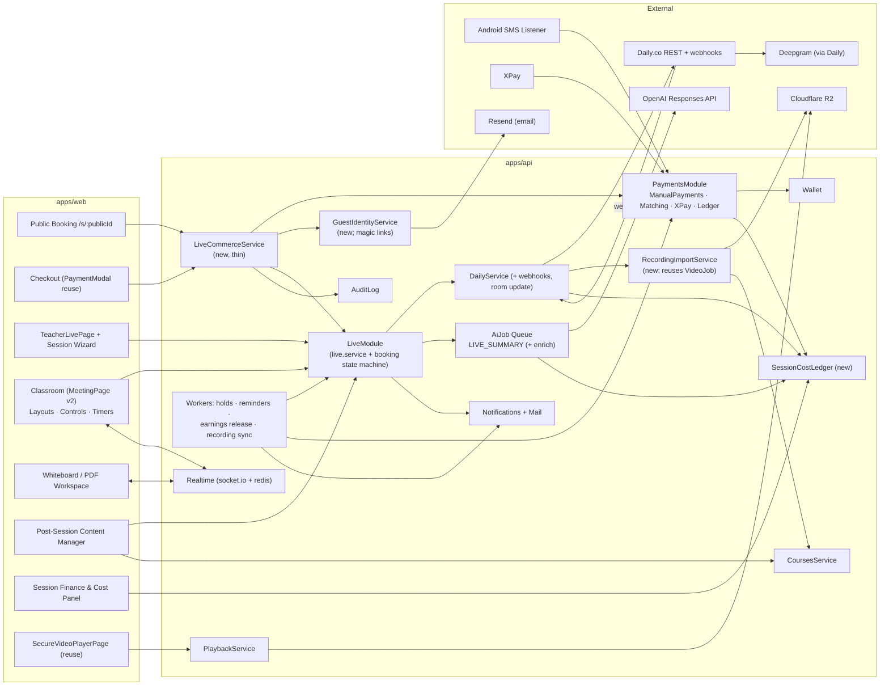
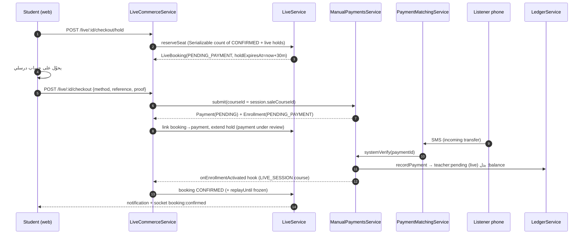
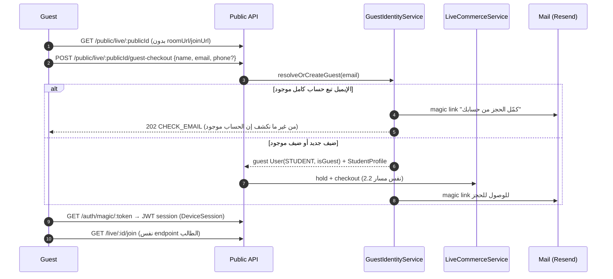
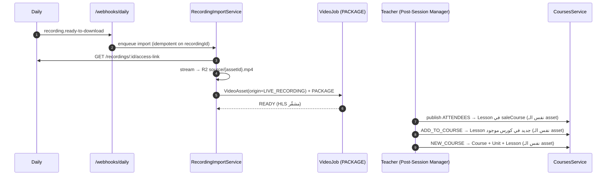
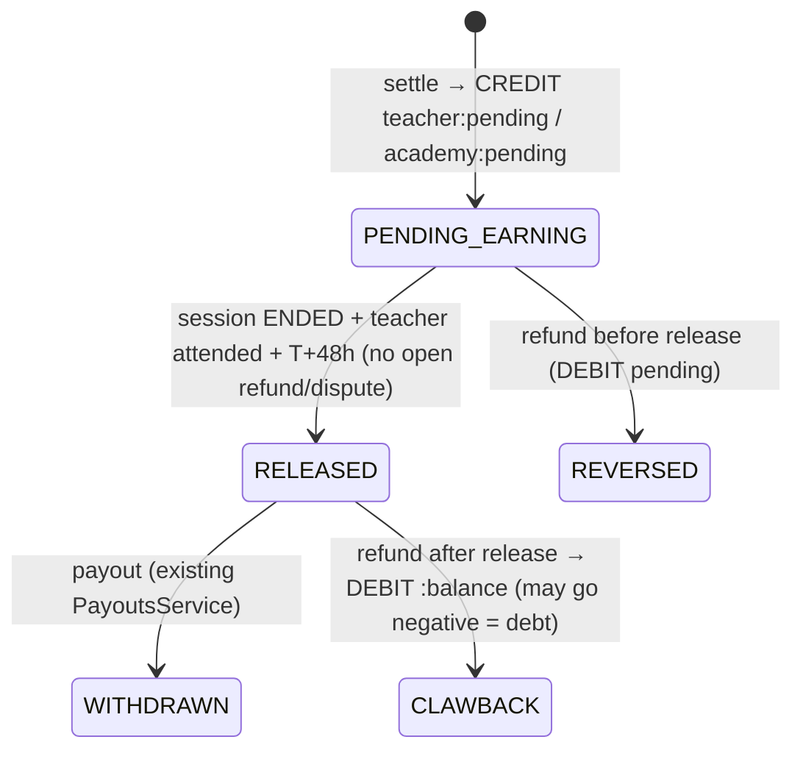
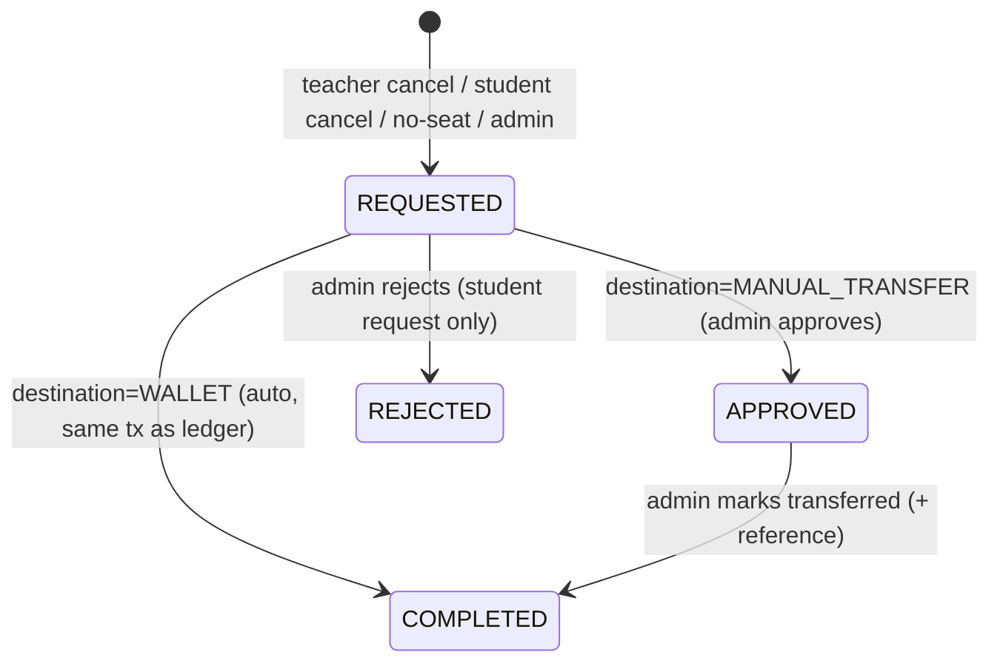
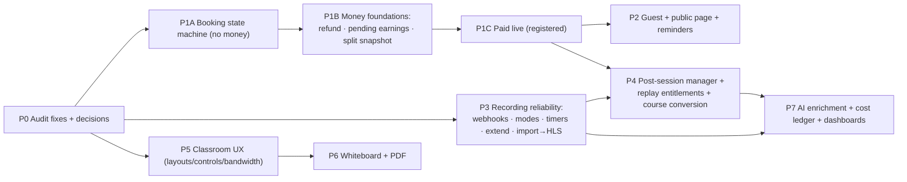

# Darsly — Live Commerce, Professional Classroom & Recorded Learning

**نوع الوثيقة:** Architecture & Roadmap (تخطيط بس — مفيش أي تغيير في الكود)
**التاريخ:** 2026-09-25
**الـ commit اللي اتعمل عليه الفحص:** `936c9c6` (main)
**الحالة:** مستنية مراجعة وموافقة الـ Product Owner قبل أي تنفيذ

---

## 0. إزاي تقرا الوثيقة دي

كل ادّعاء مهم عليه واحد من الأربع علامات دول:

| العلامة | المعنى |
|---|---|
| **VERIFIED** | اتأكدت منه من الكود نفسه (فيه لينك للملف والسطر) |
| **PROPOSED** | تصميم أو سلوك جديد مقترح |
| **UNKNOWN** | محتاج معلومة مش موجودة في الريبو (حساب Daily، تسعير، سياسة) |
| **BLOCKER** | لازم يتحسم قبل ما التنفيذ يبدأ |

كل اللينكات relative من `docs/architecture/`.

### الخلاصة في سطور (للي مستعجل)

1. **نظام الدفع الموجود قوي وناضج ويتبني عليه** (VERIFIED): double-entry ledger، والـ listener بيطابق الـ SMS بـ dedupe و exact reference و payer-name، وفيه separation of duties بين "تفعيل الوصول" و"تسوية الفلوس"، و serializable transactions للمحفظة، و XPay بيوصل لنفس نقطة التسوية. **مش هنبني payment engine تاني.**
2. **فيه تعارض مباشر بين قرار البيزنس وبين الكود** (BLOCKER): البيزنس بيقول "درسلي بتخصم عمولتها من المدرس"، والكود بيطبّق **رسوم خدمة إضافية بيدفعها الطالب فوق السعر** ([fee.util.ts](../../apps/api/src/payments/fee.util.ts)). لازم قرار قبل Phase 1.
3. **مفيش refund flow خالص** (VERIFIED)، ومفيش "أرباح معلّقة" (pending earnings)، ومفيش expiry للمدفوعات المعلّقة. من غيرهم مينفعش نبيع جلسة لايف ممكن تتلغي.
4. **الـ playback كله متبني على `Lesson` → `Course` → `Enrollment`** (VERIFIED)، و `Lesson.videoAssetId` عليه `@unique`، و `removeLessonVideo` بيمسح الـ asset من الـ storage. معنى كده إن الـ replay لازم يعدّي على Lesson جوه Course، وإن مشاركة الفيديو بين كذا كورس محتاجة تعديل في الـ constraint ده.
5. **التوصية المعمارية الأساسية** (PROPOSED): كل جلسة مدفوعة ليها **Course مخفي من نوع `LIVE_SESSION`** بيبقى هو "وحدة البيع" ووعاء الـ replay. كده الجلسة بتعيد استخدام `Payment` و `Enrollment` والـ listener والمحفظة و XPay والفواتير والـ playback المشفّر زي ما هم، من غير ما نغيّر `Payment.courseId`.
6. **مفيش SMS gateway في الإنتاج** (VERIFIED — [device-enrollment.service.ts:12](../../apps/api/src/device/device-enrollment.service.ts#L12))، فالـ phone OTP مينفعش يتسلّم. الضيف (guest) لازم يتعرّف بالإيميل (Resend موجود) أو بقناة جديدة. ده BLOCKER لتجربة الضيف.
7. **ترتيب التنفيذ المقترح مختلف عن المقترح في الـ brief**: الـ refunds والأرباح المعلّقة لازم **تسبق** البيع. الـ Recording asset والـ entitlements لازم **تسبق** بيع الـ replay. والـ Classroom UX شغل frontend يقدر يمشي بالتوازي.

---

# سجل القرارات والتنفيذ (بيتحدّث مع كل checkpoint)

> السجل ده **بيغلب** على أي حاجة تحت بتعارضه. الأجزاء اللي تحت بتفضل زي ما هي عشان التاريخ، والحالة الحالية لكل قرار موجودة هنا.

## قرارات الـ Product Owner (2026-09-25) — APPROVED

| # | القرار | اللي اتغيّر في الوثيقة |
|---|---|---|
| PO-1 | **شروط تجارية قابلة للضبط، مش نموذج عمولة واحد.** `feeType` (PERCENT/FIXED) + `feeValue` + `feeMode` (ADDITIVE/DEDUCTED)، على مستوى علاقة البيع: درسلي ↔ مدرس شخصي، ودرسلي ↔ Center، والـ Center ↔ مدرس. الـ Super Admin بيملك المستوى الأعلى، ومدير الـ Center بيدير اتفاقه مع مدرسينه في حدود الصلاحيات | بيحل **B1** و **Q1**. **ADR-10 اتغيّر**: الاتنين بيتدعموا لكل اتفاق، مش global. تصميم `CommercialTerms` النهائي هيتكتب **في أول Checkpoint D قبل أي كود** |
| PO-2 | **الـ Center بيقسّم على طبقتين:** الأول رسوم درسلي (additive أو deducted)، وبعدين الباقي بيتقسم بين الـ Center والمدرس بنسبة الاتفاق. **كل قيم الاتفاق بتتجمّد على المعاملة** | بيأكد الـ split snapshot (6.3) ويوسّعه ليشمل `feeMode` |
| PO-3 | **الضيف MVP مبسّط:** مفيش OTP ولا SMS ولا WhatsApp ولا magic link ولا حساب. اسم + موبايل + حقول المرجع اللي الـ matcher محتاجها ← الدفع بالـ UI الموجود ← الـ listener يأكّد ← لينك دخول سري على نفس الصفحة. لو الضيف ضيّع اللينك مفيش استرجاع آلي في المرحلة دي (قيد UX صريح) | **ADR-2 و ADR-4: REJECTED للـ MVP** (DEFERRED لبعد كده). **B2 اتحل** بالتبسيط |
| PO-4 | **الدخول:** مفيش أي لينك Daily أو Zoom يتعرض قبل الدفع. بعد التأكيد: `/live/access/<secret>`، والمخزّن hash بس. Daily: توكن قصير العمر. خارجي: redirect | جديد (Checkpoint F) |
| PO-5 | **الـ Refund:** الطالب المسجّل بيسترد لمحفظته بقيود ledger. الضيف بيطلب refund يدوي (وجهة InstaPay/Vodafone Cash)، ودورته REQUESTED ← APPROVED ← COMPLETED أو REJECTED. التحويل تنفّذه مالية درسلي، مش المدرس | بيحل **Q3/Q4** جزئياً (السياسة نفسها configurable) |
| PO-6 | **سياسة الـ refund قابلة للضبط وبتتجمّد مع الحجز.** إلغاء المدرس = 100%. إلغاء الطالب مبكر أو متأخر = حسب السياسة. استرداد رسوم الخدمة كمان configurable | جديد |
| PO-7 | **الأرباح:** PENDING لحد ما الجلسة **تنتهي**، وبعدين AVAILABLE. **مفيش hold عشوائي 48 ساعة.** التحرير server-controlled و idempotent | **بيعدّل 6.3**: شرط الـ release بقى "الجلسة اتسلّمت وانتهت" بدل T+48h. الشروط الدقيقة (start فعلي، end فعلي، مش ملغية) هتتحدد في Checkpoint D |
| PO-8 | **اقتصاديات الجلسات:** طبقة وعي بالتكلفة (تقدير قبل الجلسة + فعلي بعدها) + guardrails (تحذير أو منع قابل لـ override من الأدمن). مفيش تغيير تلقائي في سعر أو اتفاق. الأسعار من config مش من الكود | بيحل **B4/Q11** كاتجاه |
| PO-9 | **الـ Transcription:** OFF / MANUAL / AUTO_WHEN_RECORDING | جديد (Checkpoint C) |
| PO-10 | **ترتيب التنفيذ:** Checkpoints A ← I، وكل واحد بيقف للمراجعة | بيحل محل Deliverable 10 كترتيب رسمي |

## حالة الـ ADRs

| ADR | الحالة |
|---|---|
| ADR-1 (Course مخفي كوحدة بيع) | APPROVED كاتجاه، هيتراجع في Checkpoint E |
| ADR-2 (الضيف = حساب خفيف) | **REJECTED للـ MVP** (PO-3). DEFERRED |
| ADR-3 (الـ hold بينتهي والـ Payment لأ) | APPROVED |
| ADR-4 (magic link) | **REJECTED للـ MVP** (PO-3). DEFERRED |
| ADR-5 (pending earnings في الـ ledger) | APPROVED. التحرير عند نهاية الجلسة (PO-7) |
| ADR-6 (VideoAsset مشترك + HLS) | APPROVED. الـ 1:N ورا feature flag (Checkpoint G) |
| ADR-7 (visibility مستقلة) | APPROVED |
| ADR-8 / ADR-9 (السبورة) | APPROVED (Checkpoint I) |
| ADR-10 (نموذج الرسوم) | **REVISED** بـ PO-1 |
| ADR-11 (workers بنمط setInterval + lease) | APPROVED |

## Checkpoint A — Existing Live Hardening — **IMPLEMENTED** (مستني مراجعة)

| Bug | الحالة | الملخص |
|---|---|---|
| L1 | IMPLEMENTED | CAS claim ← enqueue ← لو فشل يرجع للحالة السابقة. PROCESSING من غير job لمدة ≥ 2 دقيقة = STALLED، وقابل لإعادة الطلب. التعارض بقى على نفس الجلسة (`sameInput`) مش الأكاديمية كلها |
| L2 | IMPLEMENTED | الـ AI job على `session.academyId ?? tenantId` |
| L3 | IMPLEMENTED | `AiCallLog.liveSessionId` و `aiJobId` + trace. الـ job cost = تكلفة الـ calls الفعلية (والمحاولات الفاشلة كمان) |
| L4 | IMPLEMENTED | `activeEnrollmentWhere()` نفسه في الإعلان |
| L5 | IMPLEMENTED | التعليق بقى "per teacher". السلوك متغيّرش |
| L6 | IMPLEMENTED (**محتاج تأكيد staging**) | cursor pagination بحدود (10 صفحات / 30 ثانية)، وبتقف لو مفيش تقدّم |
| L7 | لسه (Checkpoint B) | — |
| L8 | IMPLEMENTED | الإلغاء بعد البدء 409 `CANCEL_WINDOW_CLOSED`. قبل البدء زي ما كان |
| L9 | IMPLEMENTED | `cancelledAt`/`cancelReason` + إشعار + socket + قفل الغرفة لو LIVE + AuditLog |
| L10 | لسه (Checkpoint B) | — |
| L11 | لسه (Checkpoint C) | — |
| P6 | IMPLEMENTED | `manualMatch` بيقارن `amountCents - walletCents` |

**Migration:** `20261001100000_live_hardening`: 4 أعمدة nullable + 2 indexes، additive بالكامل.

**Validation على PostgreSQL حقيقي (2026-09-25، PostgreSQL 16.14 مؤقت UTF8، معزول عن أي بيئة):**
- الـ 94 migration بتاع `82e9658` اتطبقوا من الصفر، وبعدين اتحملت داتا شبه الإنتاج: 20k session، و 100k booking، و 50k attendance، و 5k AiJob، و 300k AiCallLog. وبعدين اتطبقت `live_hardening` من HEAD.
- `migrate status` = up to date، و `migrate diff` (DB ← schema) = فاضي (مفيش drift).
- fingerprint (count + md5) للـ 5 جداول **متطابق** قبل وبعد.
- الأعمدة nullable ومن غير default، والـ indexes `valid/ready`.
- بناء index على 300k صف ≈ 0.2 ثانية، و `ADD COLUMN` metadata-only.
- `live-checkpoint-a.integration.spec.ts` (13 test على Postgres): التزامن، والـ JSON-path scoping، والـ STALLED، واستنفاد المحاولات، والـ lease المنتهي، وتتبع تكلفة L3 كامل عبر الـ worker الحقيقي، والإلغاء بيحافظ على الحجوزات والحضور، و P6 عبر الـ ledger الحقيقي.

**تصليح اتعمل أثناء الـ validation:** `LiveSummaryHandler` بقى:
- ياخد `max(sum(AiCallLog), job.costCents × 1000)` كتكلفة المحاولات السابقة، عشان كتابة الـ log fire-and-forget. لو اتأخرت ما تضيّعش تكلفة المحاولة الأولى، ومن غير ما تتحسب مرتين.
- يسجّل التكلفة على الـ job **فور** نجاح الـ call، عشان لو write بعده فشل ما تضيعش.

**Rollback (الصياغة الصح):**
- **Deployment/application rollback:** نرجّع الكود لـ `82e9658` و**نسيب الأعمدة**. الكود القديم مش بيقراها ولا بيكتبها، فالرجوع آمن ومن غير أي خسارة. **ده الأسلوب الموصى بيه.**
- **Destructive schema rollback** (`DROP COLUMN`/`DROP INDEX`): **بيمسح داتا اتجمعت بعد الـ deploy**، يعني أسباب ومواعيد الإلغاء، وربط الـ AI calls بالجلسات والـ jobs. مش مطلوب لأي rollback للكود، ولو اتعمل لازم نعمل export للأعمدة دي الأول.

**L6 — لسه مش متأكد منه على Daily:** مفيش `DAILY_API_KEY` على جهاز التطوير. فيه read-only probe (GET بس) جاهز للتشغيل بمفتاح staging، وبيسجّل: شكل الـ response، و `total_count`، والترتيب، ومعنى `starting_after` مقابل `ending_before`، وسلوك نهاية القايمة، ووجود `roomName`/`roomId`، وأي فلتر (`room_name`/`roomName`) الـ API بيقبله. الكود الحالي آمن في كل الحالات (بيقف لو مفيش تقدّم، و 10 صفحات / 30 ثانية)، بس **ممكن ما يوصلش لصفحات أبعد** لو الـ cursor معناه عكسي.

**اكتشافات أثناء التنفيذ:**
- **Daily transcript list:** الـ docs الرسمية بتقول إن items الـ `GET /transcript` فيها `roomId` مش `roomName`، وإن فيه فلتر `room_name` كـ query param. الكود بيفلتر على `item.roomName` (زي ما كان)، وده متأكد منه من سلوك الإنتاج في commits سبتمبر. **الـ order والـ page size مش موثّقين.** محتاج تأكيد على staging قبل ما نعتمد على الفلتر أو نغيّر المطابقة.
- **ESLint** مش شغال محلياً (`@eslint/js` مش متسطّب). ده موجود من قبل، ومش من التغييرات دي.

## Checkpoint A — production

**IMPLEMENTED ✅** — `b109604`, Railway deployment `4fc07873` SUCCESS، الـ migration اتطبقت، والـ smoke test نضيف. L6 = known non-blocking limitation.

## Checkpoint B — Extension + Attendance + Darsly-owned end — **COMPLETE ✅** (`b8db84c`، Railway `1bff8766`، production smoke 22/22)

> **الـ revision الأخير (بيغلب على اللي تحت):** Darsly هي اللي بتنهي الفصل. `LiveSession` effective end هو سلطة البيزنس، والـ **end sweep** (`LiveEndWorker`، كل 15 ثانية) بينادي `endSession(SCHEDULED_END)`، وده بيمسح غرفة Daily ويطلّع كل اللي فيها. `exp` غرفة Daily بقى **safety TTL بس** = `startsAt + LIVE_MAX_DURATION_MIN + 30min`، بيتحط مرة واحدة ومش بيتغير خالص. المد بقى **تغيير في الـ DB بس**، من غير أي نداء للـ provider. الأجزاء اللي تحت اللي بتوصف "Daily الأول وبعدين الـ DB" في المد **اتلغت**.

| Bug | الحالة | الملخص |
|---|---|---|
| L7 | IMPLEMENTED (**النسخة القديمة من الصف ده اتلغت، شوف الـ revision فوق**) | `POST /teacher/live/:id/extend {minutes, expectedEndsAt?}`: `SELECT … FOR UPDATE`، وبعدين validate، وبعدين **Daily `POST /rooms/:name {properties:{exp}}` الأول**، وبعدين DB، وبعدين commit، وبعدين `live:timing-updated`. حساب واحد للانتهاء: `roomExpiryMs` / `tokenExpiryMs` (end + 30 دقيقة). و `update()` بيرفض تغيير توقيت فصل شغال (`LIVE_TIMING_LOCKED`) |
| L10 | IMPLEMENTED | الـ reward اتشال من `join()`. الـ heartbeat بقى `UPDATE … FROM "LiveSession"` واحد atomic، والـ credit بيقف عند الـ effective end. الـ reward بـ `recordOrThrow` + lookup بالـ idempotencyKey، وبيتعاد مع الـ heartbeat اللي بعده لو فشل |
| Timing | IMPLEMENTED | `serverNow` و `startedAt` و `endsAt` في رد الـ join، وفي كل heartbeat (كل 30 ثانية)، وفي الـ socket. الواجهة بتحسب الـ offset وبتتجاهل أي رد أقدم. **مفيش** recording timer (ده Checkpoint C) |

**قرارات (ADR-12 إلى ADR-14، APPROVED بالتنفيذ):**
- **ADR-12 ترتيب المد:** الـ provider الأول وهو ماسك lock على الـ row، وبعدين الـ DB.
  - الـ invariant: expiry الـ provider **عمره ما يبقى أقل** من اللي نهاية Darsly بتقتضيه.
  - Daily فشل: rollback كامل، ومفيش أي حدث بيتبعت.
  - Daily نجح والـ commit فشل: الغرفة بتعيش أطول (مش ضار)، والـ retry بيبعت نفس القيمة المطلقة.
  - السياسة لو جه طلبين مع بعض:
    - `expectedEndsAt` (والواجهة دايماً بتبعته): الطلب التاني ياخد `TIMING_CHANGED` + التوقيت الحالي.
    - من غيره: الطلبين بيتجمعوا (+15 و+15 = +30)، ومفيش lost update.
  - المد مسموح طول ما الفصل LIVE وغرفته لسه موجودة، **بما فيها دقايق الـ grace**.
- **ADR-13 الـ heartbeat الذرّي:** الـ row lock + إعادة الـ evaluation في Postgres (READ COMMITTED EPQ) بيمنعوا العد مرتين في حالات: التابين، والـ duplicates، والطلبات المتزامنة، والـ replicas. **مفيش** تغيير في البروتوكول ولا في الـ schema. قاعدة الـ gap زي ما هي: ثواني صحيحة، و `1 ≤ gap ≤ PRESENCE_GRACE_SEC (90)`. **الجديد:**
  - الـ credit بيقف عند الـ effective end.
  - الـ heartbeat بعد النهاية ما بيفتحش الـ row تاني.
  - أي row لسه مفتوح بيتقفل عند النهاية.
- **ADR-14 الـ threshold:** `min(LIVE_ATTENDED_MIN_SECONDS = 600, LIVE_ATTENDED_MIN_SHARE = 0.5 × مدة الفصل)`. نفس فكرة النسبة اللي بتستخدمها الدروس المسجلة (90%)، بس بسقف مطلق.

**Validation على Postgres حقيقي (16.14 مؤقت):** `live-checkpoint-b.integration.spec.ts` = 18 test ✅
- **Mutation test:** رجّعنا الـ heartbeat القديم، ففشلت 5 tests من L10. وشلنا `FOR UPDATE`، ففشل testين من L7 (lost update: +15 بدل +30، والتابين الاتنين "نجحوا").

**لسه مش متأكد منه (DAILY STAGING VALIDATION PENDING):**
1. إن `POST /rooms/:name` بيقبل تغيير `exp` لغرفة فيها meeting شغال.
2. إن `eject_at_room_exp` بيحترم الـ exp الجديد ومش القديم.
3. إن الـ response فيه `config.exp`. الكود بيتحقق منه لو موجود، ولو مش موجود بيعدّي.

الـ tokens بيتعملوا من غير `eject_at_token_exp` (متأكد من الـ docs ومن test)، فمش هيطلّعوا حد.

**تبعات لازم تتعرف:**
- **الجلسات الخارجية (Zoom/Meet) مبقاش بياخد عليها حد `LIVE_ATTENDED`**، لأن مفيش heartbeat نقيس بيه حضور حقيقي. ده مقصود في L10. الحل المستقبلي هو self check-in (Q13).
- الـ ASSISTANT والمدرّس اللي مش OWNER يقدروا يمدّوا **جلساتهم هم بس**. ده نفس نطاق `start`/`end` الحالي (`assertOwned`).

### Checkpoint B — final validation pass (2026-09-25)

**Daily: لسه PENDING.**
- الـ Railway فيه environment واحد بس (`production`)، ومفيش staging.
- مفتاح Daily الوحيد هو مفتاح الإنتاج. استخدامه، حتى لغرفة disposable، **محتاج موافقة صريحة**، ومتعملش.
- الـ probe جاهز ومتأكد إنه بيحمّل كل الـ modules الحقيقية، وبيرفض من غير مفتاح أو مع DB مش local. والـ participant الـ headless (Chrome 154 + daily-js 0.87.0) اتأكدنا إنه `supported`.
- الـ probe بيعمل:
  - **(A)** غرفة exp = now+90s و `eject_at_room_exp`، وبعدين participant حقيقي، وبعدين update exp لـ +180s وهو جوه، وبعدين يتأكد إنه لسه جوه بعد الـ exp الأصلي، وإنه اتطرد عند الجديد.
  - **(B)** `LiveService.extend` الحقيقي، وبعدين GET `config.exp` = `roomExpiryMs(newEnd)`، وبعدين `exp` الـ token الجديد = `tokenExpiryMs(newEnd)`.
  - وبيمسح الغرفتين في `finally`.

**فرع فشل الـ provider (اتأكد منه):** integration test عبر `DailyService` الحقيقي (HTTP mocked):
- 500 بيرجّع `LIVE_PROVIDER_ERROR`، والـ timeout بيرجّع `LIVE_PROVIDER_UNREACHABLE`.
- الـ DB ما اتغيرتش، ومفيش emit.
- وبعدين retry نجح. والتلات محاولات بعتوا نفس الـ `exp` المطلق.

**قرار الـ transaction: KEEP CURRENT LOCKED TRANSACTION.**
- **البديل** (CAS optimistic): اقرا D، ونادي Daily بـ D+m، وبعدين `UPDATE … WHERE durationMin = D`، ولو فيه تعارض أعد.
  - ده بيحافظ على الـ lost-update وعلى `TIMING_CHANGED`.
  - بس **Daily مفيهوش conditional update** (مفيش version ولا ETag على `POST /rooms/:name`).
  - فكتابتين متزامنتين للـ provider ممكن يوصلوا بالعكس، والقيمة الأقدم الأصغر تكسب، فـ Daily يخلص **قبل** Darsly. ده بيكسر الـ invariant الأساسي.
  - وقفل الثغرة دي محتاج loop تحقق وإصلاح بعد الكتابة، أو lease منفصل (column جديد، أو advisory lock بيمسك connection برضه). ده distributed-state complexity من غير مكسب حقيقي.
- **تكلفة التصميم الحالي، متقاسة على Postgres:** وهو ماسك الـ lock لمدة 3 ثواني (provider بطيء):
  - الـ heartbeat أخد **8ms**، والـ join أخد **16ms**، وقراية الجلسة أخدت **2ms**. **مفيش ولا واحد اتعطل.**
  - الكتابة التانية على **نفس row الجلسة بس** هي اللي استنت (2.76s).
  - ده مع connection واحد من الـ pool لمدة ≤ 10 ثواني (timeout الـ provider)، لأكشن نادر بيعمله المدرس.

**Attendance timeline (10 heartbeats متزامنين، Postgres حقيقي):** على مدى 90 ثانية حقيقية وصل **24 heartbeat** (10 + 10 + 3 + 1، كلهم concurrent)، واتحسب **90 ثانية**. التابات الزيادة ما بتصنعش حضور. والوقت كله من ساعة السيرفر.

**Threshold الـ LIVE_ATTENDED: PRODUCT-APPROVED FOR GAMIFICATION** (الـ PO، 2026-09-25). القاعدة `min(600s, 50% من الـ effective duration)` زي ما هي. **للـ gamification بس**، ومينفعش تتستخدم كتعريف لتسليم مالي، ولا تحرير أرباح، ولا refund، ولا شهادة، ولا حضور مدفوع. (النص اللي تحت اتكتب قبل الموافقة.)

**Threshold (نص ما قبل الموافقة):**
- القاعدة المنفّذة: `min(600s, 0.5 × مدة الفصل)`. يعني:
  - 5 دقايق = 2.5
  - 15 = 7.5
  - 20 = 10
  - 60 = 10
  - 120 = 10
- الـ PO فوّض اختيار قيمة معقولة وقابلة للضبط، **ومعتمدش القيمة دي صراحة**.
- البدائل:
  - **(1)** 10 دقايق ثابتة: بسيطة، بس مستحيلة على فصل أقصر.
  - **(2)** 50% من الفصل: عادلة نسبياً، بس ساعة كاملة لفصل ساعتين.
  - **(3)** `max(حد أدنى ثابت، نسبة)`: أصعب، ومستحيلة على فصل قصير لو الحد الأدنى كبير.
  - **(4)** قاعدة configurable لكل أكاديمية أو من الأدمن.
- **مهم:** `LIVE_ATTENDED` حدث gamification بس. **مش** دليل تسليم مالي، ولا شرط refund، ولا شرط تحرير أرباح، ولا شرط شهادة. المفاهيم دي هيبقى ليها تعريفاتها الخاصة في Checkpoints D/E.


### Checkpoint B — الملاحظات على Daily الحقيقي، وقرار "Darsly تملك النهاية"

**سلوك Daily اتقاس على الحساب الحقيقي (`darsly.daily.co`، بغرف disposable، ومن غير أي secrets في التقرير):**

1. **تحديث `exp` لغرفة فيها ناس مش بيأجّل طردهم** (probe 1، 2026-09-25):
   - كان `exp` الأصلي 12:03:31Z، واتحدّث لـ 12:05:01Z والـ participant جوه. `POST /rooms/:name` رجّع 200، والـ GET بعده رجّع القيمة الجديدة.
   - **ومع ذلك الـ participant اتطرد عند 12:03:31.233Z بالظبط** (`error: ejected`).
   - الاستنتاج: `eject_at_room_exp` بيتثبت لكل participant لحظة ما يدخل. **Darsly مينفعش تستخدم `exp` المتغير كآلية للمد.**
2. **`DELETE /rooms/:name` بيطلّع اللي متصلين فعلاً** (probe 2، مرتين):
   - الـ participant اتشال بعد **2.5 ثانية** في المرة الأولى، و**1.1 ثانية** في التانية، من رد الـ DELETE (`error: no-room`, "Meeting has ended").
   - participant جديد بـ token متعمل قبل المسح اترفض ("Meeting has ended").
   - الـ GET بيرجّع 404.
   - عمل token لغرفة ممسوحة بيرجّع 200 (مش ضار، لأن الدخول نفسه بيترفض).
3. الـ presence API بيتأخر (مش مؤشر موثوق).

**ADR-15 (APPROVED بالتنفيذ): Darsly تملك نهاية الفصل.**
- **مسار واحد للإنهاء:** `LiveService.endSession(id, MANUAL | SCHEDULED_END | CANCELLED)` بيستخدمه زرار المدرس، والـ sweep، والإلغاء. وتحت `SELECT … FOR UPDATE`:
  - لو ENDED بالفعل، مفيش حاجة تتعمل (idempotent).
  - لو SCHEDULED_END، بيقرا **النهاية الحالية** ولو لسه موصلتش بيرجّع `not-due`. ده بيحمي من أي trigger قديم، لأن الـ sweep مفيهوش timer لكل فصل أصلاً.
  - بيعمل `closeRoom` (DELETE، والـ 404 بتتحسب "اتقفلت"، وأي فشل تاني بيعمل throw) **قبل** أي كتابة. فشل الـ provider = rollback، والفصل بيفضل LIVE، والـ sweep اللي بعده بيعيد المحاولة.
  - بعدين ENDED و `endedAt = min(now, scheduled end)`، وبيقفل الحضور المفتوح عند `endedAt`.
- **الـ sweep:** `LiveEndWorker` كل 15 ثانية، بـ batch من 25، عن طريق `overdueLiveSessionIds` (index جديد `LiveSession(status, startsAt)`، و EXPLAIN على 5,137 row LIVE = Index Scan، 0.13ms). بيعيش بعد أي restart، لأن الفصل المتأخر بيتلاقي من الداتا بتاعته. وآمن على أكتر من replica (row lock). و `LIVE_END_WORKER_ENABLED=false` بيقفله على replica معينة.
- **الـ TTL:** `roomSafetyExpiryMs(startsAt) = startsAt + (LIVE_MAX_DURATION_MIN + 30) min`، وده **أكبر من أي نهاية ممكنة** لأن `durationMin ≤ 720` في كل مكان بيتحط فيه.
- **المد:** DB بس، تحت الـ lock. بيترفض بمجرد ما النهاية الحالية توصل (مفيش resurrection).
  - **ده بيحل سؤال "مسك الـ transaction أثناء نداء Daily"** لأن المد مبقاش فيه نداء خارجي.
  - الـ lock بيتمسك بس أثناء `closeRoom` في الإنهاء، وده أكشن نادر.
- **الإلغاء (Checkpoint A):** الفصل الـ LIVE بيعدّي على `endSession(CANCELLED)` الأول. لو الـ provider فشل، الإلغاء كله بيفشل ويتعاد، ومش بيسيب غرفة شغالة لحد الـ TTL الطويل. ده تعارض مباشر اتصلّح بسبب B.
- **ADR-12 (المد provider-first) اتلغى، و ADR-15 حلّ محله.**

**Validation على Postgres حقيقي:** `live-checkpoint-b.integration.spec.ts` = 25 test (A + B + lifecycle = 220 test في `src/live`).
- المد مع الإنهاء القديم متزامنين: المد كسب، والفصل فضل LIVE.
- الإنهاء كسب الأول: المد اترفض، ومفيش resurrection.
- زرار المدرس والـ sweep مع بعض: إنهاء واحد، `closeRoom` واحد، و `live:ended` واحد.
- المد بعد الـ 30 دقيقة القديمة (+60): الإنهاء القديم والقديم+30 مبيعملوش حاجة، وبينتهي عند النهاية الجديدة.
- فشل الـ provider (500 وبعدين timeout) عبر `DailyService` الحقيقي: الفصل فضل LIVE، وبعدين اتقفل.
- recovery بعد 20 دقيقة تأخير: replicaين متزامنين قفلوه مرة واحدة، عند نهايته الحقيقية.
- **Mutation:** شيل التحقق من النهاية الحالية خلّى testين يفشلوا، وشيل `FOR UPDATE` من الإنهاء خلّى 3 tests يفشلوا.

**Migration `20261002100000_live_end_sweep_index`:** index واحد بس (`LiveSession_status_startsAt_idx`)، additive. اتطبقت على DB فيها داتا (fingerprint متطابق، ومفيش drift، وأخدت ~2.5 ثانية بما فيها startup الـ CLI). الـ rollback: نرجّع الكود ونسيب الـ index، ولو حد مسحه مفيش داتا بتضيع.

**تبعات لازم تتعرف عند أول deploy:**
- **(1)** أي جلسات قديمة فضلت `LIVE` للأبد (محدش نهاها قبل الـ sweep) **هتتقفل تلقائياً**: 25 كل 15 ثانية، `ENDED` عند نهايتها الحقيقية، والحضور المفتوح يتقفل عند النهاية دي، و DELETE لغرف قديمة (404 بتتحسب "اتقفلت")، من غير أي events.
- **(2)** الفصول اللي شغالة وقت الـ deploy غرفها اتعملت بالطريقة القديمة (`exp` = end + 30 دقيقة). المد فيها بعد 30 دقيقة لسه هيطرد اللي كانوا جوه. ده بيأثر على الفصول اللي كانت شغالة ساعتها بس.


### Checkpoint B — production validation (2026-09-25)

- **الـ push:** `b109604..b8db84c`، وبعدين Railway **`1bff8766` → SUCCESS**. `20261002100000_live_end_sweep_index` اتطبقت (95 migrations). وظهر `AI job worker started` و **`live end worker started (every 15s)`** و Redis متوصل، والـ health: DB/Redis/storage = ok. وعدد الـ ERROR/WARN من ساعة الـ deploy = 0.
- **الـ smoke test على الإنتاج (حسابات disposable باسم SMOKE-TEST، واتنضف بعدها): 22/22 PASS.**
  - `exp` الغرفة = `startsAt + 750min` بالظبط (safety TTL)، و `eject_at_room_exp=true`.
  - الـ token لوحده ما اداش LIVE_ATTENDED.
  - الـ heartbeat زوّد 30 ثانية بالظبط، والـ duplicates زوّدت 0.
  - المد +45 (بعد الـ 30 القديمة): `exp` ما اتغيرش، والـ refresh رجّع النهاية الجديدة، والـ participant فضل متصل، و `TIMING_CHANGED` اشتغل.
  - الـ End اليدوي طلّع الـ participant (`no-room`) والغرفة بقت 404.
  - **الإنهاء التلقائي من الـ worker من غير End:** النهاية كانت 13:42:41.085Z، والـ worker عمل `live.end reason=SCHEDULED_END provider=deleted` عند 13:42:48.5 (**7.4 ثانية**)، والـ `live:ended` وصل للطالب بعد **7.4 ثانية**، والـ participant اتطرد بعد **9.6 ثانية**.
  - `endedAt` = النهاية بالظبط، و `leftAt` = النهاية، والـ heartbeats بعد النهاية زوّدت 0.
  - LIVE_ATTENDED اتدى مرة واحدة عند 151s (threshold 150s لفصل 5 دقايق).
  - الـ sweeps اللي بعده: مفيش إنهاء تاني.

### Checkpoint B.5 — Cloudflare Realtime (تحقيق، مش migration) — **CLOUDFLARE POC PROMISING — PROCEED TO MIGRATION DESIGN**

- **درسلي بتستخدم إيه من Cloudflare:** **R2 بس** (`STORAGE_DRIVER=s3`، و endpoint `r2.cloudflarestorage.com`) للفيديو والـ HLS والإيصالات والميديا. **مفيش Stream ولا Realtime.** كل اللي عندنا مفاتيح R2 S3 (مش API token)، ومفيش wrangler login. **فالـ POC الحي على Cloudflare مستني إن الـ PO يعمل Realtime SFU app.**
- **الأسعار الرسمية (اتأكد منها 2026-09-25):**
  - Realtime SFU: أول **1,000 GB/شهر مجاناً (مشتركة بين SFU و TURN)**، وبعدها **$0.05/GB egress**، والـ ingress ببلاش. (developers.cloudflare.com/realtime/sfu/pricing، اتحدثت 2026-09-22)
  - RealtimeKit: $0.002/دقيقة للمشارك A/V، و $0.0005 audio-only، و recording $0.010/دقيقة. (…/realtimekit/pricing)
  - Stream: $5 لكل 1000 دقيقة تخزين، و $1 لكل 1000 دقيقة تسليم.
  - Daily: $0.004/participant-min (standard)، و 10k دقيقة مجاناً، و recording $0.01349/دقيقة، و post-call transcription $0.0043/دقيقة. (daily.co/pricing/video-sdk)
  - OpenAI: gpt-4o-mini-transcribe $0.003/دقيقة، و gpt-4o-transcribe(-diarize) $0.006.
  - Deepgram Nova-3: pre-recorded $0.0052، و streaming $0.0058.
- **الـ bandwidth (MEASURED، loopback WebRTC في Chrome، مصدر synthetic، من غير provider)، لكل طالب:**
  - كاميرا المدرس 720p = 683 kbps (0.307 GB/h).
  - مع شاشة 1080p5 = 809 kbps (0.364 GB/h).
  - مع طالب بيتكلم 360p = 1,203 kbps (0.541 GB/h).
  - مع 4 tiles صغيرة 180p = 1,426 kbps (0.642 GB/h).
- **الاقتصاديات (بالـ marginal بعد الـ free tiers، 60 دقيقة، 50 طالب):**
  - Daily RTC = **$12.24**.
  - Realtime SFU (education mode) = **~$0.97** (ولو كاميرا حقيقية عند الـ cap، ~$1.95).
  - RealtimeKit = $6.12.
  - **يعني الـ SFU أرخص في الـ RTC بـ ~6 لـ 12 مرة.**
- **العائق الحقيقي:**
  - **الـ SFU الخام مفيهوش cloud recording.** محتاج recorder bot (headless Chrome بيعمل composite، وبعدين R2، وبعدين الـ VideoJob الحالي)، أو WHIP لـ Stream.
  - ده **أصعب بكتير من Daily**، ومحتاج POC.
  - RealtimeKit عنده composite recording managed (bot، و webhook، و 7 أيام retention)، بس الـ SDK بتاعه مختلف، والعلاقة بين أسعاره وأسعار الـ SFU egress غير واضحة.
- **POC حي على Cloudflare Realtime SFU (2026-09-25، credentials محلية بس، ومحتاج rotation):**
  - مدرس و 6 طلاب، كل واحد في browser context معزول.
  - نشر المدرس ~0.6–0.8 ثانية، وأول frame عند الطالب ~1.0–1.5 ثانية.
  - **صفر freezes وصفر فقد packets**، و RTT ~50ms.
  - Reconnect أول frame بعد 1.7 ثانية.
  - 71 API call من غير ولا خطأ (median 200ms).
  - Egress لكل طالب مقاس على Cloudflare: A=693 kbps (0.312 GB/h)، B=765 (0.344)، C=1,088 (0.49)، D=1,496 (0.673). مطابق لقياس الـ loopback.
  - **Recording feasibility اتأكدت:** bot سحب تراكات المدرس من الـ SFU، وعمل composite 1280×720 (شاشة + كاميرا PiP + صوت)، والناتج webm 30 ثانية (~346 kbps) بيتقرا. ده ينفع للـ `VideoJob` الحالي.
  - **اكتشاف:** نشر طالب على نفس اتصال الاستقبال اترفض عند إعادة التفاوض (Chrome, mid 4). **الحل:** اتصال إرسال منفصل (session منفصلة) عند رفع الإيد.
  - **لسه مش متاختبر:** الموبايل، و TURN (محتاج TURN key منفصل)، والشبكات الضعيفة، و simulcast في الفصول الكبيرة، و `getDisplayMedia` الحقيقي.
- **القرار:** مفيش migration دلوقتي. الخطوة الجاية:
  - **(1)** PO يعمل SFU app.
  - **(2)** POC جودة/شبكة/موبايل/TURN.
  - **(3)** POC recording bot.
  - **(4)** مقارنة مع RealtimeKit.
  - وبعدها قرار. التقرير الكامل (الجداول والـ abstraction والـ guardrails) موجود في رد الـ checkpoint.

### Checkpoint B.6 — Cloudflare Realtime بقى الـ provider الأساسي، و Daily fallback — **IMPLEMENTED محلياً، مش متعمله push**

> commits محلية: `a11c2fc` ← `e3a9afb` ← `d521264` ← `5b1884c`. **مفيش push ولا deploy.** الـ secret اللي اتبعت في المحادثة **لازم يتعمله rotation** قبل أي production.

**المعمارية (IMPLEMENTED):**
- `LiveProvider` interface فيه openRoom و participantAccess و closeRoom و cleanup و sweepPending، و recordings و transcripts اختياريين. عليه `DailyLiveProvider` (نفس سلوك Daily بالظبط) و `CloudflareLiveProvider`.
- `LIVE_PROVIDER=cloudflare` (الافتراضي) أو `daily`. لو اخترت cloudflare من غير credentials، **الـ API مش بيقوم أصلاً**، ومفيش fallback صامت.
- `LiveSession.provider` بيتكتب مرة واحدة وقت إنشاء الجلسة. تغيير الـ config بيأثر على الجلسات الجديدة بس. الصفوف القديمة = DAILY.
- **الـ registry بتاع الفصل ملك درسلي** (Postgres، مش memory، عشان كذا replica و restart):
  - `LiveRtcConnection`: connection لكل browser. الـ browser بيشاور عليها بالـ id بتاعنا، ومبيشوفش الـ CF session id أبداً.
  - `LiveRtcTrack`: التراكات المنشورة.
  - `LiveHand`: رفع الإيد.
  - `roomName` بقى مفتاح للـ run (`cf-<id>-<ts>`)، فلو الفصل اتفتح تاني جوه الـ window بيبقى run جديد.
- **الـ connections:**
  - كل واحد ليه RECEIVE، وبيتفتح lazily (Cloudflare بيقفل session فاضية سايبة).
  - SEND للمدرس دايماً، وللطالب بس وهو مسموحله يتكلم، و**اتصال منفصل**.
  - كل push و pull بيعدّي على endpoints بتاعة درسلي (`/live/:id/rtc/...`) اللي بتتأكد من الصلاحية الأول. الـ secret على السيرفر بس.
- **Education mode:** الطالب بيدخل يسمع ويتفرج بس، ومفيش إذن مايك أو كاميرا بيتطلب منه.
  - رفع الإيد server-authoritative: IDLE ← HAND_RAISED ← APPROVED_TO_SPEAK ← ACTIVE_SPEAKER ← RELEASED.
  - حد أقصى للمتكلمين (`LIVE_MAX_SPEAKERS`، الافتراضي 3) تحت advisory lock.
  - الـ revoke بيقفل التراكات عند الـ SFU بـ force، مهما الـ browser عمل.
- **Simulcast:** كاميرا المدرس بتطلع طبقتين: h = 720p، و l = 180p.
  - الطالب بينزل للطبقة الصغيرة لما يلاقي loss أو freezes أو estimate قليل، وبيطلع تاني بعد استقرار مع backoff.
  - اتأكد على الـ SFU الحقيقي إن التبديل بيحصل من غير renegotiation.
- **النهاية:** تحت الـ row lock الفصل بيبقى ENDED على طول (`cleanup-pending`)، فمحدش يقدر يعمل push أو pull بعدها. التراكات بتتقفل عند الـ SFU بعد الـ commit، والـ end sweep بيعيد المحاولة، ومفيش إحياء للفصل.
- **Reconnect:** connection بيقع (`failed`) بيتبني من جديد (session جديدة، وسحب من الأول). و 410 من Cloudflare بيرجع `RTC_SESSION_EXPIRED` والصفحة بتعيد البناء لوحدها.
- **الـ Recorder بتاع درسلي:**
  - worker بـ lease و heartbeat (UTC صريح).
  - headless Chromium بيدخل الفصل receive-only، ويعمل composite (شاشة + كاميرا المدرس PiP + المتكلمين + صوت ممزوج).
  - قطع كل 10 دقايق، وكل قطعة بتترفع على الـ storage أول ما تتقفل.
  - لو حصل crash، recorder تاني بيكمّل في قطعة جديدة.
  - في الآخر: ffmpeg ← R2 ← `VideoAsset` + `VideoJob` في transaction واحدة ← encrypted HLS الموجود.
  - فشل التسجيل **عمره ما بيقفل الفصل**.
  - ليه service لوحده (`Dockerfile.recorder`).
- **Usage capture (مش ledger):** `LiveSession.usage` لكل run فيه:
  - دقايق الاتصال حسب الدور.
  - أعلى عدد مستقبلين في نفس الوقت.
  - دقايق التسجيل.
  - egress **ESTIMATED** ومكتوب معاه الأساس اللي اتحسب منه.

**اللي اتقاس (MEASURED، Cloudflare حقيقي + الـ API والصفحة الحقيقيين محلياً، 2026-09-25):**

| الاختبار | النتيجة |
|---|---|
| E2E (مدرس + 3 طلاب) | **26/26**: الدخول، والصوت، و education mode، والـ simulcast (h: 1280، و l: 320، ورجوع h)، ورفع الإيد ← السماح ← الكلام ← الـ revoke (السيرفر رفض SEND بعدها)، والشاشة، والـ reload، والـ extend، والإنهاء للكل (~30ms)، والـ teardown كامل، و 0 تسريب للـ secret |
| النهاية المجدولة | **16/16**: الـ extension لغى النهاية القديمة. الـ sweep أنهى الفصل خلال ≤15 ثانية من النهاية الجديدة، و `endedAt` = النهاية بالظبط. إلغاء فصل LIVE ← ENDED + teardown، ومبيرجعش |
| الشبكة | **8/8**: connection الاستقبال `failed` ← اتبنى تاني والفيديو رجع في ~6 ثواني. **الـ API وقع 20 ثانية وسط الحصة: الميديا ما اتأثرتش (301 مقابل 301 frame)**، وبعد ما رجع الصفحة لحقت الشاشة الجديدة |
| موبايل (Pixel 5 emulated، عربي RTL) | **7/7**: من غير horizontal scroll، والأزرار ≥44px، والدخول 1.5 ثانية، ورفع الإيد باللمس، والمدرس سمع الموبايل |
| Daily fallback | **11/11**: الـ API مبيقومش لو cloudflare من غير creds. `daily` بيقوم من غير CF creds. الجلسة الجديدة = DAILY، والـ room والتوكنات والـ DELETE وصلوا لـ Daily، والصفحة استخدمت الـ Daily adapter (0 RTC calls). جلسة CF قديمة فضلت CF، ولما مفيش creds قالت `LIVE_NOT_CONFIGURED` ومرجعتش لـ Daily |
| الـ Recorder | **17/17**: اتلقط في ثانيتين، وطلعت REC عند الطلاب، والقطع اتلفّت، و**قتل الـ process وسط التسجيل ← recorder جديد كمّل بعد ~23 ثانية**. اتقفل مع الفصل، ثم ffmpeg ثم upload ثم VideoJob ثم **HLS مشفّر READY (360/480/720p)**. التمن: ~25–30 ثانية تسجيل ضاعوا في الـ crash |
| Stress 10 | **10 صفحات حقيقية**: 10/10، وأول frame p50 = 1.3s و p95 = 2.5s، وصفر freezes أو loss، ورفع الإيد اتسمع في 1.6s |
| Stress 30 | 5 صفحات + 25 client خفيف بنفس الـ endpoints: 30/30 من غير أخطاء signalling. **~786 kbps للطالب = 0.354 GB/ساعة** (مطابق لتقدير B.5). الـ loss (~13%) سببه **خط البيت** (24 من 28 Mbps)، مش Cloudflare |
| Stress 50 | signalling-scale، الـ clients الخفيفة صوت بس: **50/50، و 0 أخطاء**، وأول frame p50 = 1.8s و p95 = 3.6s، وكل الـ endpoints p95 < 600ms، ورفع الإيد 1.6s، والإنهاء 57ms، و 53/53 connection اتقفلوا |
| Security | 0 fragment من الـ secret أو الـ app id في web dist (116 ملف) أو api dist أو السورس أو الـ docs أو **الـ git history كله**. **9/9 mutations** على guards الصلاحيات اتقتلوا |
| Suites | API **2431** test (منهم integration على Postgres حقيقي؛ 1 flake معروف في `password-reset` تحت الحِمل، بيعدّي لوحده 3/3 ومش متأثر بـ B.6) + web **80** + typecheck + route check. E2E النهائي: **85/85** |

**مش متاختبر / يدوي:**
- **ABLE TO MEASURE ONLY FROM ONE HOST:** جودة الوسائط لكل طالب عند 30 و 50. خط التست 28 Mbps ومبيشيلش 50 × 0.79 Mbps. **محتاج اختبار موزّع (أجهزة وشبكات مختلفة).**
- **MANUAL — TURN:** محتاج TURN key منفصل (`CF_TURN_KEY_ID` و `CF_TURN_KEY_API_TOKEN`). من غيره STUN بس، والشبكات اللي بتقفل UDP مش هتدخل.
- **MANUAL — موبايل حقيقي:** Android و **iOS Safari** على أجهزة حقيقية وبيانات موبايل.
- **NOT TESTED:** الشبكة الضعيفة بـ packet shaper (CDP مبيأثرش على WebRTC). منطق الـ simulcast متاختبر unit + switch حقيقي، بس مش تحت loss حقيقي.
- **NOT TESTED end-to-end:** سقوط connection الـ recorder نفسه بالـ SFU (المسار موجود ومشترك مع مسار الـ crash اللي اتاختبر).
- **ARABIC BENCHMARK PENDING INPUT:** `apps/api/scripts/transcription-bench/bench.mjs` جاهز. محتاج صوت حصص مصري مع transcript مرجعي، وموافقة على الصرف.
- **مشاهدة تسجيل Cloudflare جوه التطبيق = Checkpoint C.** الـ asset جاهز HLS مشفّر، بس التشغيل بيعدّي على Lesson.

**قبل production (MANUAL ACTION REQUIRED):**
1. **Rotate** الـ Realtime app secret، وحط الجديد في Railway secrets.
2. TURN key (موصى بيه).
3. service جديد للـ recorder من `Dockerfile.recorder`، بنفس الـ DB و R2 و CF vars، و `LIVE_END_WORKER_ENABLED=false`، و `WORKER_ENABLED=false`، ومن غير domain.
4. `LIVE_PROVIDER=cloudflare` على الـ API.

**الـ Rollback:** `LIVE_PROVIDER=daily` بيأثر على الجلسات الجديدة بس. الجلسات اللي اتعملت على Cloudflare بتفضل عليه، **فمتشيلش الـ CF credentials وقت الـ rollback.**

---

# Deliverable 1 — Current System Audit

## 1.1 Live Sessions — دورة الحياة الفعلية

### الملفات

| الطبقة | الملف | الدور |
|---|---|---|
| API | [live.controller.ts](../../apps/api/src/live/live.controller.ts) | 20 endpoint (teacher / student / classroom / presence) |
| API | [live.service.ts](../../apps/api/src/live/live.service.ts) | كل المنطق (~1200 سطر) |
| API | [daily.service.ts](../../apps/api/src/live/daily.service.ts) | Daily REST: rooms, tokens, recordings, transcripts, Deepgram wiring |
| API | [live-summary.handler.ts](../../apps/api/src/live/live-summary.handler.ts) | AI job من نوع `LIVE_SUMMARY` |
| API | [realtime.service.ts](../../apps/api/src/realtime/realtime.service.ts) و [chat.gateway.ts](../../apps/api/src/realtime/chat.gateway.ts) | socket rooms `live:{id}` و `user:{id}` |
| Web | [TeacherLivePage.tsx](../../apps/web/src/pages/teacher/TeacherLivePage.tsx) | جدولة وقايمة المدرس |
| Web | [LiveSessionsPage.tsx](../../apps/web/src/pages/student/LiveSessionsPage.tsx) | قايمة الطالب والحجز |
| Web | [MeetingPage.tsx](../../apps/web/src/pages/live/MeetingPage.tsx) | الفصل (custom UI) |
| Web | [SessionSummary.tsx](../../apps/web/src/pages/live/SessionSummary.tsx) | التسجيل والملخص |
| Web | [useDailyMeeting.ts](../../apps/web/src/lib/useDailyMeeting.ts) و [useLiveChat.ts](../../apps/web/src/lib/useLiveChat.ts) | hooks |
| DB | [schema.prisma:2309-2460](../../apps/api/prisma/schema.prisma#L2309) | `LiveSession`, `LiveBooking`, `LiveAttendance`, `LiveChatMessage`, `LiveSessionStatus`, `LivePipelineStatus` |
| Tests | `live-classroom.spec.ts` (36), `live-meeting.spec.ts` (36), `live-scope.spec.ts` (13), `live-session-access.spec.ts` (3) | 88 test case تقريباً |

### الـ lifecycle خطوة بخطوة (VERIFIED)

| المرحلة | Endpoint | الدالة | اللي بيحصل فعلاً |
|---|---|---|---|
| Create/Schedule | `POST /teacher/live` (`live.manage`) | [`create`](../../apps/api/src/live/live.service.ts#L73) | `assertAssignableTeacher` ← `resolveGroup` ← [`assertTeacherFree`](../../apps/api/src/live/live.service.ts#L132) (بيقارن مع `GroupSession` و `LiveSession` في **كل** الأكاديميات) ← insert ← [`announceToStudents`](../../apps/api/src/live/live.service.ts#L1166) (notification لكل الجروب أو كل الـ enrollments) |
| Update | `PATCH /teacher/live/:id` | [`update`](../../apps/api/src/live/live.service.ts#L177) | بيعيد check الـ overlap لو الوقت أو المدرس اتغيّر. **مبيحدّثش غرفة Daily** لو الجلسة LIVE |
| Cancel | `DELETE /teacher/live/:id` | [`remove`](../../apps/api/src/live/live.service.ts#L209) | soft delete. **مفيش notification للحاجزين** و**مفيش** أي تعامل مع الـ bookings |
| Book | `POST /live/:id/book` (STUDENT) | [`book`](../../apps/api/src/live/live.service.ts#L273) | `assertEnrolledWith` (enrollment ACTIVE غير منتهي + عضوية الجروب) ← Serializable transaction فيه count ثم insert مع retry على P2034 ← notification للمدرس |
| Cancel booking | `DELETE /live/:id/book` | [`cancel`](../../apps/api/src/live/live.service.ts#L342) | `deleteMany` — hard delete، في أي وقت، حتى بعد الجلسة |
| Start | `POST /teacher/live/:id/start` | [`start`](../../apps/api/src/live/live.service.ts#L426) | window check (قبل الميعاد بـ 15 دقيقة) ← claim ذرّي بـ `updateMany where status != LIVE` ← check "جلسة LIVE واحدة" ← `daily.createRoom(darsly-{id})` مع rollback لو فشل ← `announceStart` (socket `live:started` + notification) ← owner token |
| Teacher rejoin | `GET /teacher/live/:id/join` | [`teacherJoin`](../../apps/api/src/live/live.service.ts#L503) | owner token جديد |
| Student join | `GET /live/:id/join` | [`join`](../../apps/api/src/live/live.service.ts#L356) | booking + window + room ← **gamification `LIVE_ATTENDED` بيتسجّل هنا** ← external `joinUrl` fallback ← non-owner token ← `markPresent` |
| Attend | `POST /live/:id/heartbeat` كل 30 ثانية | [`heartbeat`](../../apps/api/src/live/live.service.ts#L559) | بيضيف الفرق لـ `durationSeconds` لو ≤ 90 ثانية (`PRESENCE_GRACE_SEC`) |
| Chat | `GET/POST /live/:id/chat` و socket `live:join` | [`sendChat`](../../apps/api/src/live/live.service.ts#L647) و [`joinLive`](../../apps/api/src/realtime/chat.gateway.ts#L137) | [`assertInSession`](../../apps/api/src/live/live.service.ts#L597) هو البوابة الوحيدة: المدرس، أو staff الأكاديمية، أو طالب حاجز. أقصى حاجة 200 رسالة |
| Record | `POST /teacher/live/:id/recording/start\|stop` | [`markRecording`](../../apps/api/src/live/live.service.ts#L688) | التسجيل بيبدأ من **البراوزر** (`callObject.startRecording()`)، والسيرفر بيتبلّغ بس. الحالة بتبقى `PROCESSING` مع `recordingId` |
| End | `POST /teacher/live/:id/end` | [`end`](../../apps/api/src/live/live.service.ts#L515) | `ENDED` + قفل الحضور في transaction ← `deleteRoom` ← `live:ended` للغرفة ولكل حاجز |
| Transcribe | client `startTranscription({language})` | [useDailyMeeting.ts:256](../../apps/web/src/lib/useDailyMeeting.ts#L256) | Deepgram عن طريق Daily بمفتاحنا (BYO key) ([`ensureTranscriptionProvider`](../../apps/api/src/live/daily.service.ts#L343)). اللغة `ar-EG` أو `en` حسب `TeacherProfile.language` |
| Summarize | `POST /teacher/live/:id/summary` | [`requestSummary`](../../apps/api/src/live/live.service.ts#L750) ← [`LiveSummaryHandler`](../../apps/api/src/live/live-summary.handler.ts#L94) | job في الـ AI queue ← بيستنى الـ transcript لحد 3 دقايق في كل محاولة ← `completeStructured` بـ schema (summary/topics/keyPoints/Q&A/actionItems) ← بيحفظ `transcriptText` ← notification للمدرس |
| Share | `PATCH /teacher/live/:id/summary/visibility` | [`setSummaryVisibility`](../../apps/api/src/live/live.service.ts#L763) | **switch واحد** (`summaryForStudents`) بيتحكم في الملخص **والتسجيل** مع بعض |
| Watch | `GET /live/:id/recording` | [`recordingLink`](../../apps/api/src/live/live.service.ts#L717) | لينك **download** من Daily بينتهي لوحده، بيتعمل مع كل طلب ومبيتخزنش. الحالة بتتحدّث بـ [`refreshRecording`](../../apps/api/src/live/live.service.ts#L804) لما حد يفتح الصفحة (مفيش webhook) |

### الحماية من الـ race conditions الموجودة (VERIFIED)

- **Booking capacity**: Serializable + retry على P2034، و `@@unique([sessionId, studentId])` ([live.service.ts:273-340](../../apps/api/src/live/live.service.ts#L273)).
- **Start**: claim ذرّي بـ `updateMany where status != 'LIVE'`، ولو الجلسة LIVE وليها room بيرجّع نفس الغرفة. والـ room بيتعمل rollback لو Daily فشلت.
- **Attendance**: `upsert` على `(sessionId, userId)`.
- **Summary**: idempotent على مستوى `summaryStatus` (PROCESSING أو READY بيرجع من غير enqueue).

### عقود (contracts) لازم تفضل backward-compatible

1. **الـ 20 endpoint** في [live.controller.ts](../../apps/api/src/live/live.controller.ts) بنفس الـ paths والـ response shapes. أهمها:
   - `studentView` (`canJoin`, `external`, `seatsLeft`, `joinOpensAt`)
   - `join` بيرجع `{session, externalUrl, meeting:{provider,url,token,language?}, participant:{role}}`
2. **Socket events**: `live:started`, `live:ended`, `live:message`، و `live:join`/`live:leave` من الـ client.
3. **Notification** `type: LIVE_SESSION_REMINDER` مع `meta.sessionId` / `meta.live` / `meta.summary`، وبيقراها [notificationRoute.ts](../../apps/web/src/lib/notificationRoute.ts).
4. **Gamification key** `LIVE_ATTENDED:{studentId}:{sessionId}`. أي نقل لتوقيت المنح لازم يحافظ على نفس الـ key عشان محدش ياخد النقط مرتين.
5. **academy-ops**: [`resolveDelivery`](../../apps/api/src/academy-ops/sessions.service.ts#L123) بيعتمد على وجود `LiveSession` لنفس الجروب والوقت عشان يسمح بـ `GroupSession` ONLINE/HYBRID، و [`precheckLiveOverlap`](../../apps/api/src/academy-ops/sessions.service.ts#L93) بيقرا `liveSession` مباشرة.
6. **Analytics**: [analytics.service.ts:875](../../apps/api/src/analytics/analytics.service.ts#L875) بيعدّ الـ `liveSession`.
7. **سلوك المجاني والاشتراك**: الطالب اللي عنده enrollment نشط يحجز ببلاش. ده لازم يفضل الـ default.

### Bugs وتناقضات اكتشفناها أثناء الفحص (VERIFIED)

| # | المشكلة | الدليل | الأثر |
|---|---|---|---|
| L1 | `requestSummary` بيعمل `summaryStatus=PROCESSING` **قبل** الـ `enqueue`. والـ `enqueue` ممكن يرمي exception: `hasActiveJob(academyId)` من غير `conflictsWith` بيعتبر **أي** job شغال في الأكاديمية (SITE_GENERATE / PAPER_IMPORT) تعارض، وفيه كمان `assertWithinBudget` و `AI disabled` | [live.service.ts:750-761](../../apps/api/src/live/live.service.ts#L750)، [ai-job.service.ts:39-53](../../apps/api/src/academy-site/jobs/ai-job.service.ts#L39) | الملخص بيعلق على "جاري المعالجة" للأبد، والزرار مبيعيدش المحاولة لأن PROCESSING بيرجع على طول |
| L2 | الـ AI job بيتعمل بـ `session.tenantId` كـ academyId | [live.service.ts:759](../../apps/api/src/live/live.service.ts#L759) | في جلسة Center، الـ job والتكلفة بيتسجّلوا على الأكاديمية الشخصية للمدرس مش على الـ Center |
| L3 | `LiveSummaryHandler` مبيرجّعش `costCents` | [live-summary.handler.ts:105](../../apps/api/src/live/live-summary.handler.ts#L105) | `AiJob.costCents = 0` لكل الملخصات، والـ monthly budget مبيحسبهاش. التكلفة الحقيقية موجودة في `AiCallLog` بس من غير ربط بالجلسة |
| L4 | `announceToStudents` بيفلتر `status: 'ACTIVE'` بس، من غير `expiresAt` | [live.service.ts:1178](../../apps/api/src/live/live.service.ts#L1178) مقابل [`activeEnrollmentWhere`](../../apps/api/src/live/live.service.ts#L1125) | طالب اشتراكه الشهري خلص بيوصله إشعار بجلسة مش هيقدر يحجزها |
| L5 | التعليق بيقول "One live session per academy"، والكود بيعدّ بـ `tenantId` (لكل مدرس) | [live.service.ts:417-470](../../apps/api/src/live/live.service.ts#L417) | تناقض توثيق. السلوك الفعلي: جلسة LIVE واحدة لكل مدرس |
| L6 | `transcriptFor` بيعمل list لـ `/transcript` من غير pagination | [daily.service.ts:433](../../apps/api/src/live/daily.service.ts#L433) | مع كتر الحصص، transcript الجلسة ممكن يقع برا أول صفحة ويتقال "no transcript" غلط. **UNKNOWN**: حجم الصفحة الافتراضي عند Daily |
| L7 | الـ room والـ token بينتهوا عند `closesAt + 30min` ومعاهم `eject_at_room_exp: true`، و `update` مبيلمسش Daily | [daily.service.ts:181-227](../../apps/api/src/live/daily.service.ts#L181) | لو المدرس مدّ مدة جلسة شغالة، الناس هتتطرد على الميعاد القديم |
| L8 | `cancel` (الطالب) بيمسح الحجز في أي وقت، حتى بعد ما الجلسة بدأت أو خلصت | [live.service.ts:342](../../apps/api/src/live/live.service.ts#L342) | بيضيّع سجل الحضور والوصول للـ replay. ولو الجلسة مدفوعة ده هيبقى خطأ مالي |
| L9 | `remove` (المدرس) soft delete من غير إبلاغ الحاجزين | [live.service.ts:209](../../apps/api/src/live/live.service.ts#L209) | الطلاب مبيعرفوش إن الجلسة اتلغت |
| L10 | نقط الحضور بتتمنح أول ما الطالب يطلب الـ token | [live.service.ts:374-384](../../apps/api/src/live/live.service.ts#L374) | الطالب ياخد نقط حتى لو خرج على طول |
| L11 | لينك التسجيل لينك **download** لـ MP4 خام | [daily.service.ts:311](../../apps/api/src/live/daily.service.ts#L311) | بيتعارض مع سياسة المنصة للفيديو (HLS مشفّر + watermark)، وأي حد عنده اللينك يقدر ينزّل الحصة |

## 1.2 Payments & Wallets — الفحص الحرج

### الـ Models (VERIFIED — [schema.prisma:1377-1750](../../apps/api/prisma/schema.prisma#L1377))

- **`Payment`**:
  - `courseId` **required**، و `studentId` required.
  - `amountCents` = `netCents` + `feeCents`، و `walletCents` هو الجزء المدفوع من المحفظة.
  - `status` قيمته واحدة من PENDING, PAID, REJECTED, FAILED, REFUNDED. الـ **`REFUNDED` مش مستخدم في أي حتة**.
  - `method` قيمته واحدة من INSTAPAY, VODAFONE_CASH, BANK_TRANSFER, OTHER, WALLET, CASH.
  - `gateway` يا `manual` يا `xpay`.
  - `paidAt` (الوصول اتفعّل) منفصل عن `settledAt` (الفلوس اتسجّلت في الـ ledger كقابلة للسحب).
  - حقول الكاش: `cashOrigin`, `cashReceiver`.
- **`PaymentEvent`**: SMS خام اتطابق، و `dedupeKey @unique`، و `payerName`، و `matchedPaymentId` أو `matchedTopupId`.
- **`LedgerTransaction` و `LedgerEntry`**: double-entry و immutable. `LedgerTransaction.paymentId @unique` و `payoutId @unique`، يعني **transaction واحدة بالظبط لكل payment**.
- **`WalletTransaction`**: مرآة للقراءة بس. الرصيد الحقيقي بيتحسب من الـ ledger account `student:<id>:wallet`.
- **`WalletTopup`**: شحن المحفظة، ومنفصل عن `Payment`.
- **`PayoutRequest` و `PayoutMethodSaved`**.
- **`Invoice`**: فاتورة لكل payment.
- **`Coupon`**: `usedCount` بيتحجز وقت الـ submit.
- **`PlatformPaymentAccount`**: حسابات الاستلام بتاعة درسلي.

### Accounts في الـ Ledger (VERIFIED — [ledger.service.ts:14-37](../../apps/api/src/payments/ledger.service.ts#L14))

| الحساب | المعنى |
|---|---|
| `platform:cash` | الفلوس اللي وصلت درسلي فعلاً |
| `platform:commission` | رسوم الخدمة (دخل المنصة) |
| `teacher:<tenantId>:balance` | رصيد المدرس القابل للسحب |
| `academy:<academyId>:balance` | رصيد الـ Center |
| `teacher\|academy:…:cash-liability` | كاش المدرس أو الـ Center استلمه ولسه عليهم |
| `platform:cash-in-kind` | موازنة لنصيب المستلم من الكاش |
| `student:<id>:wallet` و `payment:<id>:escrow` | المحفظة والجزء المحجوز منها |

### مسار شراء كورس (VERIFIED)

```
submit (ManualPaymentsService.submit)
  ├─ assertSplitConfigured (Center لازم يكون ليه نسبة متفق عليها)
  ├─ منع التكرار: enrollment ACTIVE → 409 | payment PENDING → 409
  ├─ normalizePayerReference (شكل الرقم أو المرجع حسب الوسيلة)
  ├─ quote → net + fee(additive) + coupon
  ├─ proofReader.read(صورة الإيصال) → checkProofAgainstClaim → DISAGREES = 400
  └─ $transaction: reserveCouponUse + enrollment(PENDING_PAYMENT) + payment(PENDING) + reserveWalletPortion
       (P2002 → 409 ALREADY_ENROLLED)
verify paths:
  ├─ Listener SMS → PaymentMatchingService.ingest → systemVerify (verify + settle)
  ├─ reconcilePayment (التحويل وصل قبل الـ submit)
  ├─ XPay webhook (HMAC) → systemVerify
  ├─ Admin verify → verify + settle
  └─ Teacher/Owner verify → verify بس (الوصول يتفعّل، والفلوس متتسجّلش قابلة للسحب)
applyVerification:
  priceNowFor (لو السعر نزل → الفرق يرجع للمحفظة)
  runSettlement (Serializable لو فيه محفظة): updateMany where PENDING → PAID (CAS)
     → enrollment ACTIVE (+ bundle children) → ledger.recordPayment (لو settle)
```

المراجع:
- [`submit`](../../apps/api/src/payments/manual-payments.service.ts#L73)
- [`verify`](../../apps/api/src/payments/manual-payments.service.ts#L616)
- [`applyVerification`](../../apps/api/src/payments/manual-payments.service.ts#L757)
- [`settle`](../../apps/api/src/payments/manual-payments.service.ts#L927)
- [`recordPayment`](../../apps/api/src/payments/ledger.service.ts#L257)
- [xpay.service.ts](../../apps/api/src/payments/xpay/xpay.service.ts)

### الـ Mobile Listener: بيأكّد التسوية ولا بيتفرّج على إشعارات بس؟ (VERIFIED)

- الـ listener تطبيق Android متسجّل على موبايل الخزنة بـ **enrollment code** من الأدمن (argon2-hashed، مرة واحدة، مربوط برقم) ([`DeviceEnrollmentCode`](../../apps/api/prisma/schema.prisma#L2784)).
- بيقرا **SMS** (`RECEIVE_SMS`)، مش notification scraping، وبيبعته لـ [`SmsEventsService.ingest`](../../apps/api/src/device/sms-events.service.ts).
- السيرفر **بيعيد تحليل** الرسالة بنفسه (amount و reference و incoming/outgoing و sender rules)، ومش بيثق في اللي الموبايل بيقوله.
- ده **دليل صادر من البنك أو المحفظة إن فلوس وصلت** لحساب درسلي، **مش** تأكيد settlement على مستوى API. ومفيش مطابقة دورية مع كشف الحساب.

**الحماية الموجودة (VERIFIED):**

| التهديد | الحماية | المكان |
|---|---|---|
| إيصال مزوّر | صورة الإيصال "دليل مش إثبات". بتتقرا وتتقارن، ولو فيه اختلاف بترفض الـ submit. التسوية التلقائية محتاجة SMS حقيقي أو XPay أو أدمن | [proof-check.ts](../../apps/api/src/payments/proof-check.ts)، [`submit`](../../apps/api/src/payments/manual-payments.service.ts#L150) |
| Replay لنفس الـ SMS | `DeviceSmsEvent @@unique([deviceId, messageHash])` و `PaymentEvent.dedupeKey @unique` | [payment-matching.service.ts:92-130](../../apps/api/src/payments/payment-matching.service.ts#L92) |
| SMS تحويل صادر من حسابنا | `isIncomingTransfer` بيتطبّق في الـ engine نفسه، مش عند الباب بس | [payment-matching.service.ts:130-170](../../apps/api/src/payments/payment-matching.service.ts#L130) |
| مبلغ غلط | مطابقة exact على `amountCents - walletCents`، و `manualMatch` بيرفض أي اختلاف في المبلغ | [payment-matching.service.ts:178-201](../../apps/api/src/payments/payment-matching.service.ts#L178) |
| مرسل غلط | exact reference، ولو مفيش reference لازم الاسم يطابق `namesAgree(payerName, owner)`، وإلا AMBIGUOUS وبيروح لإنسان | [payment-matching.service.ts:260-330](../../apps/api/src/payments/payment-matching.service.ts#L260) |
| اتنين بيطالبوا بنفس التحويل | أكتر من candidate = AMBIGUOUS. والـ payments والـ topups بيتنافسوا في نفس الـ pool | نفس الملف |
| تسجيل رصيد المحفظة مرتين | CAS على status في الـ topup approve، و Serializable في wallet settlement | [wallet.service.ts:274](../../apps/api/src/wallet/wallet.service.ts#L274)، [manual-payments.service.ts:697](../../apps/api/src/payments/manual-payments.service.ts#L697) |
| تفعيل الشراء مرتين | `updateMany where status='PENDING'` + `Enrollment @@unique([studentId, courseId])` + `LedgerTransaction.paymentId @unique` | [`applyVerification`](../../apps/api/src/payments/manual-payments.service.ts#L828) |
| المدرس يأكّد لنفسه | يفعّل الوصول بس ومن غير settle، فالفلوس متبقاش قابلة للسحب لحد ما SMS أو أدمن يسوّيها | [`verify`](../../apps/api/src/payments/manual-payments.service.ts#L616) |
| Webhook مزوّر من XPay | HMAC بـ `timingSafeEqual`، ومن غير secret كله بيترفض (fail closed) | [xpay.service.ts](../../apps/api/src/payments/xpay/xpay.service.ts)، [xpay.config.ts](../../apps/api/src/payments/xpay/xpay.config.ts) |
| سحب رصيد مرتين | Serializable في `PayoutsService.request` و `process` | [payouts.service.ts:88](../../apps/api/src/payouts/payouts.service.ts#L88) |

**ثغرات في الـ payments (VERIFIED):**

| # | الثغرة | الأثر على Live Commerce |
|---|---|---|
| P1 | **مفيش refund flow.** `REFUNDED` مش مستخدم، والحاجة الوحيدة اللي بترجّع فلوس هي "فرق السعر" لما السعر ينزل ([manual-payments.service.ts:855](../../apps/api/src/payments/manual-payments.service.ts#L855)) | **BLOCKER** لبيع جلسات ممكن تتلغي |
| P2 | **مفيش expiry للـ Payment PENDING** ولا للـ Enrollment PENDING_PAYMENT، ومفيش worker بيكنسهم | حجز المقعد المؤقت محتاج expiry |
| P3 | **مفيش "أرباح معلّقة".** الـ settle بيحط الفلوس في `:balance` على طول، يعني قابلة للسحب فوراً | لو الجلسة اتلغت والمدرس كان سحب، نبقى محتاجين نسترد منه |
| P4 | `LedgerTransaction.paymentId @unique`، يعني مفيش مكان لـ transaction تانية مرتبطة بنفس الـ payment (release أو refund) | محتاج idempotency key عام للـ ledger |
| P5 | نسبة الـ Center (`computeSplit`) بتتحسب **وقت الـ settle**، مش وقت الـ submit. و `feeCents`/`netCents` متجمّدين من الـ submit، بس `priceNowFor` بيعيد حساب الرسوم **بإعداد الأكاديمية الحالي** لما السعر ينزل | تثبيت الـ agreement التاريخي ناقص جزئياً |
| P6 | `manualMatch` بيقارن `event.amountCents` بـ `payment.amountCents` كامل، مش `amountCents - walletCents` | الدفعات المختلطة (محفظة + تحويل) مينفعش تتطابق يدوي |
| P7 | مفيش reconciliation دوري بين `platform:cash` وكشف الحساب الحقيقي | UNKNOWN: هل بيحصل يدوي؟ |
| P8 | مفيش reversal: لو تحويل InstaPay اترجع بعد ما اتطابق، مفيش مسار يعكس القيد | خطر منخفض بس مش صفر |
| P9 | SMS sender spoofing: الحماية بتعتمد على `SenderRule` (اسم المرسل) | UNKNOWN: مدى إمكانية تزوير sender ID على الشبكات المصرية. التخفيف: الموبايل مسجّل بإذن الأدمن + dedupe + payer-name |

## 1.3 Courses, Lessons, Media & Playback

**الـ Models (VERIFIED — [schema.prisma:881-1343](../../apps/api/prisma/schema.prisma#L881)):**

- **`Course`**:
  - `tenantId` (المؤلف) و `academyId` (الجهة).
  - `kind` قيمته STANDARD أو EXAM، و `status` قيمته DRAFT أو PUBLISHED أو ARCHIVED.
  - `pricingModel` قيمته ONE_TIME أو MONTHLY_SUBSCRIPTION أو BUNDLE، ومعاه `priceCents`.
  - قواعد الوصول: `accessWindowDays` و `defaultViewsCap`.
- **الهيكل:** `CourseUnit` ثم `Lesson`. نوع الـ Lesson (`type`) واحد من VIDEO, QUIZ, ASSIGNMENT.
  - **`videoAssetId String? @unique`**: كل asset مربوط بدرس واحد بس.
  - الدرس عليه كمان `isFreePreview`، و drip، و `viewsCap`.
- **`VideoAsset`**:
  - `tenantId` و `originalKey`.
  - `hlsMasterKey`: الفيديو بيتحوّل لـ HLS مشفّر AES-128.
  - `status`, `durationSec`, `sizeBytes`, `renditions`.
- **`VideoJob`**: durable queue فيها lease و `FOR UPDATE SKIP LOCKED`. **الـ source بيتمسح بعد النجاح** ([video-processing.service.ts](../../apps/api/src/video/video-processing.service.ts)).
- **`Enrollment`**: `@@unique([studentId, courseId])`، و `status` واحد من PENDING_PAYMENT, PENDING_APPROVAL, ACTIVE, REJECTED, EXPIRED, REVOKED، و `expiresAt`، و `source`.
- **`PlaybackSession`**: **`lessonId` required**، و `watermarkId`، و telemetry.
- **`LessonProgress`**: `@@unique([studentId, lessonId])`.

**الـ Access control (VERIFIED — [`resolveAccess`](../../apps/api/src/playback/playback.service.ts#L71)):**

الطالب بيحتاج واحدة من دول:
- `isFreePreview`.
- enrollment `ACTIVE` غير منتهي **في كورس الدرس**.

وبعدين بيتطبّق عليه بالترتيب: drip، وبعدين entry exam، وبعدين access window، وبعدين views cap.

المدرس صاحب الكورس بيدخل على طول، والـ SUPER_ADMIN كمان.

**الاستنتاج:** مفيش أي طريق لتشغيل فيديو من غير Lesson ضمن Course. أي replay لازم يبقى Lesson.

**إعادة استخدام مهمة (VERIFIED):**
- [`importYoutube`](../../apps/api/src/courses/courses.service.ts#L945) بيعمل `VideoAsset(UPLOADING)`، وبعدين Lesson، وبعدين download من برا، و `storage.put`، و `VideoJob PACKAGE`.
- **نفس المسار ده بالظبط** ينفع لاستيراد تسجيل Daily (نبدّل YouTube بـ Daily access-link).

**عائق مهم (VERIFIED):**
- [`removeLessonVideo`](../../apps/api/src/courses/courses.service.ts#L1151) **بيمسح الـ VideoAsset والملفات من الـ storage**.
- لو asset واحد اتشارك بين درسين، مسح الفيديو من درس هيبوّظ التاني.
- معنى كده إن مشاركة الـ asset محتاجة: نشيل `@unique`، ونضيف reference check قبل الحذف.

**الـ Purchase units (VERIFIED):**
- الشراء على مستوى الكورس بس، والـ bundle بيفعّل الكورسات الفرعية.
- `WalletTransaction.lessonId` موجود في الـ schema، بس **مفيش أي مسار بيشتري درس لوحده**. الـ grep على `lessonId` في `payments/` و `wallet/` مطلعش أي استخدام.

## 1.4 Academy & Teacher Commercial Agreements

| الحاجة | التمثيل الحالي (VERIFIED) |
|---|---|
| ملكية الأكاديمية | `Academy.ownerUserId`، و `kind` واحد من PERSONAL (id == TeacherProfile.id) أو CENTER |
| ملكية المحتوى | `tenantId` = المؤلف و `academyId` = الجهة، على Course و LiveSession و Payment |
| رسوم المنصة | **`Academy.feeType` (PERCENT/FIXED) و `feeValue` (default 20)، وبتتضاف على الطالب فوق السعر** ([schema.prisma:111-118](../../apps/api/prisma/schema.prisma#L111)، [fee.util.ts](../../apps/api/src/payments/fee.util.ts)) |
| عمولة legacy | `TeacherProfile.commissionPercent` (default 20). بتُستخدم **بس** كـ fallback للمدفوعات القديمة اللي `feeCents` فيها null ([ledger.service.ts:270-277](../../apps/api/src/payments/ledger.service.ts#L270))، وكـ seed لـ `feeValue` وقت الـ provisioning ([provision.ts:49](../../apps/api/src/academy/provision.ts#L49)) |
| نسبة المدرس في الـ Center | `AcademyMembership.revenueSharePercent`، ولو مش موجودة `Academy.teacherSharePercent`. **مفيش default**، ولو مش متحددة البيع بيترفض ([revenue-split.ts](../../apps/api/src/payments/revenue-split.ts)) |
| رصيد المدرس | بيتحسب من الـ ledger، يعني مجموع entries حساب `teacher:<tenantId>:balance` ([`teacherBalance`](../../apps/api/src/payments/ledger.service.ts#L504)) |
| شروط السحب | `payout.minimumCents` من `PlatformSetting`، والرصيد لازم يغطي المبلغ + الطلبات المعلّقة (Serializable) |
| الصلاحيات المالية | capabilities `payment.verify` و `payment.collect` ([permissions.ts](../../apps/api/src/academy/permissions.ts)). الـ settlement والـ payouts للأدمن بس |

> ### ⚠️ BLOCKER B1 — تعارض نموذج العمولة
> الـ brief بيقول: "Darsly deducts its agreed platform commission. The remaining amount becomes payable to the teacher."
> الكود بيقول: **الطالب بيدفع `price + fee`، والمدرس بياخد `price` كاملة** (PERSONAL)، أو نصيبه من `price` (CENTER).
> الاتنين بيتسجّلوا في الـ ledger بنفس الشكل (`platform:commission` و `teacher:…:balance`)، فالفرق كله في **مين بيشيل الرسوم**.
> **التوصية:** الجلسات المدفوعة تستخدم **نفس** الآلية الموجودة (`computeServiceFee` من إعداد الأكاديمية، ومتجمّدة على `Payment.feeCents/netCents`). ولو البيزنس عايز نموذج الخصم، نضيف `Academy.feeMode: ADDITIVE | DEDUCTED` يتطبّق على **كل** المبيعات، مش على الجلسات بس. نموذجين في منصة واحدة هيخلّوا الأرقام اللي المدرس بيشوفها متتفهمش.

## 1.5 AI Pipeline & Cost Tracking

- **Queue:** `AiJob` + [ai-job.worker.ts](../../apps/api/src/academy-site/jobs/ai-job.worker.ts). بيعمل poll كل 3 ثواني، والـ lease 5 دقايق مع heartbeat، و `MAX_ATTEMPTS = 3`، والأخطاء نوعين RETRYABLE و TERMINAL (VERIFIED).
- **Client:**
  - [ai.client.ts](../../apps/api/src/academy-site/ai/ai.client.ts) بيكلّم **OpenAI Responses API** بـ Structured Outputs. الموديل والأسعار جايين من env (`AI_MODEL` وأسعار per-M-token).
  - كل call بيتسجّل في `AiCallLog` ومعاه tokens و `costMillicents` و `priceIn/OutPerMToken`، يعني الأسعار التاريخية محفوظة (VERIFIED).
  - الربط بـ context بيتم عن طريق `withAiTrace` ([ai-trace.ts](../../apps/api/src/academy-site/ai/ai-trace.ts))، بس الـ trace فيه `importId` بس. **مفيش `liveSessionId`**.
- **Budget:** `assertWithinBudget` بيجمع `AiJob.costCents` للشهر. **الـ LIVE_SUMMARY مش داخل الحساب** (bug L3).

## 1.6 Auth, Guest Identity, Notifications, Realtime, Workers

| المكوّن | الحالة (VERIFIED) | أثره على التصميم |
|---|---|---|
| Guest identity | **مش موجود.** `Role` قيمه SUPER_ADMIN, TEACHER, STUDENT, STAFF. `User.passwordHash` nullable، و `email` و `phone` unique | ينفع نعمل "حساب خفيف" من غير باسورد |
| OTP | [otp.service.ts](../../apps/api/src/auth/otp.service.ts) موجود، بس `deliver()` مش متوصّل بـ SMS gateway في الإنتاج | **BLOCKER B2**: مينفعش نتحقق من رقم الموبايل |
| Email | [mail.service.ts](../../apps/api/src/mail/mail.service.ts) على Resend. نتيجته `delivered: false, reason: 'no-provider'` لو مش متظبط | الإيميل هو القناة الموثوقة الوحيدة للضيف |
| Tokens بنمط magic link | `PasswordResetToken` و `AcademyActivationToken` و `AcademyInvitationLink` (hashed + TTL) | نفس النمط يتعمل منه magic link |
| Notifications | in-app + socket push ([notifications.service.ts](../../apps/api/src/notifications/notifications.service.ts)) + `useWebNotifications` في الويب. **مفيش email أو SMS أو WhatsApp للتذكير** | التذكير للضيف لازم يبقى إيميل |
| Realtime | socket.io + `@socket.io/redis-adapter`، والـ handshake بـ JWT وبيتعاد التحقق منه على كل event ([chat.gateway.ts](../../apps/api/src/realtime/chat.gateway.ts)) | يستحمل sync السبورة عبر instances. والضيف لازم يبقى عنده JWT |
| Scheduler | **مفيش `@nestjs/schedule`.** الـ workers بتتعمل بنمط `setInterval` + DB lease (`AiJobWorker`, `VideoJobWorker`, `MediaMaintenanceWorker`) | التذكيرات وانتهاء الحجز وتحرير الأرباح هيتعملوا بنفس النمط |
| Rate limiting | `ThrottlerGuard` global + `@Throttle` لكل endpoint ([app.module.ts:140](../../apps/api/src/app.module.ts#L140)) | يتطبّق على الـ public checkout |
| Audit | `AuditLog` (actor, action, entity, academyId, meta) | يتسجّل فيه كل refund و cancel و publish |

## 1.7 Reusable Component Inventory

| المكوّن الموجود | هيتستخدم في |
|---|---|
| `ManualPaymentsService.submit/verify/settle/reject/quote` | checkout الجلسة المدفوعة (لو اتباعت كـ Course) |
| `PaymentMatchingService` (listener) | تأكيد الدفع تلقائياً، ومن غير أي تعديل لو الدفعة `Payment` |
| `XPayService.startCheckout` + webhook | دفع بالكارت للجلسة |
| `payFromWallet` + escrow | الدفع من المحفظة |
| `LedgerService.recordPayment/creditWallet` | الإيرادات والـ refunds للمحفظة |
| `computeSplit` / `computeServiceFee` | نصيب المدرس والـ Center والمنصة |
| `Coupon` + `reserveCouponUse` | خصومات الجلسات، ببلاش |
| `Invoice` / `ensureInvoice` | فاتورة لكل حجز مدفوع |
| `PayoutsService` | سحب أرباح الجلسات |
| `VideoAsset` + `VideoJob` + DRM/HLS + `PlaybackService` | الـ replay المحمي بـ watermark |
| `importYoutube` pattern | استيراد تسجيل Daily |
| `AiJob` queue + `AiClient` + `AiCallLog` | الملخص وأي AI إضافي وتكلفته |
| `LiveService.book` (Serializable capacity) | نمط حجز المقعد المؤقت |
| socket.io + redis adapter + `assertInSession` | مزامنة السبورة و moderation |
| `useDailyMeeting` (Call Object) | الأساس اللي هيتبني عليه الـ layouts |
| `PaymentModal.tsx` و `WalletPage.tsx` | checkout الجلسة في الويب |
| Worker pattern (setInterval + lease) | التذكيرات، انتهاء الحجز، تحرير الأرباح، ومزامنة التسجيل |

## 1.8 Gap Analysis

| المطلوب | الموجود | الفجوة |
|---|---|---|
| جلسة مدفوعة لوحدها | ❌ | وحدة بيع، و booking state machine، و seat hold |
| Checkout الضيف | ❌ | هوية خفيفة، magic link، وصفحة عامة |
| Refund | ❌ | flow كامل + قيود ledger |
| أرباح معلّقة لحد ما الجلسة تتسلّم | ❌ | حساب pending + worker للتحرير |
| Expiry للدفع والحجز | ❌ | worker + حالات |
| تسجيل تلقائي أو معطّل | يدوي بس | `recordingMode` + provider state |
| حالة التسجيل موثوقة | polling وقت فتح الصفحة | Daily webhooks |
| Visibility منفصلة | switch واحد | flags منفصلة |
| Replay محمي | لينك MP4 من Daily | import لـ VideoAsset/HLS |
| تحويل التسجيل لكورس | ❌ | مشاركة الـ asset + publish actions |
| Layouts احترافية | grid واحد + tile كبير | Gallery / Focus / Presentation |
| Raise hand / waiting room / spotlight / polls | ❌ | app logic + Daily features |
| Whiteboard / PDF | ❌ (مفيش ولا dependency) | مكتبة + sync + تخزين |
| Timers | ❌ | UI + recording state |
| مدّ الجلسة | الـ DB بس | تحديث room exp |
| تذكيرات | ❌ | worker + email |
| حضور جلسات Zoom | ❌ | self check-in أو تقرير يدوي (محدود) |
| ledger تكلفة الجلسة | ❌ (AI بس) | usage capture + cost entries |

---

# Deliverable 2 — Target Architecture

## 2.1 Component Diagram (PROPOSED)



**مبدأ التصميم:** `LiveCommerceService` طبقة رفيعة بتنسّق بس، ومبتمسكش فلوس. الفلوس كلها بتعدّي من `ManualPaymentsService` و `LedgerService` الموجودين. الـ replay كله بيعدّي من `PlaybackService` الموجود.

## 2.2 Data-flow: شراء جلسة (طالب مسجّل، تحويل)



## 2.3 Data-flow: ضيف



## 2.4 Data-flow: التسجيل ← الـ Replay ← الكورس



---

# Deliverable 3 — Data Model Proposal (PROPOSED)

> كل التغييرات **additive** (columns nullable أو ليها default). مفيش rename ولا drop في نفس الـ migration. الأسماء مقترحة.

## 3.1 تعديلات على Models موجودة

### `LiveSession`

```prisma
enum LiveAccessMode {
  ACADEMY_MEMBERS  // السلوك الحالي: enrollment نشط (+ جروب) → حجز مجاني
  PAID             // بيع فردي (مسجّلين + ضيوف لو publicBooking)
  FREE_PUBLIC      // مجاني بلينك عام (للتسويق) — اختياري Phase 2
}
enum LiveRecordingMode { OFF MANUAL AUTO }
enum LiveContentVisibility { PRIVATE ATTENDEES BOOKERS }

model LiveSession {
  // ... الموجود كما هو
  accessMode          LiveAccessMode    @default(ACADEMY_MEMBERS)
  priceCents          Int?              // net price (قبل رسوم المنصة لو additive)
  currency            String            @default("EGP")
  publicId            String?           @unique   // 12 حرف base62 عشوائي، مش cuid
  publicBooking       Boolean           @default(false)
  saleCourseId        String?           @unique   // Course(kind=LIVE_SESSION) وحدة البيع/الـ replay
  recordingMode       LiveRecordingMode @default(MANUAL)
  replayPolicy        LiveContentVisibility @default(PRIVATE)
  replayDays          Int?              // مدة الـ replay لحاجزي الجلسة؛ null = مفتوح
  recordingVisibility  LiveContentVisibility @default(PRIVATE)
  transcriptVisibility LiveContentVisibility @default(PRIVATE)
  summaryVisibility    LiveContentVisibility @default(PRIVATE)
  recordingAssetId    String?           @unique   // VideoAsset المستورد
  recordingError      String?
  cancelledAt         DateTime?
  cancelReason        String?
  roomExpiresAt       DateTime?         // آخر exp اتبعت لـ Daily (للمدّ)

  @@index([publicId])
  @@index([accessMode, startsAt])
}
```

- `summaryForStudents` **بيفضل** موجود في الـ migration الأولى (dual-write). الـ backfill بيحط `summaryVisibility` و `recordingVisibility` بـ ATTENDEES لو كان true. بيتشال في migration لاحقة بعد ما الكود كله يقرا الجديد.
- `courseId` الموجود (من غير relation) **بيفضل بمعناه الحالي** (الكورس المرتبط تعليمياً)، ومبيتستخدمش كوحدة بيع.

### `LiveBooking`

```prisma
enum LiveBookingStatus { PENDING_PAYMENT CONFIRMED CANCELLED EXPIRED REFUNDED }
enum LiveBookingSource { ACADEMY FREE PURCHASE COMP }

model LiveBooking {
  // ... الموجود
  status        LiveBookingStatus @default(CONFIRMED)  // الصفوف القديمة = CONFIRMED تلقائياً
  source        LiveBookingSource @default(ACADEMY)
  holdExpiresAt DateTime?
  enrollmentId  String?   @unique      // Enrollment في saleCourse (للمدفوع)
  replayUntil   DateTime?              // متجمّد وقت التأكيد = العقد مع المشتري
  cancelledAt   DateTime?
  cancelReason  String?
  updatedAt     DateTime  @updatedAt

  @@index([sessionId, status])
  @@index([status, holdExpiresAt])
}
```

- **"تحت المراجعة" مش حالة على الحجز**، دي `Payment.status = PENDING`. الـ UI بيجمع الاتنين. كده منكررش حالة مالية في جدولين.
- `@@unique([sessionId, studentId])` بيفضل زي ما هو، والحجز الملغي بيترجع PENDING_PAYMENT بـ update (نفس نمط `Enrollment` في `submit`).

### `Course` و `Enrollment`

```prisma
enum CourseKind { STANDARD EXAM LIVE_SESSION }   // + قيمة جديدة
model Course {
  // ...
  listed Boolean @default(true)   // LIVE_SESSION = false افتراضياً؛ مش في الـ catalog
}
enum EnrollmentSource { MANUAL_APPROVAL DEMO LIVE_BOOKING }  // + قيمة
```

### `Lesson` و `VideoAsset`

```prisma
enum VideoAssetOrigin { UPLOAD YOUTUBE LIVE_RECORDING }
model VideoAsset {
  // ...
  origin         VideoAssetOrigin @default(UPLOAD)
  liveSessionId  String?          @unique
  archivedAt     DateTime?
  retainUntil    DateTime?
  lessons        Lesson[]         // كان lesson Lesson? (1:1)
}
model Lesson {
  videoAssetId String?          // ⚠️ نشيل @unique ونضيف @@index([videoAssetId])
}
```

**Migration risk (عالي):** Prisma هيحوّل الـ relation من 1:1 لـ 1:N، وكل كود بيقرا `videoAsset.lesson` هيتغيّر. لازم نراجع:
- `uploads.controller.ts` (ownership).
- `playback.service.ts`.
- `courses.service.ts`، خصوصاً `removeLessonVideo` (هيبقى detach ومبيمسحش الـ asset إلا لو مفيش references غيره و `origin != LIVE_RECORDING`).
- `video-processing`.

### `User`

```prisma
model User {
  isGuest   Boolean   @default(false)
  claimedAt DateTime? // لما الضيف يحط باسورد ويبقى حساب كامل
}
```

### `LedgerTransaction`

```prisma
model LedgerTransaction {
  kind           String?   // PAYMENT | PAYOUT | REFUND | EARNINGS_RELEASE | ADJUSTMENT
  idempotencyKey String?   @unique  // "release:<paymentId>" | "refund:<refundId>"
}
```

**Accounts جديدة (من غير schema):**
- `teacher:<tenantId>:pending` و `academy:<academyId>:pending`: أرباح الجلسات قبل ما الجلسة تتسلّم.
- `LedgerService.teacherBalance` بيقرا `:balance` بس، فالـ payouts **مبتشوفش** الـ pending أوتوماتيك. ده الأمان اللي عايزينه.

### `AiCallLog`

```prisma
model AiCallLog { liveSessionId String? ; @@index([liveSessionId]) }
```

الـ `AiTrace` بيتمدّ بـ `liveSessionId`.

## 3.2 Models جديدة (بس اللي مش موجود له بديل)

```prisma
/// Refund كيان مستقل: ممكن يبقى جزئي، ليه سبب ووجهة وموافقة، ومرتبط بقيد ledger واحد.
enum RefundDestination { WALLET MANUAL_TRANSFER }
enum RefundStatus { REQUESTED APPROVED COMPLETED REJECTED }
model PaymentRefund {
  id            String            @id @default(cuid())
  paymentId     String
  amountCents   Int               // ≤ amountCents - refunded so far
  feeRefundCents Int              // جزء رسوم المنصة المسترد (سياسة)
  destination   RefundDestination
  status        RefundStatus      @default(REQUESTED)
  reason        String            // TEACHER_CANCELLED | NO_SEAT | ADMIN | STUDENT_REQUEST
  requestedById String?
  approvedById  String?
  ledgerTxnId   String?           @unique
  createdAt     DateTime          @default(now())
  completedAt   DateTime?
  @@index([paymentId])
  @@index([status, createdAt])
}

/// Magic link / booking access (نفس نمط PasswordResetToken: hash + TTL + one-shot).
enum AccessTokenPurpose { MAGIC_LOGIN BOOKING_ACCESS }
model AccessToken {
  id         String   @id @default(cuid())
  userId     String
  purpose    AccessTokenPurpose
  tokenHash  String   @unique      // sha256 لـ 32 بايت عشوائية
  bookingId  String?
  expiresAt  DateTime
  consumedAt DateTime?
  createdAt  DateTime @default(now())
  @@index([userId, purpose])
}

/// Idempotency لكل webhook جاي من برّا.
model ProviderWebhookEvent {
  id          String   @id @default(cuid())
  provider    String   // daily
  externalId  String   // event id من الـ provider
  type        String
  payload     Json
  receivedAt  DateTime @default(now())
  processedAt DateTime?
  error       String?
  @@unique([provider, externalId])
  @@index([provider, type, receivedAt])
}

/// عشان التذكير يتبعت مرة واحدة بس.
model LiveReminderLog {
  id        String   @id @default(cuid())
  sessionId String
  userId    String
  kind      String   // T_MINUS_24H | T_MINUS_15M | STARTED
  channel   String   // IN_APP | EMAIL
  sentAt    DateTime @default(now())
  @@unique([sessionId, userId, kind, channel])
}

/// Session Cost Ledger — تكلفة تشغيلية، مش قيد مالي (منفصل عن LedgerTransaction عمداً).
enum CostComponent { VIDEO_PARTICIPANT_MIN RECORDING_MIN RECORDING_STORAGE_GB_MONTH TRANSCRIPTION_MIN AI_INPUT_TOKENS AI_OUTPUT_TOKENS PAYMENT_PROCESSING }
model SessionCostEntry {
  id             String        @id @default(cuid())
  sessionId      String
  component      CostComponent
  quantity       Decimal       @db.Decimal(18, 4)
  unitPriceMicros BigInt       // بالـ micro-USD أو micro-EGP
  currency       String        // USD | EGP
  amountMicros   BigInt
  estimated      Boolean       // true = تقدير قبل الجلسة أو من الحضور
  source         String        // DAILY_WEBHOOK | ATTENDANCE | AI_CALL_LOG | XPAY | MANUAL
  sourceRef      String?       // meeting id / callLog id
  pricingVersion String        // "daily-2026-09" ...
  createdAt      DateTime      @default(now())
  @@unique([sessionId, component, source, sourceRef])
  @@index([sessionId])
}

/// لوحات الفصل (سبورة أو PDF).
enum BoardKind { WHITEBOARD PDF }
model ClassroomBoard {
  id          String    @id @default(cuid())
  sessionId   String
  kind        BoardKind
  title       String
  pdfKey      String?   // R2 key للـ PDF الأصلي
  pageCount   Int       @default(1)
  createdById String
  createdAt   DateTime  @default(now())
  @@index([sessionId])
}
model ClassroomBoardSnapshot {
  id        String   @id @default(cuid())
  boardId   String
  page      Int
  version   Int
  sceneKey  String   // R2 JSON (مش Postgres — الـ scenes ممكن تكبر)
  createdAt DateTime @default(now())
  @@unique([boardId, page, version])
}

/// ملفات ما بعد الجلسة (PDF أو export السبورة) مع visibility لكل ملف.
model LiveSessionFile {
  id         String   @id @default(cuid())
  sessionId  String
  kind       String   // PDF | WHITEBOARD_EXPORT
  storageKey String
  fileName   String
  visibility LiveContentVisibility @default(PRIVATE)
  createdAt  DateTime @default(now())
  deletedAt  DateTime?
  @@index([sessionId])
}
```

**اتعمدت أرفض models تانية زي دي (كانت هتبقى redundant):**
- ❌ `LivePayment` / `LivePurchase`: `Payment` + `Enrollment` بيغطوهم.
- ❌ `Entitlement` عام: الـ entitlement هو `Enrollment` (بـ `expiresAt` و `source`) + `LiveBooking.replayUntil`.
- ❌ `TeacherEarning`: الـ ledger هو مصدر الحقيقة.
- ❌ `RecordingAsset`: `VideoAsset` بـ `origin` بيكفي.

## 3.3 Indexes و Constraints المهمة

- `LiveBooking @@index([sessionId, status])`: عشان عدّ المقاعد.
- `LiveBooking @@index([status, holdExpiresAt])`: عشان worker الانتهاء.
- `LiveSession.publicId @unique` و `saleCourseId @unique` و `recordingAssetId @unique`.
- `LedgerTransaction.idempotencyKey @unique`: بيمنع تحرير أو refund مرتين.
- `ProviderWebhookEvent @@unique([provider, externalId])`.
- **DB CHECK (raw SQL في الـ migration):** `LiveSession.priceCents IS NOT NULL` لما `accessMode = 'PAID'`.

## 3.4 استراتيجية الـ Migration

1. **M1 (additive):** كل الـ columns والـ enums والـ models الجديدة. الـ defaults بتخلّي الكود القديم يشتغل من غير أي تغيير.
2. **M2 (backfill script، مش migration):**
   - `summaryVisibility` و `recordingVisibility` من `summaryForStudents`.
   - `VideoAsset.origin` من `originalKey` (`source/…youtube`؟ **UNKNOWN**: محتاج نتأكد من naming الـ keys، ولو مش واضح نسيبه UPLOAD).
3. **M3:** نشيل `Lesson.videoAssetId @unique`. بيتنفّذ **بعد** ما كود الـ 1:N ينزل ويتختبر. الـ unique index بيتشال بـ `DROP INDEX`، وده آمن ومن غير lock طويل.
4. **M4 (لاحقاً):** نشيل `summaryForStudents` بعد deploy كامل للقراءة من الجديد.

---

# Deliverable 4 — API Contract Proposal (PROPOSED)

**قواعد عامة:**
- كل endpoint مالي **idempotent بـ natural key**، يعني unique constraint + CAS على الحالة، زي ما الكود الحالي بيعمل. مش `Idempotency-Key` header، عشان نفضل متسقين مع [`applyVerification`](../../apps/api/src/payments/manual-payments.service.ts#L757).
- الأخطاء بنفس الشكل الحالي `{message, code}`.

## 4.1 Public (من غير login)

| Method & Route | الغرض | Auth / Authz | Request | Response | أخطاء | Idempotency |
|---|---|---|---|---|---|---|
| `GET /public/live/:publicId` | صفحة الحجز العامة | `@Public` + throttle 60/min/IP | — | `{title, description, teacher:{name,slug,avatar}, startsAt, durationMin, priceCents, feeCents, totalCents, currency, seatsLeft, status, bookingOpen, accessMode}`. **مفيش** `roomUrl` ولا `joinUrl` ولا id داخلي | 404 (مش موجودة، أو ملغية، أو `publicBooking=false`) | read |
| `POST /public/live/:publicId/guest-checkout` | بداية حجز ضيف | `@Public` + throttle 5/10min/IP + 3/hour/email | `{fullName, email, phone?, consent:true}` | `202 {status:'CHECK_EMAIL'}` **دايماً** (مبنكشفش إن الإيميل ليه حساب) | 400 validation، 409 `SESSION_FULL`، 410 `BOOKING_CLOSED` | بيعيد استخدام الضيف والحجز لو موجودين |
| `POST /public/magic-link` | استرجاع الحجز أو الدخول | `@Public` + throttle | `{email}` | `202` دايماً | — | TTL 15 دقيقة، ولينك جديد بيلغي اللي قبله |
| `POST /auth/magic/consume` | تبديل اللينك بـ session | `@Public` | `{token}` | نفس شكل `login` (access + refresh) | 400 `TOKEN_INVALID` / `TOKEN_USED` / `TOKEN_EXPIRED` | one-shot بـ `consumedAt` CAS |

**قرار أمني:** الـ checkout نفسه (رفع الإيصال والدفع) بيتعمل **بعد** فتح الـ magic link، يعني والضيف عامل login كطالب. ده بيدّينا:
- إيميل متأكد منه قبل ما أي فلوس تتربط بالهوية دي.
- إعادة استخدام كاملة لـ endpoints الـ checkout بتاعة الطالب.

التكلفة خطوة زيادة. **البديل** (checkout قبل التحقق) مذكور في ADR-4.

## 4.2 Student (JWT، role STUDENT، يشمل الضيف)

| Method & Route | الغرض | Authz | Request | Response | أخطاء | Idempotency |
|---|---|---|---|---|---|---|
| `GET /live/upcoming` (موجود، **بيتمدّ**) | نفس القايمة + حقول جديدة | زي ما هو + الجلسات المدفوعة اللي فيها `publicBooking` أو في أكاديميات الطالب | — | الحالي + `accessMode, priceCents, totalCents, bookingStatus, paymentStatus, holdExpiresAt` | — | — |
| `POST /live/:id/book` (موجود) | حجز مجاني أو بالاشتراك | زي ما هو | — | زي ما هو | **جديد:** 402 `PAYMENT_REQUIRED` لو `accessMode=PAID` | زي ما هو |
| `POST /live/:id/checkout/hold` | حجز مقعد مؤقت | طالب. لو الجلسة `ACADEMY_MEMBERS` بيترفض. لو مش `publicBooking` لازم enrollment في الأكاديمية | — | `{bookingId, holdExpiresAt, quote:{netCents, feeCents, totalCents}}` | 409 `SESSION_FULL`، 409 `ALREADY_BOOKED`، 410 `BOOKING_CLOSED` | لو فيه hold حي بيرجّعه |
| `POST /live/:id/checkout` | رفع إثبات تحويل | صاحب الـ hold | `{method, reference, proofImageUrl, useWallet?, couponCode?}` | `Payment` بنفس شكل `/payments` | نفس أخطاء `submit` (`PROOF_DISAGREES`, `PAYMENT_PENDING`...)، و 410 `HOLD_EXPIRED` لو المقاعد خلصت | `Payment` pending واحد لكل enrollment (موجود) |
| `POST /live/:id/checkout/wallet` | دفع كامل من المحفظة | صاحب الـ hold | `{couponCode?}` | `{status:'CONFIRMED'}` | `INSUFFICIENT_BALANCE`, `WALLET_CONCURRENT_WRITE` | زي `payFromWallet` |
| `POST /live/:id/checkout/card` | XPay | صاحب الـ hold | `{couponCode?}` | `{redirectUrl}` | `XPAY_DISABLED` | زي `startCheckout` |
| `DELETE /live/:id/book` (موجود، **بيتغيّر**) | إلغاء الطالب | صاحب الحجز | — | `{ok, refund?:{amountCents, destination}}` | 409 `CANCEL_WINDOW_CLOSED` بعد الـ cutoff أو بعد بداية الجلسة | CAS على الحالة. **مبقاش hard delete** (يصلّح L8) |
| `GET /live/:id/replay` | الوصول للـ replay | حجز CONFIRMED و `replayUntil` لسه مخلصش و `replayPolicy != PRIVATE`، **أو** enrollment في `saleCourse` | — | `{lessonId}` وبعدين المشغّل الموجود `SecureVideoPlayerPage` | 403 `REPLAY_NOT_AVAILABLE` / `REPLAY_EXPIRED`، 409 `RECORDING_PROCESSING` | read |
| `GET /live/:id/detail` (موجود) | التفاصيل | زي ما هو | — | + `transcript` لو `transcriptVisibility` بيسمح، + `files[]` | — | — |
| `GET /live/:id/recording` (موجود) | **deprecated** | زي ما هو | — | بيفضل شغال للجلسات القديمة اللي لسه مستوردتش. بعد الاستيراد بيرجّع 410 `USE_REPLAY` | — | — |

## 4.3 Teacher / Academy (`@AcademyStaff('live.manage')`)

| Method & Route | الغرض | Request | Response / أخطاء | Idempotency |
|---|---|---|---|---|
| `POST /teacher/live` (بيتمدّ) | إنشاء | الحالي + `accessMode, priceCents, publicBooking, recordingMode, replayPolicy, replayDays, capacity` | الحالي + `publicUrl`. أخطاء: `CENTER_REVENUE_SPLIT_NOT_CONFIGURED`، `PRICE_REQUIRED`. الـ `saleCourse` بيتعمل في **نفس الـ transaction** | — |
| `PATCH /teacher/live/:id` (بيتمدّ) | تعديل | نفس الحقول | 409 `PRICE_LOCKED` لو فيه مدفوعات مؤكدة وحد حاول يغيّر السعر (السعر المدفوع مبيتغيّرش). الـ capacity مينفعش تقل عن عدد المؤكدين. المدة **وهي LIVE** بتعدّي على `/extend` بس | — |
| `POST /teacher/live/:id/cancel` | إلغاء جلسة (بديل `DELETE` للجلسات اللي فيها حجوزات) | `{reason}` | `{cancelled, refunds:{count, totalCents}}`. بيعمل refund تلقائي للمحفظة لكل payment مؤكد + notifications + email | CAS `cancelledAt IS NULL`، و refund واحد لكل payment بـ `idempotencyKey` |
| `DELETE /teacher/live/:id` (موجود) | حذف | — | **جديد:** 409 `HAS_BOOKINGS` لو فيه حجوزات مدفوعة (الـ UI يوجّه لـ cancel) | — |
| `POST /teacher/live/:id/extend` | مدّ الجلسة | `{addMinutes: 5..120}` | `{endsAt}` ← `durationMin += n` + Daily `POST /rooms/:name {properties:{exp}}` + socket `live:extended`. أخطاء: `TEACHER_CONFLICT` (لو المدّ داخل على جلسة تانية)، `LIVE_PROVIDER_ERROR` (مع rollback) | idempotent لو اتبعت `targetEndsAt` بدل `addMinutes` (**PROPOSED**) |
| `POST /teacher/live/:id/recording/start\|stop` (موجود) | زي ما هو | — | الحالة بتفضل "requested" لحد ما الـ webhook يأكّد | — |
| `GET /teacher/live/:id/content` | Post-Session Manager | — | `{recording:{status, assetStatus, durationSec}, transcript:{status, chars}, summary:{status,data}, files[], attendance:{count, rows}, finance:{...}, visibility:{...}, placements:[{courseId,lessonId}]}` | read |
| `PATCH /teacher/live/:id/visibility` | visibility لكل نوع محتوى | `{recording?, transcript?, summary?, files?:{id:vis}}` | الحالة الجديدة. ولو فيه حاجة اتفتحت للطلاب بيتبعت notification | CAS |
| `POST /teacher/live/:id/recording/publish` | إجراءات التسجيل | `{action:'ATTENDEES'\|'ADD_TO_COURSE'\|'NEW_COURSE'\|'STANDALONE', courseId?, unitId?, title?, description?, priceCents?, isFreePreview?}` | `{lessonId, courseId}`. أخطاء: `ASSET_NOT_READY`، `NOT_YOUR_COURSE`، `ALREADY_PLACED` | unique على `(courseId, videoAssetId)` في الكود |
| `POST /teacher/live/:id/recording/archive` | أرشفة | — | `archivedAt` بيتحط، والـ lessons المرتبطة **بتفضل** (حقوق المشترين)، بس بتختفي من أي عرض جديد | CAS |
| `DELETE /teacher/live/:id/recording` | طلب حذف | `{confirm:true}` | 409 `HAS_ENTITLEMENTS` لو فيه مشترين ليهم replay ساري أو lessons في كورسات مدفوعة. غير كده بيتمسح (asset + R2 + Daily recording) | CAS |
| `POST /teacher/live/:id/summary` (موجود) | الملخص | — | **يصلّح L1:** يـ enqueue **الأول**، وبعدين يعلّم PROCESSING. ولو الـ enqueue فشل يرجّع الخطأ بـ code | — |
| `GET /teacher/live/:id/finance` | إيراد الجلسة | — | `{confirmedBookings, grossCents, feeCents, refundsCents, teacherCents, academyCents, pendingCents, releasedCents}`. الأرقام دي **للمدرس** (راجع 11.3) | read |
| `POST /teacher/live/:id/boards` و `GET .../boards` | السبورة و PDF | `{kind, title, pdf? (upload)}` | board | — |

## 4.4 Webhooks و Admin

| Method & Route | الغرض | Auth | ملاحظات |
|---|---|---|---|
| `POST /webhooks/daily` | recording و transcript و meeting events | `@Public` + HMAC verify (**UNKNOWN**: طريقة التوقيع عند Daily وشكل الـ secret — لازم نتأكد من الـ docs والحساب) | `ProviderWebhookEvent` unique ← handler ← 200 سريع. اللي بيتعامل معاه: `recording.started` و `recording.ready-to-download` و `recording.error` و `transcript.ready-to-download` و `meeting.ended` و `participant.left` (لحساب الـ participant-minutes). **UNKNOWN**: الأسماء بالظبط |
| `POST /admin/payments/:id/refund` | refund يدوي | SUPER_ADMIN | `{amountCents, destination, reason}`، وبيتسجّل في AuditLog |
| `GET /admin/refunds?status=` | طابور الـ refunds | SUPER_ADMIN | للـ MANUAL_TRANSFER |
| `GET /admin/live/:id/costs` | تكلفة الجلسة | SUPER_ADMIN | `SessionCostEntry` مجمّعة + هامش المنصة |
| `GET /admin/live/finance?from&to` | تقرير | SUPER_ADMIN | إيراد وتكلفة ومساهمة صافية |

## 4.5 Socket events جديدة

| Event | الاتجاه | Room | Payload |
|---|---|---|---|
| `live:extended` | server→client | `live:{id}` | `{endsAt}` |
| `live:recording` | server→client | `live:{id}` | `{state:'starting'\|'recording'\|'stopped'\|'error', startedAt?}` (مصدرها webhook أو Daily event) |
| `live:hand` | client↔server | `live:{id}` | `{raised:boolean}`. السيرفر بيضيف الـ userId، ومش بيثق في اللي جاي من الـ client |
| `live:spotlight` / `live:layout` | teacher→room | `live:{id}` | `{participantUserId?, layout}` (owner بس) |
| `live:poll:*` | teacher→room / students→server | `live:{id}` | Phase 3b |
| `board:op` / `board:snapshot` / `board:sync` | teacher→room / server→late joiner | `live:{id}` | راجع Deliverable 5.5 |
| `booking:confirmed` | server→user | `user:{id}` | `{sessionId}` |

---

# Deliverable 5 — Frontend Architecture

## 5.1 صفحات موجودة هتتعدّل

| الصفحة | التعديل |
|---|---|
| [TeacherLivePage.tsx](../../apps/web/src/pages/teacher/TeacherLivePage.tsx) | wizard من 4 خطوات: أساسيات، ثم الوصول والسعر، ثم التسجيل والمحتوى، ثم المراجعة. وفيه badge حالة لكل جلسة، ولينك عام مع زرار نسخ، ورابط لـ Post-Session Manager |
| [LiveSessionsPage.tsx](../../apps/web/src/pages/student/LiveSessionsPage.tsx) | كارت فيه السعر وحالة الحجز (حجز مؤقت بعدّاد، أو تحت المراجعة، أو مؤكد، أو refund)، وزرار "ادفع" بيفتح checkout، وزرار "شوف التسجيل" |
| [MeetingPage.tsx](../../apps/web/src/pages/live/MeetingPage.tsx) | بيتقسّم لـ `ClassroomShell` + `LayoutEngine` + `ControlBar` + `SidePanels` (people و chat و hands و polls) + `TimerBar` + `RecordingIndicator` |
| [SessionSummary.tsx](../../apps/web/src/pages/live/SessionSummary.tsx) | بيبقى جزء من `PostSessionManager` (للمدرس) و `SessionRecap` (للطالب) |
| [PaymentModal.tsx](../../apps/web/src/components/PaymentModal.tsx) | يتعمله generalize: `target: {kind:'course'\|'live', id}`، وتبقى نفس الـ UX للتحويل والإيصال والمحفظة والكارت |
| [App.tsx](../../apps/web/src/App.tsx) | routes: `/s/:publicId` (public)، و `/auth/magic/:token`، و `/teacher/live/:id/content` |

## 5.2 Components جديدة

- **`PublicSessionPage`** (`/s/:publicId`):
  - SSR-less، زي صفحات الأكاديمية العامة الموجودة.
  - فيه صورة المدرس وتفاصيل الجلسة والسعر شامل الرسوم والمقاعد المتبقية وعدّاد للميعاد.
  - الـ CTA على حسب الحالة: logged-in يروح للـ checkout، والضيف يشوف `GuestForm`.
  - **الحالات:** مفتوح، مكتمل، الحجز اتقفل، ملغي، انتهت.
- **`GuestCheckoutForm`**:
  - الاسم والإيميل والموبايل (اختياري).
  - checkbox موافقة على الشروط وعلى التسجيل لو `recordingMode != OFF`.
  - بعد الإرسال شاشة "افتح إيميلك" + resend بعدّاد.
- **`MagicLinkLanding`**: تبديل التوكن بـ session، وبعدين redirect للـ checkout أو للجلسة.
- **`SessionCheckout`**: بيلفّ `PaymentModal`، وفيه عدّاد للحجز المؤقت، ولو المقاعد خلصت يعرض "المقعد اتحرّر" ويحاول يحجز تاني.
- **`LiveSessionWizard`**: فيه تحذير واضح لو الأكاديمية Center ونسبة المدرس مش متحددة. ومعاينة لـ "الطالب هيدفع X، إنت هتاخد Y" بتتحسب من السيرفر (`/payments/quote`-style)، **مش** في البراوزر.
- **`ClassroomLayouts`**: `GalleryView` و `FocusView` و `PresentationView`، راجع 5.4.
- **`WhiteboardWorkspace`** و **`PdfAnnotator`**، راجع 5.5.
- **`PostSessionManager`**:
  - tabs: التسجيل، النص، الملخص، الملفات، الحضور، الإيراد.
  - كل عنصر عليه visibility switch **مستقل**.
  - زرار "انشر" بيفتح `PublishRecordingDialog` بالخيارات A إلى H.
  - الحذف لازم يعدّي على `confirmDelete` (قاعدة المنصة).
- **`CourseConversionDialog`**: اختيار كورس ثم unit، أو إنشاء كورس جديد (عنوان ووصف مقترح من AI **كـ draft**).
- **`SessionFinancePanel`** (للمدرس) و **`AdminLiveCostPage`** (للأدمن).

**قواعد UI موجودة لازم نلتزم بيها** (من ذاكرة المشروع):
- كل حذف يعدّي على `confirmDelete`.
- مفيش raw i18n keys.
- صيغ الجمع العربي الست.
- `check-web-routes` قبل أي commit ويب.

## 5.3 حالات UX مهمة وطريقة التعامل مع الأخطاء

| الحالة | السلوك |
|---|---|
| الحجز المؤقت خلص والطالب في نص الدفع | رسالة واضحة + "احجز تاني". **لو الطالب قال إنه حوّل خلاص، الإيصال بيتقبل برضه** (راجع ADR-3) |
| الدفع تحت المراجعة وقت بداية الجلسة | كارت "دفعتك بتتراجع" + زرار "كلّم الدعم". الدخول مقفول |
| الجلسة اتلغت | بانر + مبلغ الـ refund ووجهته |
| التسجيل لسه بيتعالج | "التسجيل هيبقى جاهز خلال ~X دقيقة"، مع تحديث بالـ socket |
| الـ replay خلص | "انتهت مدة المشاهدة في ‹تاريخ›" |
| Daily مش متظبط | الأكواد الحالية `LIVE_NOT_CONFIGURED` و `LIVE_PROVIDER_*` بتفضل زي ما هي |

## 5.4 Classroom Layouts (Call Object — VERIFIED إن الـ UI custom)

**VERIFIED:**
- [useDailyMeeting.ts:96](../../apps/web/src/lib/useDailyMeeting.ts#L96) بيستخدم `DailyIframe.createCallObject({subscribeToTracksAutomatically: true})`، يعني **Call Object** مش Prebuilt.
- الـ tiles معمولة يدوي في [MeetingPage.tsx](../../apps/web/src/pages/live/MeetingPage.tsx).
- الـ SDK المتسطّب `@daily-co/daily-js@0.87.0`.

- **Local layout state:** كل مشارك يختار Gallery أو Focus، و pin محلي. الاختيار بيتحفظ في `localStorage` (convenience).
- **Shared presentation state:** المدرس يفرض Presentation و spotlight. ده بيتبعت على socket `live:layout` و **بيتخزن في Redis** (key `live:{id}:stage`)، عشان اللي داخل متأخر ياخده في `live:join` ack. الطالب يقدر يعمل override محلي ("شوف الكل") إلا لو المدرس فعّل "إجبار".
- **Gallery:**
  - grid بيتظبط حسب العرض: 2×2 على الموبايل، و 3×3 على التابلت، و 5×5 على الديسكتوب.
  - pagination من غير virtualization لـ DOM الفيديو: الصفحة الحالية بس هي اللي بتعمل subscribe.
  - مؤشر active speaker من event `active-speaker-change`.
- **Focus:** tile كبيرة + filmstrip.
- **Presentation:** الـ screen share أو السبورة أو PDF في المساحة الرئيسية، والكاميرات في شريط، والـ controls ثابتة.
- **Bandwidth (مدعوم في الـ SDK — VERIFIED إن `updateReceiveSettings` و `setBandwidth` و `getNetworkStats` و `network-quality-change` و `cpu-load-change` موجودين في `index.d.ts`):**
  - نبطّل `subscribeToTracksAutomatically`، ونعمل subscribe يدوي للي ظاهر بس (`updateParticipant(id, {setSubscribedTracks})`).
  - الـ tiles الصغيرة تاخد simulcast layer 0 عن طريق `updateReceiveSettings`، والـ spotlight يتاخد بأعلى جودة.
  - لو الشبكة `network-quality-change` بقت low يحصل التالي:
    - الكاميرات تتقفل تلقائياً عند الطلاب بس، مع رسالة.
    - الـ audio + الشاشة يبقوا الأولوية.
  - **على الموبايل:**
    - layout مخصوص: tile واحدة + شريط.
    - لما التاب يروح background الفيديو يتوقف.
    - `App.tsx` عنده فعلاً معالجة للموبايل في الفصل (السطر 87).

## 5.5 Whiteboard و PDF و Screen Annotation

**VERIFIED:** مفيش أي مكتبة canvas أو whiteboard أو PDF في [apps/web/package.json](../../apps/web/package.json).

**تلات مشاكل مختلفة، واتنين بس هنحلّهم دلوقتي:**

| # | المشكلة | الحل المقترح | ليه |
|---|---|---|---|
| 1 | سبورة درسلي | **Excalidraw** (`@excalidraw/excalidraw`، MIT). فيه pen و highlighter و eraser و text و shapes و arrows و undo/redo و laser، و export PNG/SVG | ترخيص MIT، ونموذج بيانات JSON بسيط (elements بـ `version` و `versionNonce`) سهل يتعمله sync. **tldraw اترفض**: SDK بتاعه محتاج license key تجاري في الإنتاج (**UNKNOWN**: السعر، ومحتاج تأكيد) |
| 2 | PDF annotation | `pdfjs-dist` يرسم الصفحة كصورة، وبعدين يتحط كـ **locked background element** في scene من Excalidraw **لكل صفحة**. طبقة الـ annotation = elements الصفحة | محرّك رسم واحد وأدوات واحدة، بس بـ **نموذج بيانات منفصل**: board من نوع PDF ليه `pdfKey` و `pageCount` و snapshot لكل صفحة. الـ export لـ PDF يتعمل بدمج الصفحات (pdf-lib، MIT) |
| 3 | رسم فوق screen share | **مؤجّل** | محتاج overlay متزامن مع إحداثيات فيديو بيتغيّر حجمه ومقاسه، ومش هيتسجّل في cloud recording. قيمته أقل من 1 و 2 |

**المزامنة (عن طريق socket.io الموجود مع Redis adapter):**
- **teacher-authoritative:**
  - المدرس (و ASSISTANT لو اتفعّل) هو الوحيد اللي بيبعت `board:op`.
  - الطلاب read-only، إلا لو المدرس فتح "اكتب على السبورة" لطالب معيّن.
- **Ops:**
  - بنبعت `{boardId, page, elements:[changed only], seq}` كل 50 إلى 100ms (throttle).
  - Excalidraw بيحل التعارض على مستوى الـ element بـ `version`.
- **Snapshots:**
  - كل 30 ثانية أو 200 op، الـ server بيكتب scene كامل لـ R2 (`ClassroomBoardSnapshot`).
  - اللي داخل متأخر أو اللي رجع بعد reconnect بيطلب `board:sync`، فيجيله آخر snapshot + الـ ops من الـ Redis stream (`XADD live:{id}:board`، cap 5000).
- **الحجم:**
  - حد أقصى للـ op (مثلاً 64KB).
  - الصور تترفع على R2 والـ op فيه reference بس.
  - socket.io's `maxHttpBufferSize` محتاج مراجعة (**UNKNOWN**: القيمة الحالية).
- **بعد الجلسة:**
  - آخر snapshot يتحوّل export (PNG لكل صفحة + PDF) كـ `LiveSessionFile(kind=WHITEBOARD_EXPORT)`.
  - يقدر يتفتح تاني للعرض أو الاستكمال في جلسة جديدة (نسخ الـ board).

> **BLOCKER-lite B3 — السبورة مش هتظهر في التسجيل.** الـ cloud recording بيسجّل **tracks** مش DOM. عشان السبورة تظهر في الـ replay:
> - **(أ)** المدرس ينشر canvas السبورة كـ custom track: `canvas.captureStream()` ثم `startCustomTrack` (VERIFIED إنه موجود في الـ SDK). **UNKNOWN**: إزاي custom track بيظهر في layouts التسجيل (preset `default` مقابل `custom`/VCS).
> - **(ب)** المدرس يعمل share للتاب نفسه.
>
> **محتاج Spike** قبل Phase 4.

---

# Deliverable 6 — Payment State Machines

## 6.1 Booking (جلسة مدفوعة)

```mermaid
stateDiagram-v2
  [*] --> PENDING_PAYMENT: hold (Serializable; seat counted)
  PENDING_PAYMENT --> PENDING_PAYMENT: proof submitted → Payment PENDING (hold extended)
  PENDING_PAYMENT --> CONFIRMED: Payment PAID (listener / XPay / wallet / admin / teacher-verify)
  PENDING_PAYMENT --> EXPIRED: hold expired AND no Payment submitted
  PENDING_PAYMENT --> CANCELLED: Payment REJECTED / student abandons
  EXPIRED --> PENDING_PAYMENT: re-hold (same row, if seat)
  EXPIRED --> CONFIRMED: late Payment PAID and seat available
  EXPIRED --> REFUNDED: late Payment PAID and no seat → wallet refund
  CONFIRMED --> CANCELLED: student cancels before cutoff (→ refund per policy)
  CONFIRMED --> REFUNDED: session cancelled by teacher/admin → full refund
  CANCELLED --> [*]
  REFUNDED --> [*]
  CONFIRMED --> [*]: session delivered (attended or no-show)
```



**قواعد:**

1. **عدّ المقاعد:** `CONFIRMED + PENDING_PAYMENT (holdExpiresAt > now أو ليه Payment PENDING)`، جوه Serializable (نفس [`book`](../../apps/api/src/live/live.service.ts#L273)).
2. **الـ hold:** 30 دقيقة (إعداد في `PlatformSetting`).
   - بعد رفع الإثبات، الحجز بيفضل ماسك المقعد **لحد ما الـ Payment يتحسم** أو لحد `startsAt`، أيهم أقرب.
   - والـ Payment اللي لسه PENDING وقت بداية الجلسة بيروح لأدمن بأولوية.
3. **الانتهاء lazy + worker:**
   - كل قراءة بتعتبر الـ hold اللي خلص منتهي (نفس فلسفة `effectiveStatus`).
   - وفيه worker كل دقيقة بيكتب `EXPIRED` عشان التقارير.
4. **الـ Payment هو اللي بيقول الحقيقة عن الفلوس، والحجز بيقول الحقيقة عن المقعد.** التحويل بينهم في hook واحد:
   - `onEnrollmentActivated(tx, enrollment)` جوه transaction الـ `applyVerification` بالظبط، عشان مفيش لحظة يبقى فيها "PAID ومفيش حجز".
   - لو مفيش مقعد، الـ hook **مبيرميش exception**. بيحط `booking=REFUNDED` ويعمل `creditWallet` في نفس الـ tx، ويسجّل `PaymentRefund(reason=NO_SEAT)`. الـ enrollment بيبقى `REVOKED` بـ `revokedReason='NO_SEAT'`.
5. **No-show:** الحجز بيفضل `CONFIRMED`. ده مش refund، والـ replay حسب السياسة.
6. **السلوك المجاني والاشتراك** (`ACADEMY_MEMBERS`): `book()` زي ما هو، مع `status=CONFIRMED` و `source=ACADEMY`.

## 6.2 Payment

الـ `PaymentStatus` الموجود كافي، ومش بنضيف عليه حالات:

```mermaid
stateDiagram-v2
  [*] --> PENDING: submit / XPay start
  PENDING --> PAID: verify (settledAt set if trusted)
  PENDING --> REJECTED: reject (coupon + wallet escrow released)
  PENDING --> FAILED: XPay failure
  PAID --> PAID: settle (settledAt)
  PAID --> REFUNDED: full refund completed
  PAID --> PAID: partial refund (PaymentRefund rows; status stays PAID)
```



- **`PAYMENT_UNDER_REVIEW`** = `PENDING` + `proofImageUrl`. مش حالة جديدة.
- **الـ Payment مالوش expiry.** طالما فيه احتمال إن فلوس حقيقية اتحوّلت، الـ Payment بيفضل PENDING لحد ما يتطابق أو يترفض من إنسان. **اللي بينتهي هو الـ hold بس.** ده بيمنع إننا "نرمي" فلوس وصلت متأخر.

## 6.3 Teacher Earnings (جلسة مدفوعة)



**قيود الـ ledger:**

| الحدث | DEBIT | CREDIT | idempotencyKey |
|---|---|---|---|
| settle (دفعة جلسة) | `platform:cash` (أو wallet/escrow) | `platform:commission` (fee)، و `teacher:<t>:pending`، و `academy:<a>:pending` (Center) | `paymentId` (الـ unique الموجود) |
| release | `teacher:<t>:pending` | `teacher:<t>:balance` (+ نفس الشيء للـ academy) | `release:<paymentId>` |
| refund للمحفظة قبل الـ release | `teacher:<t>:pending` (+ academy)، و `platform:commission` (لو الرسوم بترجع) | `student:<s>:wallet` | `refund:<refundId>` |
| refund بعد الـ release | `teacher:<t>:balance` | `student:<s>:wallet` | `refund:<refundId>` |
| refund تحويل يدوي (أدمن) | نفس المصادر | `platform:cash` (خارج) | `refund:<refundId>` |

- **شرط الـ release** (PROPOSED، محتاج موافقة):
  - `status=ENDED` أو الوقت عدّى.
  - المدرس ليه `LiveAttendance` بمدة ≥ 50% من الجلسة.
  - عدّى 48 ساعة من غير refund مفتوح.
  - لو المدرس محضرش، الـ release **مبيحصلش تلقائي** وبيروح لأدمن.
- **Worker:** `EarningsReleaseWorker` كل 10 دقايق.
  - بيعمل claim بـ `idempotencyKey`.
  - الـ transaction بتاعته: CAS على غياب الـ release txn، وبعدين قيد.
- **ثبات النسبة تاريخياً:**
  - `feeCents` و `netCents` متجمّدين على الـ Payment (موجود).
  - **جديد:** `computeSplit` يتحسب **وقت الـ submit** للجلسات، ويتخزن `teacherCents/academyCents` في `Payment.splitSnapshot Json`. كده الـ release والـ refund بيقروا من الـ snapshot مش من النسبة الحالية (يصلّح P5 للجلسات).

## 6.4 Refund



**الـ consistency:**
- كل refund transaction بتعمل كل دول مع بعض:
  - CAS على `PaymentRefund.status`.
  - قيد ledger بـ `idempotencyKey`.
  - تحديث `LiveBooking.status`.
  - `WalletTransaction(kind=REFUND)`.
- مجموع الـ refunds ≤ `amountCents` (check جوه الـ tx).
- **الـ default:** refund للمحفظة. الأسرع والأرخص ومن غير تحويل يدوي، وبيستخدم `creditWallet` الموجود.

---

# Deliverable 7 — Recording-to-Course Lifecycle

```mermaid
stateDiagram-v2
  [*] --> NotRecorded: recordingMode=OFF
  [*] --> Requested: MANUAL click / AUTO on teacher join
  Requested --> Recording: webhook recording.started (confirmed)
  Requested --> Failed: recording.error / no confirmation in 60s
  Recording --> ProviderProcessing: stop / meeting.ended
  ProviderProcessing --> Importing: recording.ready-to-download
  ProviderProcessing --> Failed: recording.error
  Importing --> Packaging: stored in R2 → VideoAsset(origin=LIVE_RECORDING) + VideoJob
  Packaging --> Ready: VideoAsset READY (encrypted HLS)
  Packaging --> Failed: VideoJob FAILED (retries exhausted)
  Ready --> TeacherReview
  TeacherReview --> Private: default
  TeacherReview --> Attendees: publish ATTENDEES
  TeacherReview --> Placed: ADD_TO_COURSE / NEW_COURSE / STANDALONE
  Attendees --> Placed
  Private --> Placed
  Placed --> Placed: more placements (same asset)
  Private --> Archived
  Attendees --> Archived
  Placed --> Archived: hides from new placements; existing lessons keep playing
  Archived --> Deleted: only if no active entitlements
  Private --> Deleted
```



## 7.1 إعادة استخدام الـ asset

- **تسجيل واحد = `VideoAsset` واحد** بـ `origin=LIVE_RECORDING` و `liveSessionId`.
- كل "نشر" بيعمل **`Lesson` جديد بيشاور على نفس `videoAssetId`**، من غير نسخ ولا إعادة transcoding.
- الشرط: الـ migration M3 تشيل `@unique`، و `removeLessonVideo` يبقى detach.
- **حذف الـ asset** مسموح بس لو:
  - مفيش lessons غير محذوفة بتشاور عليه.
  - ومفيش `LiveBooking` بـ `replayUntil > now` وسياسة replay مفعّلة.
- Daily recording نفسه بيتمسح من Daily **بعد** الاستيراد الناجح + فترة أمان (7 أيام)، عشان تكلفة وخصوصية Daily. **UNKNOWN**: سياسة الـ retention على الحساب الحالي.

## 7.2 الـ Entitlements (الوصول)

الوصول دايماً **بيتحسب في الـ backend** عن طريق `resolveAccess` الموجود، لأن كل replay عبارة عن Lesson.

| سبب الوصول | إزاي بيتمثّل | ميعاد الانتهاء |
|---|---|---|
| اشترى الجلسة | `Enrollment` في `saleCourse` (اتعمل مع الدفع) + `LiveBooking.replayUntil` | `Enrollment.expiresAt = replayUntil` (متجمّد وقت الشراء من `replayDays`) |
| حاجز بالاشتراك (`ACADEMY_MEMBERS`) | `Enrollment(source=LIVE_BOOKING, status ACTIVE)` في `saleCourse` **لو** المدرس نشر للحاضرين | `replayUntil` لو محدد |
| اشترى الكورس اللي فيه التسجيل | `Enrollment` في الكورس ده | حسب الكورس |
| اشترى التسجيل لوحده | `Enrollment` في كورس single-lesson (Option B) | حسب الكورس |
| وصول مجاني من المدرس | `Enrollment` بـ `demoEnroll` (موجود لـ DEMO mode) أو COMP | حسب المدرس |

**الضمانات:**

1. **الضيف اللي اشترى الجلسة مبياخدش وصول لأي كورس تاني فيه نفس التسجيل.** الوصول مربوط بـ `(lesson → course → enrollment)`، والـ enrollment بتاعه في `saleCourse` بس.
2. **نشر التسجيل ككورس مدفوع مبيسحبش حق المشترين الأصليين.** الـ enrollment بتاعهم في `saleCourse` مستقل، والـ lesson بتاعة `saleCourse` **مبتتمسحش** (بتتأرشف من العرض الجديد بس).
3. **تغيير سعر الكورس، أو unpublish، أو إزالة درس:**
   - الـ `Enrollment` المدفوع بيفضل.
   - **سياسة مقترحة:** الدرس المحذوف من كورس مدفوع = soft delete. الـ playback بيرفضه دلوقتي (`deletedAt`)، يعني **ده بيسحب الوصول النهارده (VERIFIED)**.
   - محتاج قرار: هل المشتري يفضل شايف الدروس المحذوفة؟ (Open question Q7).
4. **حذف الجلسة الأصلية:** soft delete. الـ `saleCourse` والـ enrollments بيفضلوا.
5. **Refund:** بيعمل `Enrollment → REVOKED` (`revokedReason='REFUNDED'`)، فالـ replay بيتقفل.

## 7.3 Standalone paid lesson: مقارنة الـ Options

| | A: شراء درس | B: كورس من درس واحد | C: purchasable abstraction موحّد |
|---|---|---|---|
| تغيير في الـ payment path | كبير (`Payment.lessonId`، ومنطق تفعيل جديد) | **صفر** | كبير جداً (refactor لكل المشتريات) |
| تغيير في الـ playback | `resolveAccess` بيتفرّع | **صفر** | متوسط |
| الـ Catalog | محتاج صفحة جديدة | كارت كورس عادي (ممكن badge "تسجيل حصة") | جديد |
| الخطر | متوسط | منخفض | عالي |
| الـ maintainability | مسارين للوصول | مسار واحد | الأنضف على المدى الطويل |
| **التوصية** | ❌ | **✅ دلوقتي** | يتأجل لحد ما نحتاج أنواع بيع تانية (مثلاً ملفات أو باقات مختلطة) |

---

# Deliverable 8 — Daily Integration Assessment

**المصدر:** [useDailyMeeting.ts](../../apps/web/src/lib/useDailyMeeting.ts)، و [daily.service.ts](../../apps/api/src/live/daily.service.ts)، و `node_modules/@daily-co/daily-js/index.d.ts` (v0.87.0). الـ docs links لازم تتراجع، ومتفتحتش أثناء الفحص ده.

| Feature | الحالة | الدليل أو الملاحظة | Doc |
|---|---|---|---|
| Custom UI (Call Object) | ✅ متنفّذ | `createCallObject` | https://docs.daily.co/reference/daily-js/factory-methods/create-call-object |
| Private rooms + tokens + owner | ✅ متنفّذ | `privacy:'private'`، `is_owner` | https://docs.daily.co/reference/rest-api/meeting-tokens/config |
| Mute / remove participant | ✅ متنفّذ | `updateParticipant(setAudio:false / eject)` | https://docs.daily.co/reference/daily-js/instance-methods/update-participant |
| Screen share | ✅ متنفّذ | `toggleShare` | — |
| Cloud recording (يدوي من الـ client) | ✅ متنفّذ | `startRecording()`، ومعاه `enable_recording:'cloud'` على الـ room والـ token | https://docs.daily.co/reference/daily-js/instance-methods/start-recording |
| Transcription (Deepgram BYO) | ✅ متنفّذ | `startTranscription({language})` + wiring على الدومين | https://docs.daily.co/reference/daily-js/instance-methods/start-transcription |
| Recording layout presets | 🟡 في الـ SDK ومش متنفّذ | presets: `default`, `single-participant`, `active-participant`, `portrait`, `audio-only`, `custom`. وفيه كمان `updateRecording` | https://docs.daily.co/reference/daily-js/instance-methods/update-recording |
| Auto-record | 🟡 SDK أو REST | `start_cloud_recording` ظاهر في types الـ SDK (خاصية token). **محتاج تأكيد** إنه بيبدأ لما صاحب الـ token يدخل | https://docs.daily.co/reference/rest-api/meeting-tokens/config |
| Receive settings / simulcast layers | 🟡 في الـ SDK | `updateReceiveSettings`، و `setBandwidth`، و `sendSettings` | https://docs.daily.co/reference/daily-js/instance-methods/update-receive-settings |
| Manual track subscription | 🟡 في الـ SDK | `subscribeToTracksAutomatically:false` + `setSubscribedTracks` | https://docs.daily.co/guides/scaling-calls/best-practices-to-scale-large-experiences |
| Active speaker | 🟡 في الـ SDK | event `active-speaker-change` | — |
| Network quality | 🟡 في الـ SDK | `getNetworkStats`، و `network-quality-change`، و `cpu-load-change` | — |
| Permissions (camera/share/admin) | 🟡 في الـ SDK | `canSend` و `canAdmin` و `hasPresence` في `updatePermissions` | https://docs.daily.co/reference/daily-js/instance-methods/update-participant#permissions |
| Waiting room (knocking) | 🟡 في الـ SDK + room config | `enable_knocking`، و `requestAccess`، و `updateWaitingParticipant`، و `waiting-participant-added` | https://docs.daily.co/guides/configurations-and-settings/controlling-who-joins-a-meeting |
| App messages | 🟡 في الـ SDK | `sendAppMessage(data, to)`. مش مناسب للحالة المحفوظة (السبورة)، فهنستخدم socket.io | https://docs.daily.co/reference/daily-js/instance-methods/send-app-message |
| Custom track (للسبورة في التسجيل) | 🟡 في الـ SDK | `startCustomTrack`. **UNKNOWN**: ظهوره في التسجيل | https://docs.daily.co/reference/daily-js/instance-methods/start-custom-track |
| Raise hand | 🔧 app-level | socket `live:hand` (السيرفر هو الحَكَم) | — |
| Spotlight / shared layout | 🔧 app-level | socket + Redis. Daily مالوش "stage" مشترك في Call Object | — |
| Chat moderation / polls | 🔧 app-level | `LiveChatMessage` + endpoints (حذف، mute chat، polls) | — |
| Timers | 🔧 app-level | `startedAt` و `endsAt` من السيرفر + `live:recording` | — |
| Webhooks (recording, transcript, meeting) | 🟠 محتاج تأكيد الحساب | REST `/webhooks`. الأسماء والتوقيع والـ retries **UNKNOWN** | https://docs.daily.co/reference/rest-api/webhooks |
| Update room exp (مدّ الجلسة) | 🟠 محتاج تأكيد | `POST /rooms/:name` بـ `properties.exp`. **UNKNOWN**: هل تغيير الـ exp بيأثر على `eject_at_room_exp` للي جوه الغرفة فعلاً؟ | https://docs.daily.co/reference/rest-api/rooms/update-room |
| Token exp أثناء الجلسة | 🟠 محتاج تأكيد | إحنا مش بنحط `eject_at_token_exp`، فالمتوقع إن الـ token exp بيأثر على الدخول بس. **لازم spike** | https://docs.daily.co/reference/rest-api/meeting-tokens/config |
| Recording retention على Daily | 🟠 حساب | **UNKNOWN** | https://docs.daily.co/reference/rest-api/recordings |
| Participant-minutes الفعلية | 🟠 حساب | `GET /meetings` (analytics) أو webhooks. **UNKNOWN**: الـ fields | https://docs.daily.co/reference/rest-api/meetings |
| حضور جلسات Zoom/Meet | ❌ مش ممكن من Daily | self check-in (زرار "أنا حاضر" بكود بيعرضه المدرس)، أو import تقرير Zoom يدوي | — |
| Whiteboard native | ❌ Daily مالوش | Excalidraw | — |

**Spike إلزامي قبل Phase 3 (Daily account verification):**
1. webhooks: الـ events، والتوقيع، والـ retries.
2. room exp update والجلسة شغالة.
3. `start_cloud_recording`.
4. retention.
5. سعر الـ recording والـ transcription على خطة الحساب.
6. ظهور custom track في التسجيل.

---

# Deliverable 9 — Cost Model

> **كل الأسعار هنا تقديرية (ESTIMATED)** وبتوضّح المعادلة بس. لازم تتأكد من https://www.daily.co/pricing و https://deepgram.com/pricing وفاتورة الحساب الفعلية. **مفيش أي رقم هنا من الإنتاج.**

**الافتراضات:**

| البند | السعر المفترض | ملاحظة |
|---|---|---|
| Daily video | $0.004 / participant-minute | المدرس بيتحسب مشارك. أول ~10,000 دقيقة في الشهر ممكن تبقى مجانية حسب الخطة (**UNKNOWN**) |
| Daily cloud recording | $0.0135 / recorded minute | **UNKNOWN** |
| Transcription (Deepgram streaming عن طريق مفتاحنا) | $0.0059 / audio minute | بيتحسب على Deepgram مش Daily، والسعر بيختلف حسب الموديل |
| Storage (R2) | $0.015 / GB-month، والـ egress مجاني | الـ HLS بـ renditions متعددة ≈ 1.5 × المصدر |
| حجم التسجيل | ~0.6 GB / ساعة مصدر، يعني ~0.9 GB HLS | **UNKNOWN**: بيعتمد على الـ layout والدقة |
| AI summary | input ≈ 250 token/دقيقة كلام عربي. output ≈ 1,500 token | السعر من `AI_PRICE_*` في الـ env. المثال بافتراض $0.25/M input و $2/M output |
| سعر الصرف | 50 EGP/USD | افتراض |

**الجدول:**

| السيناريو | Participant-min | Video | Recording | Transcription | Storage/شهر | AI | **الإجمالي (USD)** | **≈ EGP** |
|---|---|---|---|---|---|---|---|---|
| 10 دقيقة، 5 طلاب (+ المدرس = 6) | 60 | $0.24 | $0.14 | $0.06 | ~$0.002 | ~$0.004 | **≈ $0.44** | ≈ 22 |
| 60 دقيقة، 20 طالب (21) | 1,260 | $5.04 | $0.81 | $0.35 | ~$0.014 | ~$0.007 | **≈ $6.22** | ≈ 311 |
| 120 دقيقة، 50 طالب (51) | 6,120 | $24.48 | $1.62 | $0.71 | ~$0.027 | ~$0.011 | **≈ $26.85** | ≈ 1,343 |

**ملاحظات مهمة:**
- **الفيديو هو ~80–90% من التكلفة**، والـ AI مهمل. أول تحسين للتكلفة هو إدارة الـ subscriptions والـ bandwidth (5.4)، مش الـ AI.
- التكلفة الحقيقية بتعتمد على **الدقائق الفعلية**، مش المدة المجدولة. طالب دخل 10 دقايق من 60 = 10 دقايق.
- **مصدر الأرقام الفعلية:**
  - `LiveAttendance.durationSeconds` (موجود، ومتحسب من الـ heartbeats، وتقديري).
  - Daily meetings API أو webhooks (الحقيقي، **UNKNOWN**: الـ fields).
  - `AiCallLog` بعد إضافة `liveSessionId`.
- **رسوم الدفع:** VodafoneCash و InstaPay عن طريق الـ listener = صفر رسوم gateway على درسلي (**UNKNOWN**: رسوم الاستلام على حسابات الشركة). XPay = نسبة (**UNKNOWN**) وتتسجّل كـ `PAYMENT_PROCESSING`.
- **مثال على الهامش:** جلسة 60 دقيقة، 20 طالب، 100 جنيه للمقعد، ورسوم additive 20%:
  - إجمالي الطلاب = 2,400.
  - المدرس = 2,000.
  - عمولة المنصة = 400.
  - تكلفة التشغيل ≈ 311.
  - **مساهمة المنصة الصافية ≈ 89 جنيه (~22% من العمولة).**
  - ولو 50 طالب لمدة ساعتين بنفس السعر: العمولة = 1,000 والتكلفة ≈ 1,343، يعني **خسارة**.
  - ده **BLOCKER تجاري (B4)**. التسعير أو الحد الأدنى للرسوم لازم يتحسب مع تكلفة الفيديو، أو الجلسات الكبيرة تتحوّل تلقائياً لـ "audio + screen" للطلاب.

---

# Deliverable 10 — Phased Implementation Plan

## ترتيب مقترح (بيتحدى ترتيب الـ brief)



**ليه الترتيب ده مختلف عن الـ brief:**
1. **الـ refunds والأرباح المعلّقة لازم تسبق بيع أي جلسة.** الجلسة ممكن تتلغي، والمدرس ممكن ميجيش، والـ ledger الحالي بيخلّي الفلوس قابلة للسحب فوراً. الـ brief كان حاطط الـ reconciliation في Phase 2 بعد البيع، وده ترتيب خطر.
2. **الـ recording asset والـ entitlements لازم يسبقوا بيع الـ replay.** إجابة سؤال الـ brief: **أيوه.** والحل الانتقالي:
   - P1C بيبيع **المقعد الحي بس**.
   - بس بيجمّد `replayDays` على الحجز وقت الشراء. كده الوعد متسجّل تعاقدياً، ويتنفّذ لما P4 ينزل.
   - ولو الـ PO مش عايز يوعد بـ replay قبل P4، يبقى `replayPolicy=PRIVATE` إجباري في P1C.
3. **الـ Classroom UX (P5) مالوش dependency على الفلوس.** يمشي بالتوازي من بعد P0، بفريق frontend.
4. **الـ Recording reliability (P3) مستقل عن الفلوس،** ويمشي بالتوازي مع P1.

**التوازي:** `{P1A→P1B→P1C→P2}` ‖ `{P3}` ‖ `{P5→P6}`. و P4 محتاج P1C و P3. و P7 محتاج P3 و P4.
**تعارض ملفات لازم نتنسّق عليه:** P3 و P5 الاتنين بيلمسوا `MeetingPage.tsx` و `useDailyMeeting.ts`. الحل: P5 يعمل refactor للـ shell الأول (PR صغير) قبل ما P3 يضيف الـ indicators.

---

### Phase 0 — Audit fixes + Architecture validation

- **Objective:** نقفل الـ bugs المؤكدة، ونحسم الـ BLOCKERS، وننفّذ الـ Daily spike.
- **Dependencies:** مفيش.
- **Backend:**
  - L1: `requestSummary` يعمل enqueue الأول. `conflictsWith: ['LIVE_SUMMARY']`. ولو الـ enqueue فشل يرجّع الحالة لـ `FAILED` بـ `summaryError`.
  - L2: academyId الصح.
  - L3: الـ handler يرجّع `costCents` و `withAiTrace({liveSessionId})` (محتاج `AiCallLog.liveSessionId` = migration صغيرة).
  - L4: فلتر `expiresAt` في `announceToStudents`.
  - L5: تصحيح التعليق.
  - L6: pagination في `transcriptFor`.
  - L8: `cancel` مبقاش يمسح بعد `startsAt`.
  - L9: notification للحاجزين عند الحذف.
  - P6: `manualMatch` يقارن `amountCents - walletCents`.
- **Frontend:** مفيش (غير رسالة خطأ الملخص).
- **DB:** `AiCallLog.liveSessionId` بس.
- **Tests:**
  - requestSummary وفيه job تاني شغال.
  - announce للاشتراك المنتهي.
  - manualMatch لدفعة مختلطة.
- **Spike (من غير كود إنتاج):** قايمة Deliverable 8 كلها + 3 جلسات تجريبية بقياس التكلفة الفعلية.
- **Acceptance:**
  - كل الـ BLOCKERS (B1–B4) ليها قرار مكتوب.
  - الـ spike ليه تقرير.
  - كل الـ tests الحالية خضرا.
- **Risk:** منخفض.
- **Rollback:** revert عادي.

### Phase 1A — Booking state machine (من غير فلوس)

- **Objective:** نحوّل `LiveBooking` لـ state machine وندخّل الـ holds، مع الحفاظ على السلوك الحالي بالكامل.
- **Dependencies:** P0.
- **Backend:**
  - `status` و `source` و `holdExpiresAt`، و `cancelledAt`.
  - **كل** قراءة للحجوزات تفلتر `CONFIRMED`. ده بيشمل: `_count bookings`، و `join`، و `assertInSession`، و `announceStart`، و `end`، و `setSummaryVisibility`، و `bookingsFor`، و `upcomingForStudent`.
  - `LiveSession.cancelledAt` + `POST /teacher/live/:id/cancel` (من غير refunds لسه، لأن مفيش مدفوع).
  - `HoldExpiryWorker`.
- **Frontend:** badge الحالة، وحالة الإلغاء.
- **DB:** M1 (الجزء الخاص بـ LiveBooking و LiveSession.cancel*).
- **Tests:**
  - الـ spec الحالية كلها لازم تعدّي من غير تعديل (الـ default CONFIRMED).
  - tests جديدة للـ holds والـ capacity (concurrency).
- **Migration:** additive. الصفوف القديمة CONFIRMED/ACADEMY.
- **Acceptance:**
  - مفيش أي تغيير ملحوظ للطالب أو المدرس في الجلسات المجانية.
  - إلغاء الجلسة بيبلّغ الكل.
- **Risk:** نسيان مكان بيعدّ الحجوزات من غير فلتر. **التخفيف:** grep على `liveBooking` + test بيعمل حجز CANCELLED ويتأكد إنه مبيدخلش.
- **Rollback:** الكود القديم بيتجاهل الـ columns الجديدة.

### Phase 1B — Money foundations

- **Objective:** refund، وأرباح معلّقة، و split snapshot، و ledger idempotency. ده عام، مش خاص بالجلسات.
- **Dependencies:** P0 + **قرار B1**.
- **Backend:**
  - `LedgerTransaction.kind/idempotencyKey`.
  - `PaymentRefund` + `RefundService` (wallet و manual).
  - `LedgerService.recordPayment` ياخد option `earningsAccount: 'balance'|'pending'` (default `balance`، يعني الكورسات مش بتتأثر).
  - `EarningsReleaseWorker`.
  - `Payment.splitSnapshot`.
  - admin refund endpoints + AuditLog.
- **Frontend:** طابور refunds عند الأدمن، و "أرباح معلّقة" في محفظة المدرس ([TeacherWalletPage.tsx](../../apps/web/src/pages/teacher/TeacherWalletPage.tsx)).
- **DB:** `PaymentRefund`، و columns الـ ledger، و `Payment.splitSnapshot`.
- **Tests:** ledger balanced في كل سيناريو refund، idempotency (مرتين = قيد واحد)، refund بعد الـ release (رصيد سالب)، concurrency بين refund و payout (Serializable).
- **Acceptance:**
  - `sum(DEBIT) = sum(CREDIT)` لكل transaction.
  - script reconciliation بيرجّع 0 فرق على الـ staging.
- **Risk:** **عالي** (الـ money path). **التخفيف:**
  - feature flag.
  - الكورسات مش بتتأثر (default `balance`).
  - مراجعة كود مالي منفصلة.
- **Rollback:** الـ flag off. القيود اللي اتكتبت بتفضل صحيحة ومتوازنة.

### Phase 1C — Paid live sessions (طالب مسجّل)

- **Objective:** بيع مقعد لجلسة، بالتحويل أو المحفظة أو الكارت.
- **Dependencies:** P1A و P1B.
- **Backend:**
  - `CourseKind.LIVE_SESSION` و `Course.listed`، و `saleCourse` يتعمل مع الجلسة `PAID`.
  - **audit كل queries الـ catalog** عشان تستبعد `listed=false`: discover، browse، teacher lists، analytics، certificates، reviews.
  - `LiveCommerceService` (hold، checkout، wallet، card).
  - hook `onEnrollmentActivated` في `applyVerification` لنوع `LIVE_SESSION`، والـ earnings account = `pending`.
  - `PATCH` يرفض تغيير السعر بعد أول دفعة مؤكدة.
  - `POST /cancel` يعمل refund للكل.
- **Frontend:** wizard السعر، و `SessionCheckout`، وحالات الكارت، و `PaymentModal` بقى generic.
- **DB:** columns الـ LiveSession التجارية.
- **Tests:** راجع Deliverable 11 (payment concurrency، late payment، no-seat refund، cancel storm).
- **Acceptance:**
  - طالب يدفع بتحويل ويتأكد تلقائياً بالـ SMS.
  - الأرباح pending لحد 48 ساعة بعد الجلسة.
  - الإلغاء بيرجّع الفلوس للمحفظة خلال ثواني.
- **Risk:** تسريب كورسات `LIVE_SESSION` في الـ catalog، وهوكس في `applyVerification`.
- **Rollback:** feature flag على `accessMode=PAID` (الـ UI بيخفيه والـ API بيرفضه). الجلسات المدفوعة الموجودة تفضل شغالة لحد ما تخلص.

### Phase 2 — Guest booking + Public page + Reminders

- **Dependencies:** P1C + **قرار B2** (قناة الضيف).
- **Backend:**
  - `User.isGuest`، و `AccessToken`، و `GuestIdentityService`.
  - public endpoints + throttle.
  - `LiveSession.publicId/publicBooking`.
  - `ReminderWorker` (in-app + email عند T-24h و T-15m) + `LiveReminderLog`.
  - مسار "claim account" (الضيف يحط باسورد).
- **Frontend:** `PublicSessionPage`، و `GuestCheckoutForm`، و `MagicLinkLanding`، ووضع "ضيف" في الـ layout (من غير navigation كاملة للطالب).
- **Tests:** enumeration (نفس الرد لإيميل موجود أو جديد)، token reuse/expiry، ضيف مبيوصلش لجلسة تانية، rate limits.
- **Acceptance:** ضيف يحجز ويدفع ويدخل ويشوف الـ replay (لما P4 ينزل) من غير ما يعمل باسورد.
- **Risk:** account takeover عن طريق الإيميل.
  - **التخفيف:** مبنربطش أبداً بحساب كامل غير بعد ما صاحبه يفتح magic link.
  - ضيف بنفس الإيميل = نفس الضيف، بس الـ session مبتتفتحش غير باللينك.
- **Rollback:** `publicBooking` يتقفل globally.

### Phase 3 — Recording reliability, modes, timers, extension

- **Dependencies:** P0 (نتايج الـ spike).
- **Backend:**
  - `/webhooks/daily` + `ProviderWebhookEvent`.
  - `recordingMode` (AUTO عن طريق `start_cloud_recording` أو client auto-start).
  - حالة التسجيل مصدرها الـ webhook أو الـ provider، و `live:recording` socket.
  - `POST /extend` (Daily room update + `roomExpiresAt`).
  - `RecordingImportService` (نمط `importYoutube`) + `VideoAsset.origin/liveSessionId`.
  - `RecordingSyncWorker` fallback للـ polling لو الـ webhook ماوصلش.
  - نقل منح نقط `LIVE_ATTENDED` لما الحضور يعدّي حد معيّن (**نفس الـ key**).
- **Frontend:** `TimerBar` (elapsed / remaining من `startedAt` و `endsAt` بتوع السيرفر)، و `RecordingIndicator` (requested / recording / error)، وزرار "مدّ 15 دقيقة".
- **Tests:** webhook replay، ترتيب أحداث مش مرتب، extend أثناء الجلسة، import idempotent.
- **Acceptance:**
  - الـ indicator بيقول "بيسجّل" **بس** بعد تأكيد من الـ provider.
  - المدّ مبيطردش حد.
  - كل تسجيل بيتحوّل لـ HLS خلال X دقيقة.
- **Risk:** سلوك Daily غير الموثّق.
- **Rollback:** الـ webhook handler يتقفل والـ polling القديم يرجع (الكود بيفضل).

### Phase 4 — Post-Session Content Manager + Replay + Course conversion

- **Dependencies:** P1C و P3.
- **Backend:**
  - M3 (`Lesson.videoAssetId` 1:N) + تعديل `removeLessonVideo`.
  - visibility لكل نوع محتوى + dual-write لـ `summaryForStudents`.
  - publish actions (A–H).
  - replay entitlements (enrollment في `saleCourse` بـ `expiresAt=replayUntil`).
  - archive و delete بقواعد الـ retention.
  - `LiveSessionFile`.
- **Frontend:** `PostSessionManager`، و `PublishRecordingDialog`، و `CourseConversionDialog`، و `SessionRecap` للطالب.
- **Tests:** مصفوفة الـ entitlements كاملة (Deliverable 11.6)، وحذف asset مشترك.
- **Acceptance:**
  - تسجيل واحد في 3 كورسات = asset واحد و 3 lessons.
  - المشتري الأصلي بيفضل عنده وصول بعد نشر كورس مدفوع.
- **Risk:** **عالي** في M3 (relation change).
- **Rollback:** M3 مش reversible بسهولة لو asset اتشارك فعلاً. عشان كده الـ M3 ورا feature flag للـ "ADD_TO_COURSE"، ويتفعّل بعد أسبوع من استقرار الكود.

### Phase 5 — Classroom UX

- **Dependencies:** P0.
- **Frontend:**
  - refactor للـ `MeetingPage` لـ shell/layouts.
  - Gallery و Focus و Presentation.
  - manual track subscription + receive settings.
  - raise hand، spotlight، و waiting room (لو اتأكد).
  - permissions (camera و share per student).
  - chat moderation (حذف، وقفل الشات).
- **Backend:** socket events (hand، layout، spotlight) + Redis stage state + `DELETE /live/:id/chat/:msgId` (staff).
- **Tests:** unit للـ layout engine، و e2e بـ 2–3 مشاركين (fake media)، و load test بـ 30 مشارك وهمي عن طريق Daily test room (**UNKNOWN**: الإتاحة).
- **Acceptance:** على موبايل متوسط وفي 25 مشارك، الـ CPU مستقر، والصوت مبيتقطعش.
- **Risk:** regressions في الفصل الحالي. **التخفيف:** flag `classroomV2` لكل أكاديمية.
- **Rollback:** الـ flag.

### Phase 6 — Whiteboard + PDF

- **Dependencies:** P5 + spike B3.
- **Frontend:** `WhiteboardWorkspace` (Excalidraw)، و `PdfAnnotator` (pdfjs-dist + pdf-lib للـ export).
- **Backend:** `ClassroomBoard/Snapshot`، و socket ops مع Redis stream، و snapshots على R2، و exports كـ `LiveSessionFile`.
- **Tests:** late join، reconnect، teacher-only edit، حجم الـ op، export.
- **Acceptance:** طالب داخل متأخر يشوف السبورة كاملة خلال أقل من 2 ثانية، و export PDF بيطابق اللي اتشاف.
- **Risk:** حجم الـ bundle (Excalidraw تقيلة). **التخفيف:** lazy load جوه الفصل بس.
- **Rollback:** flag.

### Phase 7 — AI enrichment + Cost ledger + Dashboards

- **Dependencies:** P3 و P4.
- **Backend:**
  - تمديد الـ `SUMMARY_SCHEMA` (الـ outputs الإجبارية زي ما هي، والاختيارية في job منفصل `LIVE_ENRICH`).
  - `SessionCostEntry` بيتملى من webhooks/meetings API والـ attendance و `AiCallLog` والـ XPay fees.
  - تقارير الأدمن والمدرس.
- **Frontend:** `SessionFinancePanel`، و `AdminLiveCostPage`، واقتراحات الـ AI كـ drafts.
- **Tests:** التكلفة من AiCallLog بتطابق، والتسعير التاريخي مبيتغيّرش.
- **Acceptance:** كل جلسة ليها تكلفة فعلية خلال 24 ساعة من نهايتها.
- **Risk:** منخفض.
- **Rollback:** مفيش أثر على المستخدمين.

---

# Deliverable 11 — Test Strategy

**الأولوية:** المال، ثم الوصول، ثم الـ provider، ثم الـ UX. الـ tests الحالية نمطها Jest specs مع Prisma حقيقي في بعضها (مثلاً `wallet-topup-race.integration.spec.ts`). هنكمّل على نفس النمط.

## 11.1 Unit
- حساب الـ quote للجلسة (fee additive، coupon، Center split snapshot).
- انتقالات الـ booking state machine (جدول انتقالات مسموح وممنوع).
- `effectiveStatus` + hold expiry lazy.
- الـ release eligibility (حضور المدرس، 48 ساعة، refund مفتوح).
- الـ layout engine (أي tracks تتعمل subscribe في كل layout وعدد).

## 11.2 Integration (Prisma حقيقي)
- `applyVerification` → hook → booking CONFIRMED في نفس الـ tx (rollback لو الـ hook رمى).
- recordPayment بحساب `pending`، و release، و refund قبل وبعد الـ release، مع **ledger balanced** بعد كل خطوة.
- webhook idempotency (نفس الـ event مرتين، وبترتيب مقلوب).

## 11.3 Payment concurrency (إلزامي)
- 20 طالب بيعملوا hold على آخر مقعد في نفس اللحظة: واحد بس بينجح، والباقي `SESSION_FULL`، ومفيش 500.
- SMS + أدمن verify + XPay webhook لنفس الـ payment في نفس اللحظة: قيد ledger واحد وحجز واحد.
- دفعة متأخرة بعد انتهاء الـ hold والمقعد اتاخد: refund للمحفظة، والحجز REFUNDED، و ledger balanced.
- إلغاء المدرس وفي نفس اللحظة SMS بيأكّد دفعة: مفيش حجز CONFIRMED في جلسة ملغية، والفلوس رجعت.
- refund و payout لنفس المدرس في نفس اللحظة: Serializable، ومفيش سحب لفلوس اترجعت.
- wallet checkout مرتين بنفس الرصيد: واحد بس.

## 11.4 Guest authorization
- إيميل موجود وإيميل جديد: نفس الـ response ونفس التوقيت تقريباً.
- magic token: مرة واحدة بس، و expired، و token لمستخدم تاني.
- ضيف بيحاول `GET /live/<جلسة تانية>/join`: 403.
- ضيف بيحاول يشغّل درس في كورس فيه نفس التسجيل: 403.
- `GET /public/live/:publicId` مبيرجّعش `roomUrl` ولا `joinUrl` (snapshot test على الـ keys).

## 11.5 Daily integration
- mock للـ `DailyService` في الـ unit (موجود في الـ specs الحالية).
- contract tests على shape الـ webhooks (fixtures من الـ spike).
- smoke test يدوي أو مجدول على staging room: create، ثم token، ثم record، ثم webhook، ثم import.

## 11.6 Course entitlements (مصفوفة)

| الحالة | saleCourse lesson | Course X (فيه نفس الـ asset) | Standalone course |
|---|---|---|---|
| اشترى الجلسة (replay 30 يوم)، اليوم 10 | ✅ | ❌ | ❌ |
| اشترى الجلسة، اليوم 31 | ❌ | ❌ | ❌ |
| اشترى Course X | ❌ | ✅ | ❌ |
| الاتنين | ✅ | ✅ | ❌ |
| الجلسة اتعملها refund | ❌ | (حسب X) | ❌ |
| المدرس أرشف التسجيل | ✅ (حقه) | ✅ (حقه) | ❌ للمشترين الجدد |
| المدرس حاول يمسح | 409 `HAS_ENTITLEMENTS` | | |

## 11.7 Financial reconciliation
- script (بيشتغل في CI على seed + في الإنتاج يومياً read-only):
  - `Σ entries` لكل transaction = 0.
  - `teacher:pending + balance` = مجموع الدفعات المسوّاة ناقص الـ refunds ناقص الـ payouts.
  - كل Payment PAID+settled ليه ledger txn.
  - كل PaymentRefund COMPLETED ليه ledger txn.

## 11.8 E2E
- مدرس ينشئ جلسة مدفوعة، ثم طالب يدفع (محاكاة SMS)، ثم الجلسة تبدأ وتتسجّل (Daily test)، ثم تنتهي، ثم الملخص، ثم publish للحاضرين، ثم الطالب يشوف الـ replay.
- ضيف: صفحة عامة، ثم إيميل، ثم دفع، ثم دخول.
- إلغاء جلسة فيها 10 مدفوعين: 10 refunds و 10 notifications.

---

# Deliverable 12 — Architecture Decision Records

### ADR-1: وحدة البيع للجلسة المدفوعة = Course مخفي من نوع `LIVE_SESSION`

- **Alternatives:**
  - (أ) Payment polymorphic: `courseId` يبقى nullable + `liveSessionId`.
  - (ب) Course-backed (المختار).
  - (ج) purchasable abstraction موحّد.
- **قيود الريبو:**
  - `Payment.courseId` required.
  - كل الـ consumers بيفترضوه: `submit`، و `priceNowFor`، و `applyVerification`، و `ledger.recordPayment` (`walletTransaction.courseId`)، و `Invoice`، والـ admin/teacher queues، و XPay.
  - الـ playback محتاج `Enrollment` في كورس.
- **Trade-offs:**
  - (أ) بيلمس أخطر كود في المنصة في 10+ أماكن.
  - (ب) بيحتاج audit لكل queries الـ catalog (`listed=false`)، و hook واحد في التفعيل.
- **Recommended:** (ب).
- **Reasoning:**
  - صفر تعديل في مسار المطابقة والتسوية.
  - الـ replay والكوبونات والفواتير والـ listener و XPay بتشتغل تلقائياً.
  - نفس الكيان بيحمل الـ replay.
- **Risks:** تسريب في الـ catalog أو التقارير. العدّ في analytics ممكن يتضخم لو محدش فلتر. **التخفيف:** helper مركزي `catalogCourseWhere()` + test بيدوّر على كل `course.findMany`.

### ADR-2: الضيف = حساب STUDENT خفيف (`isGuest`)، مش توكن مجهول

- **Alternatives:**
  - (أ) توكن حجز مجهول من غير User.
  - (ب) User خفيف (المختار).
- **قيود:** `LiveBooking.studentId` و `Payment.studentId` و `PlaybackSession.studentId` و socket JWT، كلهم محتاجين StudentProfile.
- **Recommended:** (ب) + magic links.
- **Reasoning:**
  - كل الـ guards والـ playback والإشعارات والمحفظة (refunds) بتشتغل.
  - الـ upgrade لحساب كامل = يحط باسورد.
- **Risks:**
  - حسابات ضيوف كتير. التخفيف: retention policy (Q9).
  - takeover. التخفيف: ADR-4.

### ADR-3: الـ hold بينتهي، والـ Payment مبينتهيش

- **Reasoning:** التحويل في مصر بيحصل **قبل** الـ submit غالباً (موثّق في [`reconcilePayment`](../../apps/api/src/payments/payment-matching.service.ts#L392)). لو الـ Payment انتهى، فلوس حقيقية ممكن تضيع في طابور الأدمن.
- **Recommended:**
  - الـ hold 30 دقيقة قبل الـ submit، ومفتوح بعده.
  - الدفعة المتأخرة من غير مقعد = refund تلقائي للمحفظة.
- **Risk:** overbooking مؤقت مستحيل (الحجز بيتقفل على المقعد). اللي ممكن يحصل: طالب يدفع ومياخدش مقعد، وده بيرجع فلوسه.

### ADR-4: الإيميل بيتأكد قبل ما أي فلوس تتربط بهوية الضيف

- **Alternatives:**
  - (أ) checkout قبل التحقق (أسرع).
  - (ب) magic link الأول (المختار).
- **Reasoning:**
  - (أ) بيخلّي أي حد يربط دفعة بإيميل مش بتاعه، وبيسمح بـ spam وحجز مقاعد.
  - (ب) خطوة زيادة بس آمن، وبيعيد استخدام checkout الطالب.
- **Risk:** conversion أقل. **البديل المستقبلي:** WhatsApp OTP لو اتضاف gateway (B2).

### ADR-5: الأرباح المعلّقة عن طريق حساب ledger، مش جدول جديد

- **Reasoning:**
  - الـ ledger هو مصدر الحقيقة (VERIFIED).
  - `teacherBalance` بيقرا `:balance` بس، فالـ pending معزول تلقائياً عن الـ payouts.
  - الـ release قيد عادي بـ idempotency key.
- **Risk:** الشاشات اللي بتعرض "الأرباح" لازم تضيف pending بشكل منفصل.

### ADR-6: التسجيل = `VideoAsset` مشترك + HLS، مش لينك Daily

- **Reasoning:**
  - الـ security والـ watermark والـ progress موجودين في مسار HLS.
  - الـ retention بقى تحت سيطرتنا.
  - Daily بيتمسح بعد الاستيراد (تكلفة وخصوصية).
- **Risks:**
  - M3 (1:N).
  - تكلفة التخزين (قليلة، 9).
  - زمن الـ packaging (ffmpeg على Railway: **UNKNOWN** للجلسات الطويلة، ومحتاج قياس في الـ spike).

### ADR-7: Visibility مستقلة لكل نوع محتوى

- **Reasoning:** `summaryForStudents` الحالي بيربط الملخص والتسجيل (VERIFIED)، والـ brief طالب فصلهم صراحة.
- **Migration:** dual-write، وبعدين الشيل.

### ADR-8: الـ sync بتاع السبورة على socket.io (مش Daily app messages)

- **Reasoning:**
  - محتاجين persistence و late-join و auth موحّد (`assertInSession`).
  - الـ Redis adapter موجود.
  - `sendAppMessage` لحظي من غير تخزين.
- **Risk:** حمل على الـ API instances. **التخفيف:** throttle + حد للـ op.

### ADR-9: Excalidraw بدل tldraw أو محرّك مخصوص

- **Reasoning:**
  - MIT، ومكتمل الأدوات.
  - tldraw محتاج رخصة تجارية (**UNKNOWN** التكلفة).
  - المحرّك المخصوص = شهور.
- **Risk:** حجم الـ bundle، وتخصيص الـ RTL (**UNKNOWN**: جودة دعم RTL في Excalidraw).

### ADR-10: نموذج الرسوم للجلسات = نفس نموذج المنصة (مستني B1)

- **Reasoning:** نموذجين بيخلّوا الأرقام اللي المدرس بيشوفها متتفهمش، وبيعقّدوا الـ reconciliation.
- **Recommended:** لو البيزنس اختار الخصم، يتطبّق كـ `Academy.feeMode` عام.

### ADR-11: الـ Workers بنمط setInterval + DB lease (مش @nestjs/schedule)

- **Reasoning:** نفس النمط الموجود (`AiJobWorker`, `VideoJobWorker`, `MediaMaintenanceWorker`)، آمن مع أكتر من instance، ومن غير dependency جديدة.

---

# Deliverable 13 — Open Questions (للـ Product Owner بس)

| # | السؤال | ليه مهم | اقتراحي |
|---|---|---|---|
| Q1 (B1) | الرسوم على الطالب (زي الكورسات النهارده) ولا تتخصم من المدرس؟ | بيحدد كل الأرقام اللي بتظهر | زي الكورسات (additive) |
| Q2 (B2) | قناة الضيف: إيميل إجباري؟ ولا نضيف WhatsApp/SMS provider؟ | مفيش SMS في الإنتاج | إيميل إجباري في P2، و WhatsApp بعدين |
| Q3 | سياسة الإلغاء للطالب: لحد إمتى يقدر يلغي؟ وبيرجع كام؟ | refunds | 100% لحد 24 ساعة قبل الجلسة، وبعدها مفيش |
| Q4 | لما المدرس يلغي: رسوم المنصة بترجع للطالب؟ | ledger | أيوه، refund كامل |
| Q5 | شرط تحرير أرباح المدرس: 48 ساعة بعد الجلسة وحضور ≥ 50%؟ | cash flow المدرس | زي المقترح |
| Q6 | الـ replay لمشتري الجلسة: افتراضي كام يوم؟ والمدرس يقدر يغيّره؟ | عقد مع المشتري | 30 يوم، والمدرس يغيّره قبل أول بيع بس |
| Q7 | درس اتشال من كورس مدفوع: المشتري القديم يفضل شايفه؟ | الكود النهارده بيسحب الوصول | أيوه للتسجيلات (archive بدل delete) |
| Q8 | المدرس يقدر يأكّد دفعة جلسة بنفسه (زي الكورسات)؟ | separation of duties | أيوه، بس الأرباح متتسوّاش غير بـ SMS أو أدمن (زي النهارده) |
| Q9 | مدة الاحتفاظ ببيانات الضيف والتسجيلات والـ transcripts؟ | خصوصية وتكلفة | الضيف: سنتين من آخر نشاط. التسجيلات: طول ما فيه entitlement + 90 يوم. الـ transcript: زي التسجيل |
| Q10 | موافقة التسجيل: كفاية notice وقت الحجز + إشعار داخل الفصل؟ ولا محتاجين موافقة صريحة من كل طالب؟ | قانوني | notice + checkbox في الحجز + indicator دايم |
| Q11 (B4) | الجلسات الكبيرة (50+ لساعتين) بتخسر بالعمولة الحالية. حد أدنى للرسوم؟ ولا audio-only للطلاب فوق عدد معيّن؟ | هامش | حد أدنى fee لكل مقعد + الطلاب من غير كاميرا افتراضياً فوق 25 |
| Q12 | الأرقام اللي المدرس يشوفها: إيراده ورسوم المنصة بس؟ ولا كمان تكلفة التشغيل؟ | شفافية | إيراده والرسوم بس. التكلفة للأدمن |
| Q13 | Zoom/Meet: نكتفي بـ self check-in للحضور؟ | مفيش API | أيوه |

---

# الخاتمة

## 1. المعمارية الموصى بيها

- **Live Commerce** مبني فوق نظام الدفع الموجود بالكامل:
  - كل جلسة مدفوعة ليها **Course مخفي (`LIVE_SESSION`)** هو وحدة البيع ووعاء الـ replay.
  - `LiveBooking` بيتحوّل لـ state machine للمقاعد (hold، ثم confirmed، ثم refunded).
  - الـ Payment هو اللي بيقول الحقيقة عن الفلوس.
  - hook واحد جوه `applyVerification` بيوصل الاتنين ببعض ذرّياً.
- **الفلوس:**
  - أرباح الجلسات بتدخل **`teacher:pending`**، وبتتحرر بعد تسليم الجلسة.
  - `PaymentRefund` + قيود ledger بـ idempotency key.
  - الـ split متجمّد وقت الشراء.
- **الضيف:** حساب STUDENT خفيف + magic link على الإيميل.
- **التسجيل:**
  - بيتستورد من Daily لـ **`VideoAsset` مشترك** (HLS مشفّر).
  - كل نشر = Lesson جديد لنفس الـ asset.
  - الوصول دايماً عن طريق `Enrollment` و `resolveAccess` الموجودين.
- **الفصل:** Daily Call Object، و layouts بـ manual subscriptions، وحالة مشتركة على socket.io + Redis، وسبورة و PDF بـ Excalidraw و pdf.js.

## 2. ترتيب التنفيذ الموصى بيه

`P0 → P1A → P1B → P1C → P2`، و بالتوازي `P3`، و بالتوازي `P5 → P6`. وبعدين `P4` (بعد P1C و P3)، وبعدين `P7`.

## 3. المخاطر الحرجة

1. **Money path:** hook التفعيل، والأرباح المعلّقة، والـ refunds. ده أخطر كود. الحماية: feature flags، و concurrency tests، و reconciliation يومي.
2. **Lesson ↔ VideoAsset (1:1 → 1:N):** migration فيها relation change، وحذف asset مشترك ممكن يمسح فيديو مدفوع.
3. **تسريب كورسات `LIVE_SESSION`** في الـ catalog أو التقارير.
4. **سلوك Daily غير المؤكد:** webhooks، ومدّ الـ room، والـ auto-record، وظهور السبورة في التسجيل.
5. **اقتصاديات الجلسات الكبيرة:** تكلفة الفيديو ممكن تعدّي العمولة.
6. **هوية الضيف من غير SMS:** الاعتماد على الإيميل بيقلّل الـ conversion.

## 4. قرارات محتاجة موافقة الـ Product Owner

Q1 (نموذج الرسوم) · Q2 (قناة الضيف) · Q3/Q4 (سياسة الإلغاء والـ refund) · Q5 (تحرير الأرباح) · Q6 (مدة الـ replay) · Q7 (الدروس المحذوفة) · Q9/Q10 (الـ retention والموافقة على التسجيل) · Q11 (اقتصاديات الجلسات الكبيرة). **Q1 و Q2 و Q3 و Q4 و Q5 بيوقفوا P1B وما بعدها.**

## 5. أول مرحلة تنفيذ بالظبط

**Phase 0**. نطاقها محدد ومنخفض الخطر، وبيبدأ بمجرد الموافقة على الوثيقة دي:

1. تصليح L1 + L2 + L3: `requestSummary` يعمل enqueue قبل تغيير الحالة، مع `conflictsWith: ['LIVE_SUMMARY']` و academyId الصح، وبعدين الـ handler يرجّع `costCents` ويربط `AiCallLog.liveSessionId`. ده الـ migration الوحيدة: column nullable.
2. تصليح L4 (فلتر الاشتراك المنتهي في الإشعار)، و L8 (منع مسح الحجز بعد بداية الجلسة)، و L9 (إبلاغ الحاجزين عند الحذف)، و L6 (pagination للـ transcripts)، و L5 (تصحيح التعليق).
3. تصليح P6: `manualMatch` يقارن الجزء المحوّل بس.
4. Daily spike على حساب الـ staging، وتقرير بنتايج بنود Deliverable 8 المعلّمة 🟠، ومعاه تكلفة فعلية لـ 3 جلسات تجريبية.
5. جلسة قرار مع الـ PO على Q1 إلى Q5 و Q11.

**مخرج Phase 0:** tests خضرا، وتقرير الـ spike، والقرارات مكتوبة في نسخة محدثة من الوثيقة دي. بعدها يبدأ **Phase 1A**.

---

*نهاية الوثيقة. مفيش أي تنفيذ هيبدأ قبل موافقة صريحة من الـ Product Owner على المعمارية والـ roadmap.*
